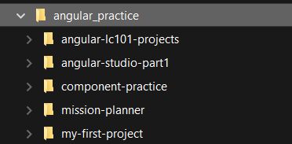
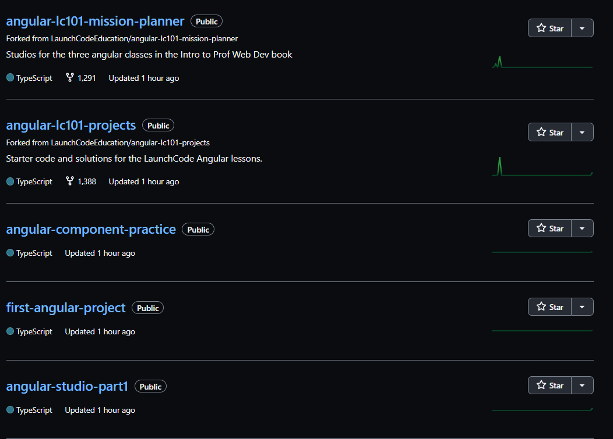
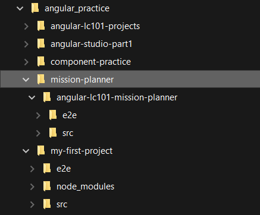

.. _tidy-repos:

Organizing Your Repositories
============================

Organizing Tips
---------------
It is important to keep your repositories organized for a few reasons:  
   #. It's easier to find your projects.
   #. It will keep you from making repositories inside repositories, like a `turducken <https://en.wikipedia.org/wiki/Turducken>`_.

Repos within repos bring frustration.  Intentional file organization can prevent potential pain points.

In the Angular lessons you are asked to create a root angular **directory** or folder.  
This folder will hold the code for the prep work and the studios in **subdirectories**.
Subdirectories are folders inside the root folder.
Knowing which folder to initialize with git is important.

Let's look at the following images to understand where we should use git in a file tree.

   This file tree shows the root directory, ``angular_practice`` and five subdirectories below it.

The file tree above is organized by repository.  
The ``angular_practice`` directory's only job is to store these related repos together.
The ``angular_practice`` directory has NOT been initialized with git.  
It is a simple folder, nothing more.

Look that the repository attached to the files within ``angular_practice``.

   This screenshot shows a repo for each directory in ``angular_practice``.

There is no repo for ``angular_practice``.  
It is a placeholder on your computer to keep all angular projects together.

You may also note that some of the subdirectory names don't match the project name and that is okay.
You are creating the file tree on your computer, you can name these directories whatever you like.

   Each subdirectory contains the code needed.  
   ``misson-planner`` was forked from LaunchCode's ``angular-lc101-mission-planner`` project. Git created a subdirectory to hold the forked code. 
   Notice that the new subdirectory's name matches the forked repo's name.
   ``my-first-project`` was created from scratch, so this is the project's only directory.

init or clone?
--------------

Inside the subdirectory is where you will either ``git init`` or ``git clone url``.
   * Use ``git init`` if you are creating the project from scratch.  This will initialize the repo with the name of the subdirectory.
   * Use ``git clone url`` if you are forking and/or cloning a repo.  This will create a project directory for that repo.  You will need to step into the project directory to find files or work with git.

.. admonition:: Warning  

   If you use ``git init`` and then ``git clone url`` you have created a repo within a repo.
   Git will print a warning about this type of repo.  

   This `article <https://gist.github.com/claraj/e5563befe6c2fb108ad0efb6de47f265>`_ can help your fix this.  Or you can create a new directory and try again.