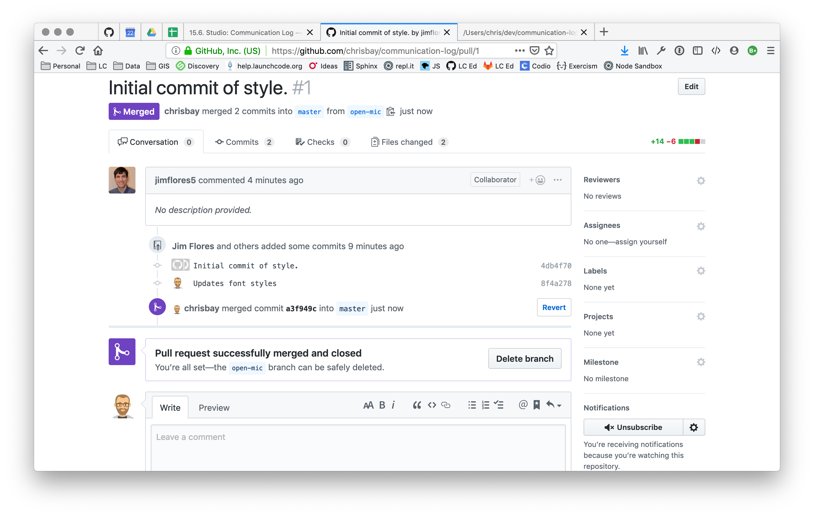

.. _git-workflows:

.. index::
   single: Git; workflows

Git Workflows
=============

This cheatsheet covers basic workflows for local and remote Git repositories.

For details on the Git commands mentioned, or on creating and cloning repositories, revisit the chapter on :ref:`git-chapter`.

.. _single-dev-branch:

Single Developer / Single Branch
--------------------------------

When working on a project by yourself, you will typically follow this workflow:

.. _basic-flow:

#. Make changes to your code
#. Check status: ``git status``
#. Stage changes: ``git add .``
#. Commit changes: ``git commit -m "Added feature X"``
#. (If working with a remote repository) Push changes:
   ``git push origin master``

.. _single-feature:

Single Developer / Feature Branches
-----------------------------------

.. index:: 
   single: Git; branch
   single: Git; feature branch

As you become more comfortable with Git and begin to build larger projects on your own, you'll want to use **feature branches**. This is a branch created in order to *isolate* changes related to a *single* feature or bug. Professional developers use them for a few reasons:

- They can work on multiple new features at the same time, while keeping the work separated.
- If a bug is found, they can commit changes to their feature branch and switch to the branch containing the bug.
- Working in feature branches allows code to be easily reviewed by other developers before it is merged.

.. admonition:: Fun Fact

   Some development teams will *only* work in feature branches. On these teams, developers are NOT allowed to make changes directly to the ``master`` branch. They must work in feature branches and create pull requests into ``master`` to add those changes to the main code base.

In the workflow below, we use ``main`` to refer to the branch from which the feature branch is created (often ``master``) and ``feature`` to refer to the feature branch. Remember to use descriptive names for your branches.

#. Create a new branch. While in ``main`` create and move to the feature branch: ``git checkout -b feature``.
#. Follow the :ref:`single-dev-branch` workflow until work on the feature is complete.
#. After all changes in ``feature`` have been committed and pushed, move back to ``main``: ``git checkout main``.
#. Merge your feature branch back into ``main``, resolving any conflicts: ``git merge feature``

.. _team-single:

Team / Single Branch
--------------------

The case of a team working on a project with a single branch is *very* uncommon. However, multiple developers working on the same branch happens quite a bit. This workflow, therefore, can be thought of as a sub-workflow of the :ref:`team-feature` workflow.

This workflow is similar to the :ref:`single-dev-branch` workflow, only now you must be mindful to merge in changes made by others.

#. Make changes to your code
#. Check status: ``git status``
#. Stage changes: ``git add .``
#. Commit changes: ``git commit -m "Added feature X"``
#. Pull changes made by other: ``git pull origin master``
#. Merge changes as necessary
#. Push changes: ``git push origin master``

.. _team-feature:

Team / Feature Branches
-----------------------

The workflow for a team of developers using feature branches combines the :ref:`team-single` and :ref:`single-feature` workflows. 

In the workflow below, we use ``main`` to refer to the branch from which the feature branch is created (often ``master``) and ``feature`` to refer to the feature branch. Remember to use descriptive names for your branches.

#. Create a new branch. While in ``main`` create and move to the feature branch: ``git checkout -b feature``. OR if contributing to a branch made by a team member, fetch and checkout their existing branch: ``git fetch origin`` then ``git checkout feature``
#. Follow the :ref:`team-single` workflow until work on the feature is complete.
#. After all changes in ``feature`` have been committed and pushed, move back to ``main``: ``git checkout main``.
#. Merge your feature branch back into ``main``, resolving any conflicts: ``git merge feature``. Alternatively, create a pull request <create-pr> into ``main`` as described below.

.. _create-pr:

Working With Pull Requests
--------------------------

.. index:: ! pull request

The ability to create pull requests is a powerful feature of GitHub that allows changes to be reviewed and discussed by team members. 

A **pull request** is a request via GitHub to merge one branch into another. Team members can comment on and review the changes in the request, suggesting or requiring changes. Once the code is ready, the pull request is merged and closed. The code from the feature branch is now part of the destination branch.

Many teams use pull requests when using the :ref:`team-feature` workflow.

To create a pull request, commit and push all changes in your feature branch. Then visit the project's GitHub page and click on the *Branches* link.

.. figure:: figures/branches-link.png
   :alt: The Branches link is just below the project description on GitHub.
   :height: 250px

The *Branches* page shows all branches that have been pushed to GitHub. To the right of every branch (except ``master``) is a button to create a new pull request. 

.. figure:: figures/new-pr-button.png
   :alt: The Branches page of a repo, with a button to open a new pull request to the right of each feature branch.
   :height: 300px

To create a new pull request, fill out the brief form describing the changes that it contains.

.. figure:: figures/create-pr.png
   :alt: The form for creating a new pull request.
   :height: 500px

Once the pull request has been created, it remains in the *Open* state for team members to comment.

.. figure:: figures/open-pr.png
   :alt: An open pull request.
   :height: 500px

When the code is ready, the pull request is merged and closed. The code is then part of the destination branch.

Forking a Repository at GitHub
------------------------------

A scenario that will occur from time-to-time in LaunchCode courses, and
which occurs quite a lot for developers in general, is when you want
to copy another developer's project and modify it. This process is known
as "forking a repository" since if you view a project's history as a
timeline, copying it effectively creates a "fork" in that history.

To fork another developer's repository, visit the project at GitHub and
hit the *Fork* button:

.. figure:: figures/fork-button.png
   :alt: The fork button is at the top right of a project page on GitHub

This will create a *copy* of the remote repository under *your* GitHub
profile. You will have a snapshot of the other developer's repository,
taken at the moment you hit the *Fork* button.

From your own profile page, you will see the forked repository listed
alongside your other repositories. To work on the code, clone the
repository to your computer using the method above.

Forked repositories can easily be identified by the reference to the
original project under the project name on your profile.

.. figure:: figures/forked-repo.png
   :alt: A forked repository on GitHub, with a link to the original repository below
   :height: 200px

Helpful Git Resources
---------------------

- `Pro Git Book <https://git-scm.com/book/en/v2>`__ - A reference book covering Git in depth.

- `Flight Rules for Git <https://github.com/k88hudson/git-flight-rules>`__ - A "How to" guide for git

- `Interactive GitHub Sandbox <https://try.github.io>`__ - A place to practice git without fear of messing anything up.

- `Connecting to GitHub with SSH <https://help.github.com/articles/connecting-to-github-with-ssh/>`__
