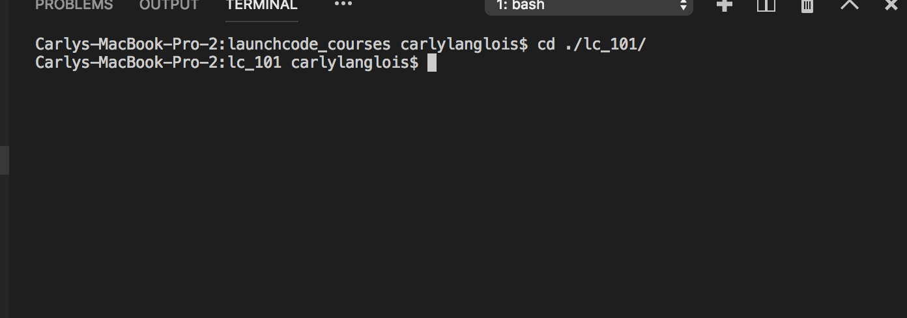
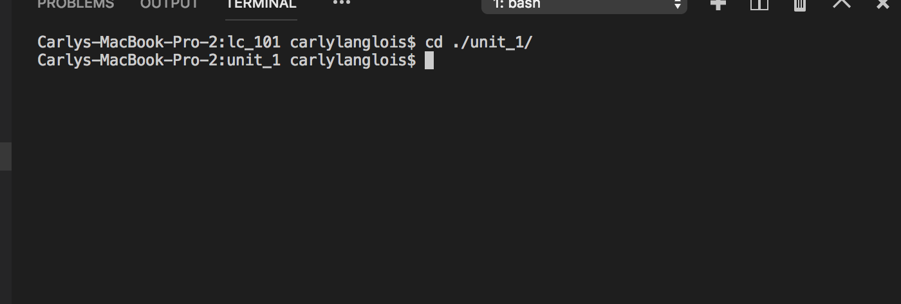
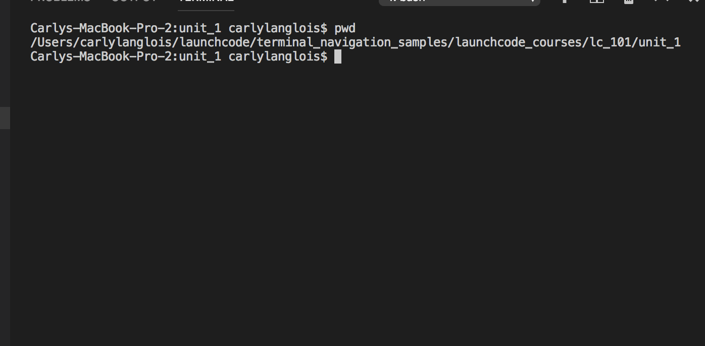
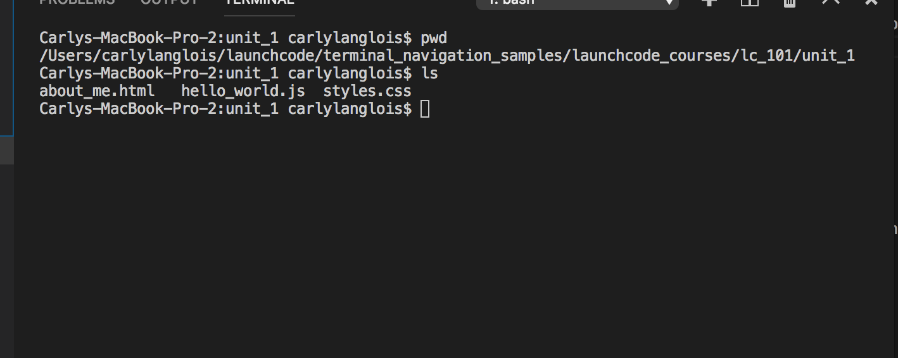

.. _terminal-basics-tutorial:

Terminal Basics Tutorial
========================

As mentioned in the terminal chapter, the essence of the command line is 
is text. Since this is quite different from how many may be used to using
their computers, this tutorial is meant to help you picture how your
machine is responding when you input common commands into the terminal.

Your computer is basically a file storage system. Sure, you may have many
applications installed. But where do they all live? In folders. Aka,
directories. The basics of terminal usage involve navigating these
directories.

Let's take a look at a given project opened in your VSCode editor:

.. figure:: ./figures/init_tree.png
    :alt: File tree in VSCode

    Sample file tree in VSCode

When working in the terminal, it can be helpful to think of yourself as
physically inside of the project's file system. File trees, like the one
above, are common visualization tools. Here's another map-like option
for imagining your file system:

.. figure:: ./figures/init.png
    :alt: Sample file system map

    Sample file system map

We'll navigate through and edit this sample project folder for the 
remainder of this tutorial. 

.. _terminal-current-dir:

Current Directory (``.``)
-------------------------

Imagining you are inside of this file system, ``.`` is a reference 
to your location, or **current directory**.

Starting at the top directory, *launchcode_courses*, ``.`` represents 
your current location.

.. figure:: ./figures/locate_launchcode_courses.png
    :alt: Inside top directory

    Your current directory is *launchcode_courses*.

Here, your terminal will look something like this:

.. figure:: ./figures/init_terminal.png
    :alt: Terminal view in launchcode_courses

    Your current directory is *launchcode_courses*.

Most of what you see to the left of the command prompt symbol, 
**$** will be different on your machine. The basic structure here is 
<machine_name>:<current_directory> <user_name>$
   
.. note::

   Some users choose to alter what they see before the command prompt.

``.`` itself isn't a command. If you type only ``.`` into the terminal,
you're not really telling the machine to do anything just yet. 

If you're curious, try it. 

.. note::

   Most commands require you to press *Enter* when you are ready to run.

You'll probably see a somewhat cryptic message, like this:

.. figure:: ./figures/current_dir_terminal.png
    :alt: Current directory prompt response

    Entering the symbol for your current directory only

That's ok! Basically, we just entered an incomplete command. Our syntax
wasn't quite right. Keep reading and we'll see how to properly use ``.``.

If you move into *lc_101*, ``.`` then refers to that directory. We'll 
cover how to move locations in detail down in :ref:`terminal-cd`.

    We're now in *lc_101*

You may notice that the <current_directory> has updated but apart from 
that, the computer doesn't give us much response. This is quite common
and is a reason why our file system visuals come in handy to help remind 
us what we're doing.

Back in our map, we've done this:

.. figure:: ./figures/lc101_current_dir.png
    :alt: Current directory lc_101

    We're now in *lc_101*

.. _terminal-parent-dir:

Parent Directory (``..``)
-------------------------

``..`` is a reference to your **parent directory**, aka the directory 
that CONTAINS your current location.

Remember the VSCode file tree? That containment structure is represented
through indentation:

.. figure:: ./figures/init_tree.png
    :alt: File tree in VSCode

    *launchcode_courses* contains *data_analysis* and *lc_101*.

By the end of the :ref:`terminal-current-dir`, we found ourselves inside 
of *lc_101*.

.. figure:: ./figures/lc101_current_dir.png
    :alt: Current directory lc_101

    We're still in *lc_101*

*launchcode_courses* is the parent directory of both the *lc_101* and 
*data_analysis* directories. While we're in *lc_101*, ``..`` refers to 
*launchcode_courses*.

Moving further down into *unit_1*, 

    Moving into *unit_1*.

.. figure:: ./figures/unit1_current_dir.png
    :alt: unit_1 location

    We're now in *unit_1*.

``..`` now refers to *lc101*. 
``../..`` here refers to *launchcode_courses*.

Like ``.`` (:ref:`terminal-current-dir`), ``..`` isn't a command itself, but rather a notation. We're
now ready to tackle our first command!

.. _terminal-pwd:

``pwd`` Command
---------------

Entering the ``pwd`` command in your terminal returns your current 
location, aka your **working directory**.

    *unit_1* is the working directory.

The working directory is another term for the current directory. Think of this 
command as like the 'You are here' star on our file maps. 

.. figure:: ./figures/unit1_current_dir.png
    :alt: unit_1 location

    We're still in *unit_1*.

You're basically just telling the computer to give you your current location. 
This may seem basic, but this one is essential. *You need to know your current 
location when working in the terminal.* A lot of beginner programmers simply enter 
commands into the terminal without mind to where they are. ``pwd`` is like a sanity
check -  a quick way to ensure that you know where you are and what you're doing.
It's the file system counterpart to Git's ``git status``.

.. _terminal-ls:

``ls`` Command
--------------

Entering the ``ls`` command in your terminal returns the contents of your 
current directory. Recall, we're in *unit_1*.

.. figure:: ./figures/unit1_current_dir.png
    :alt: unit_1 location

    We're still in *unit_1*.
    

    The innards of *unit_1*.

All of that looks to be in order. Let's move back out into *lc_101* and run ``ls``
from there.

.. figure:: ./figures/ls_lc101_terminal.png
    :alt: lc101 contents

    *lc101* contains the *unit_1* directory.

Notice that :ref:`terminal-pwd` after we moved. Also pay attention that ``ls`` 
only gives us a view one level deep. Now let's talk about how we move between
directories.

.. _terminal-cd:

``cd`` Command
--------------

``cd <path_name>`` relocates you to the provided path. 

Inside *launchcode_courses*, entering ``cd lc_101`` puts you inside of 
the *lc_101* directory.

.. sourcecode:: bash
   :linenos:

   $ cd lc_101/
   $ 

The computer does not return anything to you after this command and 
simply responds ready to accept another prompt.

If you wanted to return back to your *launchcode_courses* directory,
you can do so with ``cd ..``.
See :ref:`terminal-parent-dir` for notes on how to reference a parent 
directory.

Back inside of *launchcode_courses*, say you would like to move into
*unit_1* in one step. You can do that!

.. sourcecode:: bash
   :linenos:

   $ cd lc_101/unit_1
   $

.. _terminal-mkdir:

``mkdir`` Command
-----------------

``mkdir <new_directory_name>`` creates a new directory at your current 
location. 

We're in the *lc_101* directory. Let's create a directory for Unit 2
materials.

.. sourcecode:: bash
   :linenos:

   $ mkdir unit_2
   $ 

Again, the computer does not return anything to you after this command 
and simply responds ready to accept another prompt. 
But we can visualize the results:

    mkdir creates a new directory

.. _terminal-rm:

``rm`` Command
--------------

``rm <item_to_remove>`` removes a given item from the file tree. 

Let's say we decide we no longer need our *cities.sql* data. 
We can remove it from the terminal:

.. sourcecode:: bash
   :linenos:

   $ rm cities.sql
   $ 

Once again, the computer does not return anything to you after this 
command and simply responds ready to accept another prompt. 
But we can visualize the results:

.. figure:: ./figures/rm.png
    :alt: Sample file tree with a file removed

    rm removes an item

To remove a directory entry, rather than simply a file, requires an 
option on the command. A common method to remove a directory is to 
use the ``-r`` option, although there are other choices.

Let's say we're back up top in *launchcode_courses* directory and we want
to remove the entirety of the *data_analysis* directory. We can run:

.. sourcecode:: bash
   :linenos:

   $ rm -r data_analysis/
   $ 

Which results in:

.. figure:: ./figures/rm-r.png
    :alt: Sample file tree with a directory removed

    rm -r removes a directory entry

.. _terminal-cp:

``cp`` Command
--------------

``cp <source_path> <target_path>`` copies the item at the source and
puts it in the target path.

Take our sample file tree above. Say we're in *data_analysis* 
and we want to copy *cities.sql* into *final_project*. We can do this 
with ``cp``.

.. sourcecode:: bash
   :linenos:

   $ cp ./cities.sql ./final_project/
   $ 

Here's what that gives us:

.. figure:: ./figures/cp.png
    :alt: Sample file tree with a file copied

    cp copies an item

.. _terminal-mv:

``mv`` Command
--------------

``mv <item_to_move> <target_path>`` moves an item to the target path.

Back in *data_analysis*, lets move *cities.sql* into *final_project*. 

.. sourcecode:: bash
   :linenos:

   $ mv ./cities.sql ./final_project/
   $ 

Here's what that gives us:

    mv moves an item

.. _terminal-touch:

``touch`` Command
-----------------

``touch <new_file_name>`` creates a new file.

Back in *data_analysis*, lets add a new file to our *final_project* 
directory. 

.. sourcecode:: bash
   :linenos:

   $ touch ./final_project/more_sql.sql
   $ 

Here's what that gives us:

    touch adds a file

.. _terminal-ctrlc:

``ctrl + c`` Details
--------------------

*ctrl + c* can be used to exit a running program.

Some programs take different commands to exit. *ctrl + c* 
is sometimes used to prompt the running program for an 
exit command.

.. _terminal-clear:

``clear`` Command
-----------------

``clear`` wipes your terminal window of any previously run commands 
and outputs in case you need a clean screen to think straight. 

You probably won't encounter a scenario where you NEED to clear your
terminal, but it can be a nice command to know if you're a minimalist.

.. sourcecode:: bash
   :linenos:

   $ clear
   $ 

.. _terminal-man:

``man`` Command
---------------

``man`` is your best friend. Running ``man <command>`` gives you a manual
entry of what that command does, what options it takes, and more
documentation than you could ever need. It's so thorough, it makes this
guide blush. Any command you think you may need but you're not sure how 
to use it, or maybe you want to do something specific and are wondering if
there's a specialized option for it, use ``man`` to get more info!

Practice looking up some of the commands you know; maybe you'll learn a 
new option or two!

Some other terminal stuff you should know when using the manual:

- Some entries are very long! They will probably need to be scrolled 
    through. You'll know there's more to read if you see ``:`` at the 
    bottom of your terminal window. You can use your keyboard's arrow keys to
    navigate the entry. If you reach the bottom of the entry,
    you'll see a line that reads ``END``.

- Once you're finished reading, you'll need to exit the manual page 
    using the :ref:`terminal-q` command. 

.. _terminal-q:

``q``
-----

``q`` is another command for exiting a running program.
