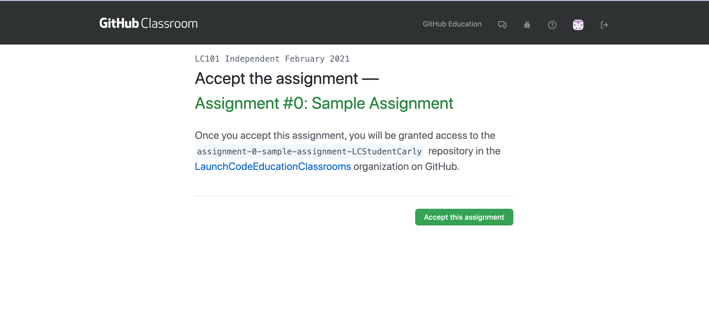
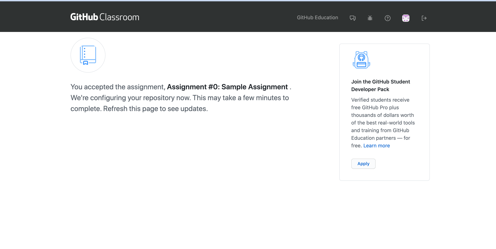
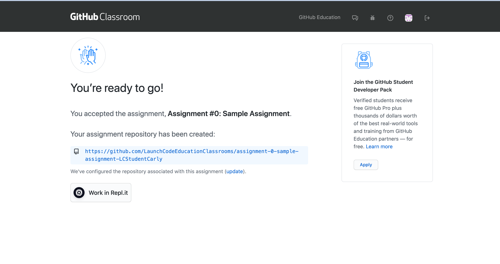
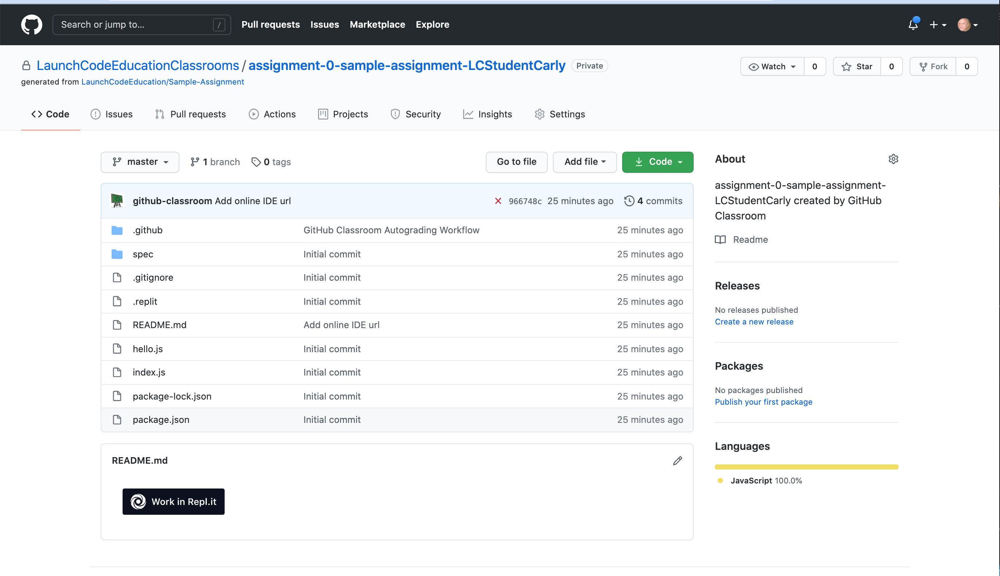
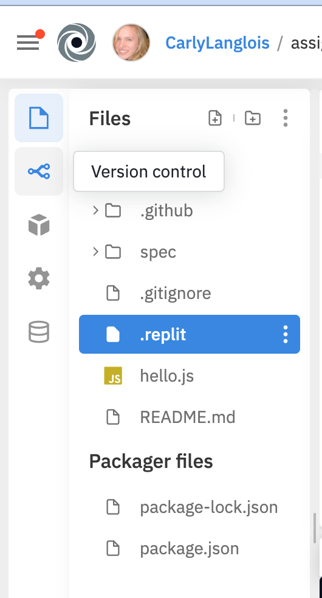
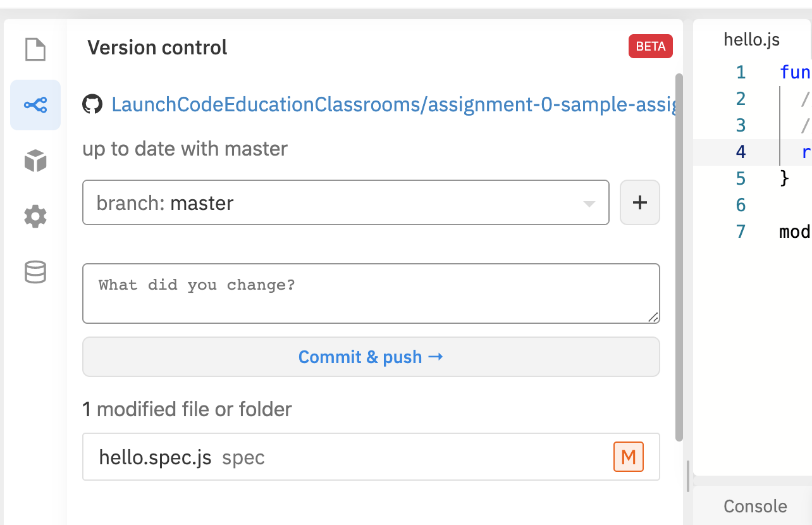
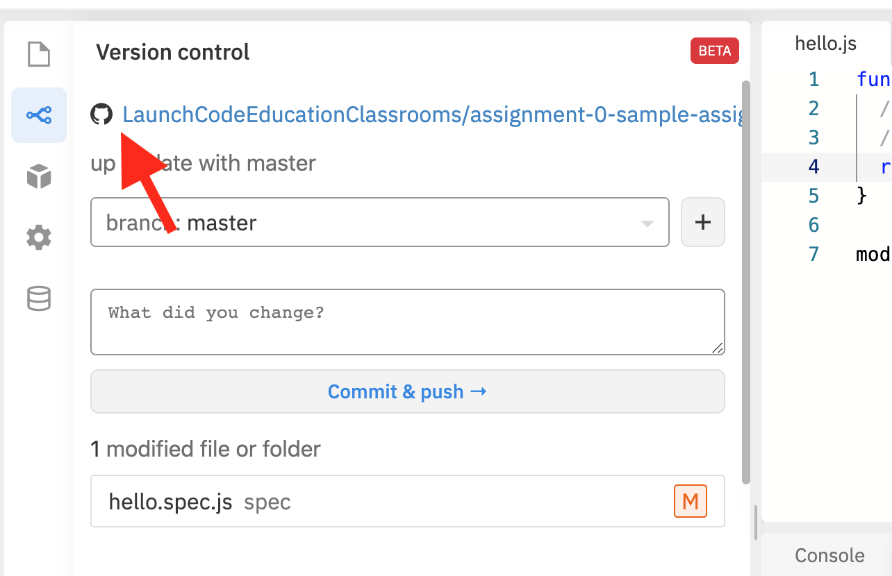
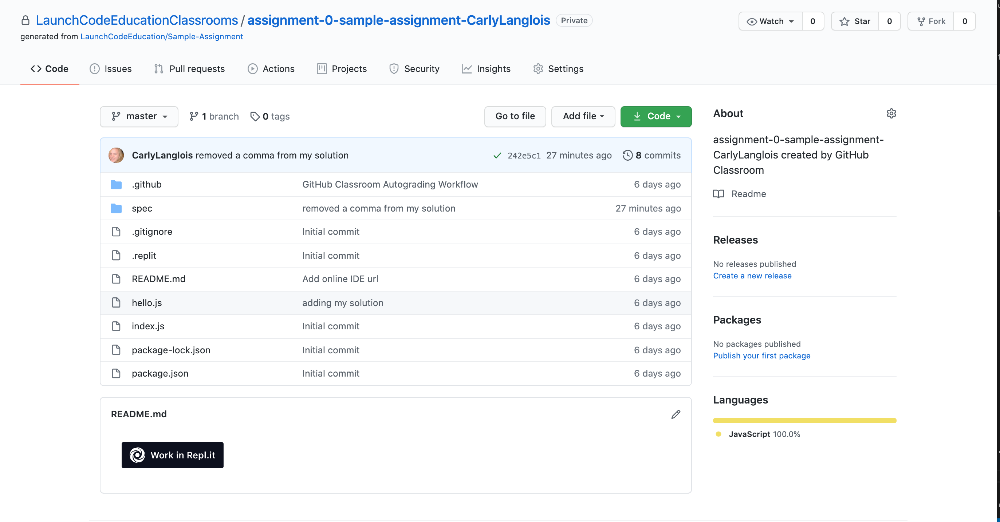
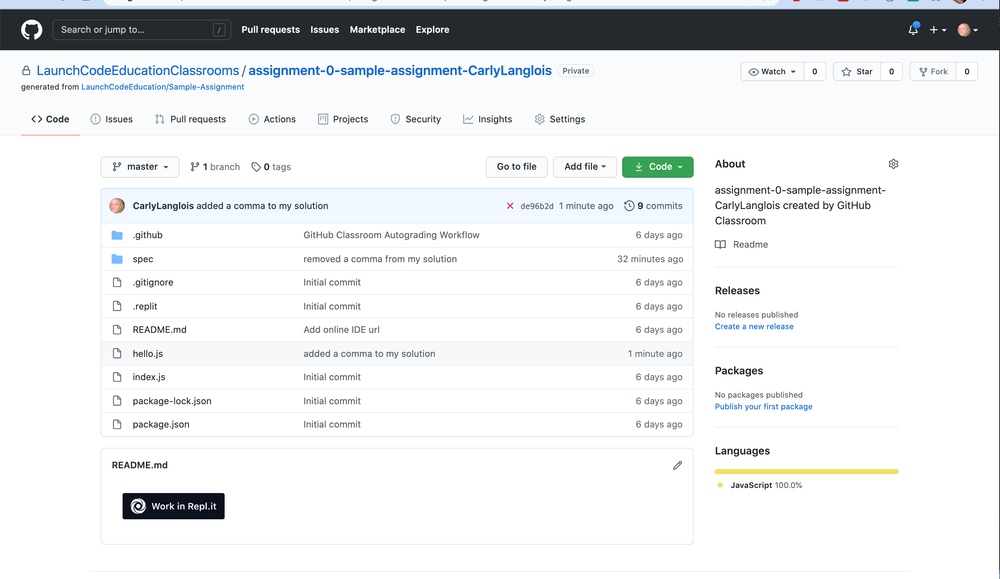

.. _assignment0:

.. index:: ! workflow, commit message, ! repository

Assignment #0: Hello World
==========================

Your first assignment is mostly an exercise in following instructions. We'll ask you to modify
an existing program so that, when run, the program prints "Hello world!".

Programming jobs often require you to get familiar with, or at least make 
use of, additional technologies. Here, you'll be using a few web applications, like GitHub and Repl.it, 
to write your code, run it, save it, and submit your assignment.

So while the coding task may appear straightforward, you'll be introduced to a set of instructions, 
or **workflow**, that is important for the rest of your success in this class.

.. admonition:: Tip

   Read this whole page before you start taking any action.

Requirements
------------

#. Sign up for a GitHub account.
#. Sign up for a Repl.it account.
#. Open and accept the GitHub classroom assignment invitation.
#. Change the code in Repl.it.
#. Commit the code in Repl.it.
#. Make sure your assignment passes the test.

GitHub
~~~~~~

If you haven't done so already, create a 
`GitHub account <https://github.com/join?ref_cta=Sign+up&ref_loc=header+logged+out&ref_page=%2F&source=header-home>`__.

Repl.it
~~~~~~~

If you haven't already done so, create a 
`Repl.it account <https://Repl.it/signup>`__.

Assignment Invitation
~~~~~~~~~~~~~~~~~~~~~

.. admonition:: Tip

   Before starting on any assignment, make sure you are signed into both your Github and Repl.it accounts!

In your Canvas classroom, click on the Assignment 0 link to accept your invitation to start coding 
your assignment solution.

Once you open the assignment invitation, if you are already logged in to your GitHub account, 
you will see a screen like this:

   Clicking on the assignment link in Canvas takes you to this page.

Before you hit the green *Accept the Assignment* button, write down the name of the
assignment repository. In this case, that would be: "assignment-0-sample-assignment-LCStudent-Carly".
A **repository** is a Github term for a folder of code.
Having the repository name written somewhere will ensure you can access your assignment code if you 
are interrupted from the rest of the setup process.

Once you have accepted and hit the green button, the next page you will see looks 
something like this:

   Most of the time, you only need to wait about 30 seconds to refresh and see the assignment repository.

When you refresh and your assignment repository has been created, this is what you should see:

   Your assignment code can now be accessed either via Repl.it or GitHub.

We recommend you first open the GitHub assignment repository page before hitting 
the *Work in Repl.it* button. When you open your GitHub assignment repository,
you will see the same *Work in Repl.it* button.

   We recommend that you access the assignment Repl.it via the GitHub repository.

.. admonition:: Note

   The first time you use the *Work in Repl.it* button, i.e. for this assignment, you will need to authorize your Repl.it account to
   work with your GitHub account. If you are prompted to do so, follow the steps to 
   link your accounts.

Hello world!
~~~~~~~~~~~~

Once you have accepted the assignment, have a look around the various files and get curious about what this 
code does.
Don't be afraid to look - just don't edit any of this code just yet.

After you have done some exploring, use the Repl.it *Run* button to run the program. To begin with, 
the program prints just ``"Hello"``. Remember, your task is to to modify the output of this program so that,
when run, ``"Hello world!"`` is printed. 

Take a look at the ``hello.js`` file. This is the only file in your starter code that needs changing.
You'll see a structure called a ``function``, along with a final ``module.exports`` line. We haven't learned 
about either of these items yet - but we will! If you are so compelled, google these terms to get a brief introduction.
If you are not compelled, you don't need to know what they do for the purposes of this class until later lessons.

.. admonition:: Tip

   Set a timer for 5 mins and google search "JavaScript functions" or "JavaScript module.exports". Or look these
   items up directly on `W3Schools <https://www.w3schools.com/>`__ or `MDN <https://developer.mozilla.org/en-US/>`__.
   When the timer is up, write down whatever you have found interesting or most salient from your search.
   
   Although you won't start learning about these terms in this book until later on, getting into the habit of 
   exploring code and google searching topics helps to get you into the developer mindset. 

   This may not be the only place where this book leaves you with more questions than answers and getting answers 
   from the world wide web is how every developer spends their time.

Back inside of ``hello.js``, you should recognize a string on this line: ``return "Hello!";``.

``return`` is another keyword related to functions that we have not yet covered. For now, know that 
``return`` behaves like a surrogate for ``console.log()``. So anything inside of the string that follows it
will be printed when your application is run.

.. admonition:: Tip

   It's a good idea to take note of how this file in the starter code looks before you start editing.
   Changing any code other than this string may cause your program to not run properly, and therefore may not
   be graded correctly. Making small changes and testing them as you go makes it easier to undo changes you don't want 
   and return to a working state.

With all of this in mind, modify the string on that line so that ``"Hello world!"`` is printed. 

Commit Your Changes
~~~~~~~~~~~~~~~~~~~

Now that your program prints ``"Hello world!"``, you'll commit your code. Committing your code is part of 
a process called version control, which we'll get into in a later lesson. For now, go to the sidebar in your Repl.it
window and click on the version control icon. 

   Here, the user selects the version control icon.

When you have opened the version control tab, write a commit message in the text field that prompts "What did you
change?". A **commit message** is a note about what you have changed in your code.

   Click on the text box and write a message that conveys what you have changed in the code.

A good commit message in this case would be something like: "Added my personal solution", or "Updated hello.js
to print 'hello world!'".

Hit the *commit & push* button. Voila - your solution is submitted (pushed) to the GitHub graders.

Check Your Solution
~~~~~~~~~~~~~~~~~~~

Once you've committed your work, head to Github to see that your solution passes the tests.

The easiest way to do this is to click on the hyperlink at the top of the Repl.it version control tab.

   The hyperlink pointed to here takes you to the GitHub location of your assignment.

If your solution passes the grading requirements, you will see a green check mark near your latest commit.

   The latest commit message on this assignment is "removed a comma from my solution". The green check to 
   the right of the message indicates that the solution passed.

If your solution does not pass, you will see a red ``x`` in its place.

   The latest commit, "added a comma to my solution" does not pass the grading requirements.

A red ``x`` can always be corrected by repeating the previous steps. These are:

#. Open Repl.it (you can use the *Work in Repl.it* button from the GitHub page)
#. Change the string, 
#. Run the program to visually ensure that ``"Hello world!"`` is printed,
#. Commit and push your changes.

You may make any number of commits to your solution. You won't lose points for pushing *commit and push* many times.
In fact, each assignment is worth only 1 point.
In most cases, you won't need to *commit and push* more than once, however. You can verify that your code runs 
we expect by running it and seeing the proper ``"Hello world!"`` message printed.

In some cases, you may see a yellow dot grading status instead of the green check or red ``x``. This is fine and 
just means that GitHub is currently building your solution. It will often resolve to either a check or ``x`` after 
a few moments.

When you see a green check, your code passes and you are all finished with the assignment. 

.. admonition:: Note

   If your program is outputting "Hello world!", but you are still not seeing a green check mark, make sure you did not edit any file other than ``hello.js``.
   An accidental space or extra character can cause problems with Github Classroom's grading.
   To double check that you have not done so, you can click on the 7-digit code next to the check mark or x.
   This will bring up which files have been changed and any changes made. If any other files other than ``hello.js`` were changed, make sure to undo the changes in Repl.it and commit to Github.
