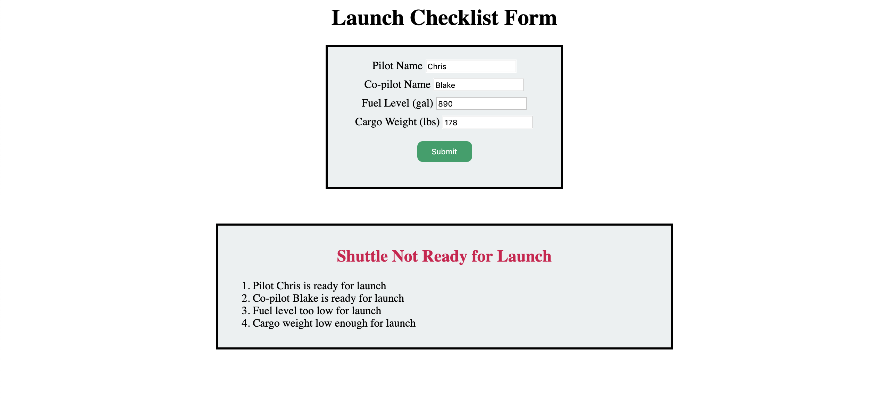
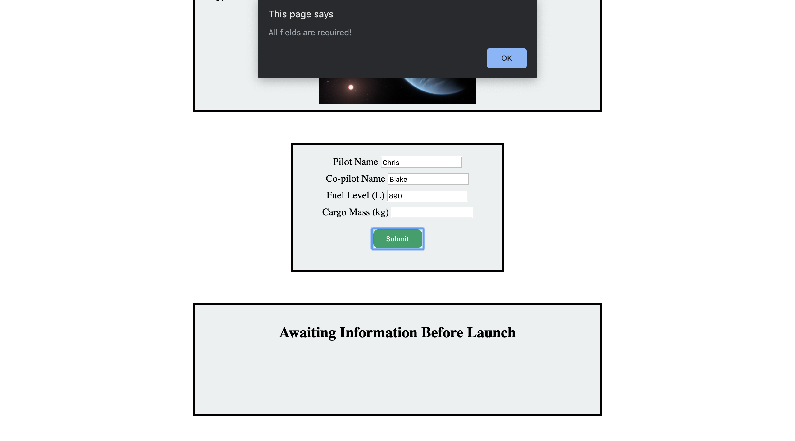

Assignment #5: Launch Checklist Form
====================================

Using our knowledge of forms, the DOM, and HTTP, the commanders of our favorite space shuttle program asked us to create a quick launch checklist.
We have four fields that need to be filled out with vital information: the pilot's name, the co-pilot's name, the fuel levels, and the mass of the cargo.

Our pilot, Chris, and the co-pilot, Blake, have been hard at work securing the cargo and filling the shuttle tank. All we need to do is use validation to ensure that we have all of the info for the space shuttle program and make sure no one prematurely launches the shuttle.

Requirements
------------

Create a Launch Checklist Form for astronauts to fill out in preparation for launch.
The form should do the following:

1. Validate the user responses with ``preventDefault()`` to ensure the following:

   a. The user entered something for every field.
   b. The user entered text for names and numbers for fuel and cargo levels.

2. With validation, update a list of what is currently ready or not ready for the shuttle launch.
3. Indicate what is good or bad about the shuttle and whether it is ready for launch by using the DOM to update the CSS.
4. Fetch some planetary JSON to update the mission destination with vital facts and figures about where the shuttle is headed. 

Setting Up Your Project Repository
----------------------------------

In `Canvas <https://learn.launchcode.org/>`__, **Graded Assignment #5: Launch Checklist Form** contains a GitHub Classroom assignment invitation link. Refer back to the GitHub Classroom instructions from **Graded Assignment #0: Hello World** for submission instructions.

To get started, navigate to the directory with your copy of the starter code. Open ``index.html`` with Firefox to verify that your starter code is working.

When you open ``index.html`` in the browser, you should see the Launch Checklist form with a rectangle above it for the mission destination and a rectangle below it that simply says "Awaiting Information Before Launch".

.. figure:: figures/form-starting-point.png
   :alt: Image showing the form and the box stating that more information is needed before launch.

Before starting work, go ahead and check out the various files in your starter code. You may notice a file called ``bundle.js``. This file contains no code except for a comment. Do NOT delete this file.
The only files you should be editing when working on this project are ``script.js`` and ``scriptHelper.js``. To modify styles or update HTML, do NOT modify ``styles.css`` or ``index.html``.

.. admonition:: Note

   If you open up your browser's dev tools, you may see a warning stating that the ``require`` statement in ``scriptHelper.js`` is not working.
   This is okay! That ``require`` statement is necessary for the autograder to function and this warning will not impact your site's ability to function.

Adding Validation
-----------------

Adding Alerts
^^^^^^^^^^^^^

First, let's add validation to notify the user if they forgot to enter a value for any one of the fields.

This process is going to look similar to the :ref:`validation section <javascript-validation>` in the chapter on forms. 
Make sure to use ``preventDefault()`` and an alert to notify the user that all fields are required.

You also want to make sure that the user entered valid info for each of the fields.
Valid information for the fields means that the user submits a value that is easily converted to the correct data type for our fellow engineers.
The pilot and co-pilot names should be strings and the fuel level and cargo mass should be numbers.
To do this, complete the helper function in your ``scriptHelper.js`` called ``validateInput()``.
``validateInput()`` should take in a string as a parameter and return ``"Empty"``, ``"Not a Number"``, or ``"Is a Number"`` as appropriate.
In ``scriptHelper.js``, you will use ``validateInput()`` to complete the ``formSubmission()`` function.
``formSubmission()`` will take in a ``document`` parameter and strings representing the pilot, co-pilot, fuel level, and cargo mass.
Using the values in those strings and the ``document`` parameter for your HTML document, update the shuttle requirements as described below.
Make sure to call your ``formSubmission()`` function at the appropriate time in your ``script.js`` file!

.. note:: 

   If you want to check if something is ``NaN``, you cannot use ``==`` or ``===``.
   Instead, JavaScript has a built-in method called ``isNaN(value)`` that returns ``true`` if ``value`` is ``NaN`` and ``false`` if ``value`` is not ``NaN``.

Updating Shuttle Requirements
^^^^^^^^^^^^^^^^^^^^^^^^^^^^^

The list of shuttle requirements, the ``div`` with the id ``faultyItems``, should be updated if something is not ready for launch. 
Using template literals, update the ``li`` elements ``pilotStatus`` and ``copilotStatus`` to include the pilot's name and the co-pilot's name.

If the user submits a fuel level that is too low (less than 10,000 liters), change ``faultyItems`` to ``visible`` with an updated fuel status stating that there is not enough fuel for the journey.
The text of the ``h2`` element, ``launchStatus``, should also change to "Shuttle not ready for launch" and the ``color`` should change to red.

If the user submits a cargo mass that is too large (more than 10,000 kilograms), change the list to ``visible`` with an updated cargo status stating that there is too much mass for the shuttle to take off.
The text of ``launchStatus`` should also change to "Shuttle not ready for launch" and the ``color`` should change to red.

If the shuttle is ready to launch, change the text of ``launchStatus`` to green and display "Shuttle is ready for launch".

Fetching Planetary Data
-----------------------

Finally, we need some JSON to fill in the crew on the mission destination.
Our planetary data can be found in `JSON format <https://handlers.education.launchcode.org/static/planets.json>`_.
Review the list and decide which planet you want to send our intrepid crew to and make note of the index number.

.. note:: 

   When fetching more than one JSON object, we get an array of all of the JSON objects.
   In this case, that means an array of our possible mission destinations.
   When picking the mission destination, just pick the item in the array you want and start counting at 0.

In ``scriptHelper.js``, you have three functions for this task: ``myFetch()``, ``pickPlanet()``, and ``addDestinationInfo()``.
First, review the comments in ``addDestinationInfo()``.
This is the format of the ``innerHTML`` for the ``missionTarget`` div, which you can locate using the ``document`` parameter of ``addDestinationInfo()``.
``addDestinationInfo()`` does not need to return anything.
``pickPlanet()`` takes in one argument: a list of planets. Using ``Math.random()``, return one planet from the list with a randomly-selected index.
``myFetch()`` has some of the code necessary for fetching planetary JSON, however, it is not complete. You need to add the URL and return ``response.json()``.

Now it is time to make use of these helper functions in ``script.js``.  We provided some of the code necessary:

.. sourcecode:: js

   let listedPlanets;
   // Set listedPlanetsResponse equal to the value returned by calling myFetch()
   let listedPlanetsResponse;
   listedPlanetsResponse.then(function (result) {
       listedPlanets = result;
       console.log(listedPlanets);
   }).then(function () {
       console.log(listedPlanets);
       // Below this comment call the appropriate helper functions to pick a planet fom the list of planets and add that information to your destination.
   })

First, do as the comments in the code tell you and set ``listedPlanetsResponse`` equal to the value returned when calling ``myFetch()``. This value is going to be a promise. 
If we head to our browser and open up our developer tools, we can now see a list of the planets.
Then using ``pickPlanet()`` and ``addDestinationInfo()``, select a planet at random from ``listedPlanets`` and pass that information to ``addDestinationInfo()``.
Reload your page and check out your site to see the mission target information.  
 
The End Result
--------------

After you implement everything, the following form submission would result in the proper updates to the ``launchStatus`` and ``faultyItems`` list.

.. figure:: figures/form-fields-ready.png
   :alt: Image showing the user is submitting a form with Chris as the pilot, Blake as the co-pilot, 890 liters as the fuel level, and 178 kilograms as the cargo mass.

With only 890 liters of fuel, the status of the launch becomes red and states that the shuttle is not ready. 
The list has also updated to indicate that that is not enough fuel for the shuttle to launch.

If the user forgets to enter the cargo mass, then an alert pops up letting the user know that all fields are required.

If the user switches up the information that needs to go in the fields, then an alert pops up letting the user know that they have tried to enter invalid information.

.. figure:: figures/form-fields-invalid.png
   :alt: Image showing an alert pop up stating that some fields have invalid information.

Submission
----------

Even if everything is working perfectly with your site, the autograder may still be counting something as wrong.
Here are some steps you can take to make sure your great work is counted as such!

#. Make sure that all of your methods are complete in ``scriptHelper.js``! The autograder needs to check your logic for each of the methods.
   ``script.js`` should contain calls to these functions.
#. If the tests labeled ``GRADING DOM MANIPULATION TEST`` are failing, make sure that you did not modify ``bundle.js`` or remove ```` from ``index.html``.
   The autograder needs ``bundle.js`` linked as a script in ``index.html`` in order to run properly.