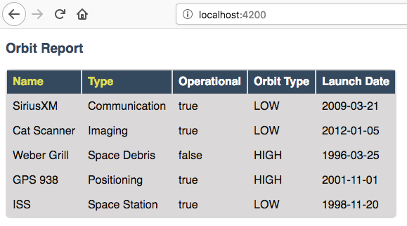
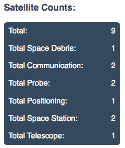

Assignment #6: Orbit Report
===========================

There are thousands of satellites orbiting the earth. You are tasked with creating a searchable, sortable table of satellites.
For the purposes of this assignment, **satellite** will be defined as any object purposefully placed into orbit.

TODO: screen shot of finished report in the browser with numbers by each feature

1. **Satellites**: Table with each row being a satellite.
2. **Counts:** Count of all satellites and count for each type of satellite.
3. **Search form:** Text entered limits results based on matches. Pressing enter or clicking button triggers search.
4. **Sortable columns:** The name and type column headers can be clicked, which will sort the table using that property.

Setup
-----

1. Create a new project on Github named ``orbit-report``.
2. Clone that repo to your computer.
3. Create a new Angular project in the cloned repo folder using this command.

   * ``$ ng new --skip-git orbit-report``
   * It's important to include the ``--skip-git`` because we don't want Angular to create a git repo for us.
   * Prompt answers: No Routing, Use CSS

4. Commit and push your changes to Github.

Requirements
------------

As you accomplish each task, be sure to commit and push your changes before moving on to the next item.

1) Define and Create Satellites
^^^^^^^^^^^^^^^^^^^^^^^^^^^^^^^

In JavaScript, TypeScript, and Angular projects you can create classes to represent entities in the project.
For this project you need to create a class named ``Satellite`` to represent, you guessed it, a satellite. The ``Satellite``
class needs to define the properties needed to accurately represent a satellite.

1. In terminal go to the ``orbit-report`` folder.
2. Create a class with command ``$ ng g class Satellite``.
3. Notice that the new file ``orbit-report/src/app/satellite.ts`` was created.
4. Add these properties to the ``Satellite`` class in ``satellite.ts``:

.. sourcecode:: js

   name: string;
   orbitType: string;
   type: string;
   operational: boolean;
   launchDate: string;

5. Add a constructor to ``Satellite`` class.

   * Constructor signature should be ``constructor(name: string, type: string, launchDate: string, orbitType: string, operational: boolean)``
   * You need to assign the class properties in the constructor.

Now we need to use the ``Satellite`` class to create an initial array of ``Satellite`` objects.

6. Define an array named ``sourceList`` in ``app.component.ts``.

   * ``sourceList: Satellite[];``
   * For this to compile, you must add ``import { Satellite } from './satellite';`` to the top of the file.

7. In the ``constructor`` in ``app.component.ts`` set ``sourceList`` to be an array of ``Satellite`` objects.

.. sourcecode:: typescript

   constructor() {
      this.sourceList = [
         new Satellite("SiriusXM", "Communication", "2009-03-21", "LOW", true),
         new Satellite("Cat Scanner", "Imaging", "2012-01-05", "LOW", true),
         new Satellite("Weber Grill", "Space Debris", "1996-03-25", "HIGH", false),
         new Satellite("GPS 938", "Positioning", "2001-11-01", "HIGH", true),
         new Satellite("ISS", "Space Station", "1998-11-20", "LOW", true),
      ];
   }

8. In terminal run ``ng serve``
9. View the app in your browser. At this point you should see the default Angular starter page. If you don't, check the build output and browser console for any errors.

2) Create Orbit List Component
^^^^^^^^^^^^^^^^^^^^^^^^^^^^^^

Now that you have an array of ``Satellite`` objects, you can display them. To do that, you are going to need to create a
new component named ``orbit-list``.

#. Create ``orbit-list`` component using ``$ ng g component orbit-list`` in the ``app`` folder.
#. Replace the contents of ``app.component.html`` with just one line of code, ``<app-orbit-list></app-orbit-list>``.
#. View the app in your browser. You should see: orbit-list works!

3) Pass in Satellites to Orbit List Component
^^^^^^^^^^^^^^^^^^^^^^^^^^^^^^^^^^^^^^^^^^^^^

The ``orbit-list`` component's job is to show a list of satellites. Remember you declared an array of ``Satellite`` objects in
``app.component.ts`` named ``sourceList``. In order to pass that array into the ``orbit-list``, you need to learn a new Angular
feature named `input properties <https://angular.io/guide/component-interaction#pass-data-from-parent-to-child-with-input-binding>`_.
For the purpose of this feature, the term input refers to data being sent *into* the component. Angular input properties are NOT related to HTML ``input``
elements.

Currently ``app.component.html`` uses the ``orbit-list`` component like so:

.. sourcecode:: html+ng2

   <app-orbit-list></app-orbit-list>

To pass in the ``sourceList`` array to the ``orbit-list`` component you need to learn new syntax.
Notice the code ``[satellites]="sourceList"``. The ``[satellites]`` declares that you are setting a
property on the ``orbit-list`` component named ``satellites``. ``="sourceList`` declares that the value
of the ``satellites`` property will be the value of the ``sourceList`` array.

.. sourcecode:: html+ng2

   <app-orbit-list [satellites]="sourceList"></app-orbit-list>

1. Add ``[satellites]="sourceList"`` to ``<app-orbit-list></app-orbit-list>`` in ``app.component.html``.

   * ``<app-orbit-list [satellites]="sourceList"></app-orbit-list>``

2. View the app in your browser.

   * You should NOT see the message "orbit-list worked!". Why?
   
3. Open developer tools in your browser and look at the JavaScript console.

You should see the below error message telling you that the ``orbit-list`` component does NOT have a ``satellites`` property.
Note only the relevant message text has been included below.

::

  Error: Template parse errors:
  Can't bind to 'satellites' since it isn't a known property of 'app-orbit-list'.
  1. If 'app-orbit-list' is an Angular component and it has 'satellites' input, then verify that it is part of this module.

To solve this issue, you need to declare in ``orbit-list.component.ts`` that the ``orbit-list`` component has an input property named ``satellites``.

4. Add the code below to just before the constructor in ``orbit-list.component.ts``.
   
   * ``@Input() satellites: Satellite[];``

The ``@Input()`` is special Angular syntax that declares that ``satellites`` is a property that will be passed into the component via ``<app-orbit-list [satellites]="sourceList"></app-orbit-list>``.

5. Update the ``require`` statements to import ``Input`` and ``Satellite``

   * ``import { Component, OnInit, Input } from '@angular/core';``
   * ``import { Satellite } from '../satellite';``

6. View the app in your browser. You should see: orbit-list works!

   * You still don't have satellites showing yet. That is the next step.

4) Display Table of Satellites
^^^^^^^^^^^^^^^^^^^^^^^^^^^^^^

Now that ``orbit-list`` has a ``satellites`` property that is an array of ``Satellite`` objects, you can
use that array to build an HTML table with each row being a different satellite.

1. In ``orbit-list.component.html`` use``*ngFor`` to loop over the ``satellites``. The HTML table you build should look like the following.

.. sourcecode:: html+ng2
   :linenos:

   <h3>Orbit Report</h3>
   <table>
      <tr class="header-row">
         <th class="sortable">Name</th>
         <th class="sortable">Type</th>
         <th>Operational</th>
         <th>Orbit Type</th>
         <th>Launch Date</th>
      </tr>
      <!-- TODO: put <tr *ngFor=""></tr> here -->
   </table>

Next you need to include CSS that will make your table and application look a little nicer.

2. Copy the entire contents of the `example orbit-list-component.css  <https://gist.github.com/welzie/5247f5ac36e973903cd5202af50932e6>`_ and put it into your ``orbit-list-component.css``.
3. Copy the entire contents of the `example app.component.css <https://gist.github.com/welzie/5247f5ac36e973903cd5202af50932e6>`_ and put it into your ``app.component.css``.
4. Copy the ``<style>`` tag from the `example index.html <https://gist.github.com/welzie/5247f5ac36e973903cd5202af50932e6>`_ and paste it into the ``<head>`` of your ``index.html``.

   * Only add in the ``<style>``, do NOT remove any other HTML from your ``index.html``.

5. View the app in your browser. You should see a table like the below.

   Example of application at this point. Don't worry if yours doesn't have a heading of "Orbit Report" yet, you can add that later.

5) Fetch Satellite Data
^^^^^^^^^^^^^^^^^^^^^^^

So far you have used an array declared in ``app.component.ts`` as the source of data to display.
Your next task is to switch to using a ``fetch`` that retrieves json data from a server.

1. Replace your ``constructor`` in ``AppComponent`` with the code below.
2. Implement the three features mentioned in the ``TODO:`` comments.

.. sourcecode:: typescript

   constructor() {
      this.sourceList = [];
      let satellitesUrl = 'https://api.myjson.com/bins/ccxv5';

      window.fetch(satellitesUrl).then(function(response) {
         response.json().then(function(data) {

            let fetchedSatellites = data.satellites;
            // TODO: loop over satellites
            // TODO: create a Satellite object using new Satellite(fetchedSatellites[i].name, fetchedSatellites[i].type, fetchedSatellites[i].launchDate, fetchedSatellites[i].orbitType, fetchedSatellites[i].operational);
            // TODO: add the new Satellite object to sourceList using: this.sourceList.push(satellite);

         }.bind(this));
      }.bind(this));

   }

.. note::

   Explaining the ``.bind(this)`` syntax is beyond the scope of this book, but is crucial for ``this.sourceList.push(satellite)`` to work properly.

3. View the app in your browser. Your table should look similar to:

.. figure:: figures/fetched-table-satellites.png
   :alt: Screen shot of browser showing http://localhost:4200 with a table of 9 satellites.

   Example of application after switching to fetched data.

6) Highlight Space Debris
^^^^^^^^^^^^^^^^^^^^^^^^^

You need to make it easier to spot dangerous space debris in the list. You will accomplish this
by adding an Angular attribute directive.

#. Add a ``shouldShowWarning`` method to the ``Satellite`` class.

   * ``shouldShowWarning`` returns a boolean and has no parameters.
   * ``shouldShowWarning`` returns ``true`` if the satellite ``type`` is ``'Space Debris'``, returns false otherwise.

#. Use ``shouldShowWarning`` to add the ``warning`` CSS class to the ``<td>`` containing the satellite's type.

   * For guidance refer to the section on :ref:`changing styles with attribute directives <changing-styles-with-booleans>`

.. figure:: figures/table-satellites-with-warning.png
   :alt: Screen shot of browser showing http://localhost:4200 with a table of 9 satellites, with Space Debris cell having a red background.

   Example of warning style adding a red background to Space Debris type.

7) Sorting
^^^^^^^^^^

Sorting is a useful feature for any table. When the "Name" heading is clicked sort the table by the
``name`` property. Also when the "Type" heading is clicked, the table should display sorted by the
``type`` property.

1. Add an Angular click handler that calls ``sort('name')`` to the Name  ``<th>`` element.

   * Note that the sorting feature will not work until you have completed step 3.

2. Add an Angular click handler that calls ``sort('type')`` to the Type ``<th>`` element.
3. Add a ``sort`` method to the ``OrbitListComponent`` class.

   * The sorting method has been provided below.
   * For an example of sort working, see :ref:`Orbit Report Demo <orbit-report-demo>`.

.. note::

   The provided ``sort`` method contains a new usage of the ``array.sort`` method. Previously in the book you used
   ``array.sort`` without passing it a function, see :ref:`sort function examples <sort-examples>`. This usage of ``array.sort``
   uses a compare function, which allows you to control how the objects in the array are sorted. A compare function
   is needed to sort the array of ``Satellite`` objects, because JavaScript does not know how to sort objects, JavaScript
   needs you to tell it which ``Satellite`` object should go before another ``Satellite`` object.
   For more details about the compare function see
   `MDN description of sort using a compare function <https://developer.mozilla.org/en-US/docs/Web/JavaScript/Reference/Global_Objects/Array/sort#Description>`_.

.. sourcecode:: typescript
   :linenos:

   sort(column: string): void {
    // array.sort modifies the array, sorting the items based on the given compare function
    this.satellites.sort(function(a: Satellite, b: Satellite): number {
      if(a[column] < b[column]) {
        return -1;
      } else if (a[column] > b[column]) {
        return 1;
      }
      return 0;
     });
   }

8) Searching
^^^^^^^^^^^^

You are doing great! Only two more features to add. Next you will add a search feature.

#. Add this HTML ``

`` in your ``app.component.html``.
#. Add an ``<input>`` element inside the ``
``.
#. Add a ``<button>`` element inside the ``
``.
#. Add an Angular ``(click)`` handler to the ``<button>`` that when triggered calls ``search(searchTerm.value)``

   * ``searchTerm`` being the local variable name for the ``<input>``

#. Add an Angular ``(keyup.enter)`` handler to the ``<input>`` that when triggered calls ``search(searchTerm.value)``
#. Add a ``search`` method to the ``AppComponent`` class.

   * The ``search`` method is provided below.

.. sourcecode:: typescript
   :linenos:

   search(searchTerm: string): void {
      let matchingSatellites: Satellite[] = [];
      searchTerm = searchTerm.toLowerCase();
      for(let i=0; i < this.sourceList.length; i++) {
         let name = this.sourceList[i].name.toLowerCase();
         if (name.indexOf(searchTerm) >= 0) {
            matchingSatellites.push(this.sourceList[i]);
         }
      }
      // assign this.displayList to be the the array of matching satellites
      // this will cause Angular to re-make the table, but now only containing matches
      this.displayList = matchingSatellites;
   }

Notice the usage of a new variable named ``displayList``. ``displayList`` should contain the ``Satellite`` objects
that the user wants to see. Previously ALL the satellites were displayed, because there was not a search feature. 
Now the user can perform a search, which means they want to see ONLY the matching results. The ``sourceList`` variable contains ALL
the ``Satellite`` objects. If you removed the ``Satellite`` objects from ``sourceList`` that didn't match the search term, then
the user could never see them again. Instead when the user performs a search, ``displayList`` will be populated with only the matching
``Satellite`` objects in ``sourceList``. Matching is defined as ``satellite.name`` containing the search term.

7. Add the ``displayList: Satellite[];`` property to the ``AppComponent`` class.

   * Set ``displayList = []`` in the constructor.

8. Pass in the ``displayList`` to the ``orbit-list-component``.

   * ``<app-orbit-list [satellites]="displayList"></app-orbit-list>``

9. View the app in your browser. Why is the table empty when the app loads?

   * What is the value of ``displayList`` when the app first loads?

10. Set ``displayList`` to be a copy of ``sourceList`` when the app loads.

    * Add this code after ``sourceList`` has been populated by the fetched data in the ``constructor``.

.. sourcecode:: typescript

         // make a copy of the sourceList to be shown to the user
         this.displayList = this.sourceList.slice(0);
      }.bind(this));
   }.bind(this));

11. For an example of search working, see :ref:`Orbit Report Demo <orbit-report-demo>`.

9) Counting Satellites
^^^^^^^^^^^^^^^^^^^^^^

For the last feature, you are on your own. You are tasked with creating a new component that
shows the total count and count by type for the satellites currently displayed in the table.

#. Create an ``orbit-counts`` component.
#. Copy the entire contents of the `example orbit-counts.component.css  <https://gist.github.com/welzie/5247f5ac36e973903cd5202af50932e6>`_ and put it into your ``orbit-counts.component.css``.
#. Use the component in ``app.component.html``.
#. Pass in ``displayList`` via ``[satellites]="displayList"``.
#. Use the given HTML as a template.
#. The rest of the steps are left for you to figure out.

.. sourcecode:: html

   <h3>Satellite Counts:</h3>
   

      
Total: 9

      
Space Debris: 1

      
Communication: 2

      
Probe: 2

      
Positioning: 1

      
Space Station: 2

      
Telescope: 1

   

   Example of the seven different satellite counts being displayed.

Bonus Missions
--------------

#. Search feature should also find matches using the ``orbitType`` and ``type`` properties.
#. Make every other row in the table have a background color.
#. For step 9, use an ``*ngFor`` to loop over an array of the different types, instead of explicitly writing a ``<tr>`` for each satellite type.

   * You may have already completed this mission, depending on how you accomplished step 9.

Submitting Your Work
--------------------

In Canvas, open the Orbit Report assignment and click the "Submit" button.
An input box will appear.

Copy the URL for your Github repository and paste it into the box, then click
"Submit" again.

.. _orbit-report-demo:

Application Demo
----------------

TODO: video of all features being demoed (not including bonus)
TODO: I have an mp4 of the demo saved. Need to upload it to youtube. (It was too large for gif)
