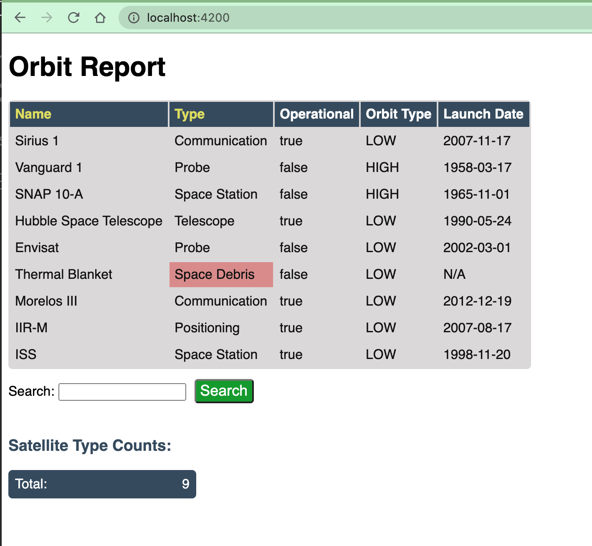

.. _orbit-report:

Assignment #6: Orbit Report
===========================

Sections:
---------

#. :ref:`Introduction and Background <orbit-report-intro>`
#. :ref:`Demo GIFs <orbit-report-demo>`
#. :ref:`Setup and Starter Code <orbit-report-setup>`
#. :ref:`Requirements <orbit-report-steps>`
#. :ref:`Bonus Missions <orbit-report-bonus-missions>`
#. :ref:`Submitting Your Work <orbit-report-submitting>`

.. _orbit-report-intro:

Introduction and Background
---------------------------

There are thousands of satellites orbiting the earth. You are tasked with
updating a searchable, sortable table of satellites. For the purposes of this
assignment, a **satellite** will be defined as any object purposefully placed
into orbit.

Your table will have the following features:

#. **Satellites**: Each row in the table contains data on one satellite.
#. **Search form:** Filters search results based on matches to the entered text.
   Pressing enter or clicking the button triggers the search.
#. **Sortable columns:** ``Name`` and ``Type`` column headers can be
   clicked, which will sort the table using that property.
#. **Counts:** Displays the total number of satellites in the table, as well as
   the count for each type of satellite.

Your completed assignment should look something like this:

.. admonition:: Warning

   Please do not attempt this assignment until after your first lesson on
   Angular. It can be tempting to dive right in, but Angular is a broad topic,
   and you want to wait to have a solid understanding of the framework before you
   get started.

.. _orbit-report-setup:

Setup and Starter Code
----------------------

In `Canvas <https://learn.launchcode.org/>`__, Graded Assignment #6: Orbit Report contains a GitHub Classroom assignment invitation link.
Refer back to the GitHub Classroom instructions from Graded Assignment #0: Hello World for submission instructions.

.. _orbit-report-steps:

Requirements
------------

As you accomplish each task, commit and push your changes before
moving on to the next item.

1) Define and Create Satellites
^^^^^^^^^^^^^^^^^^^^^^^^^^^^^^^

.. TODO: import Satellite to app component

In JavaScript, TypeScript, and Angular projects, you can create classes to
represent entities in the project. For this project you need to create a class
named ``Satellite`` to represent, you guessed it, a satellite. The
``Satellite`` class needs to define the properties needed to accurately
represent a satellite.

.. #. In terminal go to the ``orbit-report`` folder.
.. #. Create a class with command ``$ ng generate class Satellite``.
.. #. Notice that the new file ``orbit-report/src/app/satellite.ts`` was created.

#. Add these properties to the ``Satellite`` class in ``satellite.ts``:

   .. sourcecode:: js

      name: string;
      orbitType: string;
      type: string;
      operational: boolean;
      launchDate: string;

#. Add a constructor to ``Satellite`` class.

   a. Constructor signature should be:

      .. sourcecode:: TypeScript

         constructor(name: string, type: string, launchDate: string, orbitType: string, operational: boolean)

   b. You need to assign the class properties in the constructor.

Now we need to use the ``Satellite`` class to create an initial array of
``Satellite`` objects.

6. Define an array named ``sourceList`` in ``app.component.ts``.

   a. ``sourceList: Satellite[];``
   b. For this to compile, you must add ``import { Satellite } from
      './satellite';`` to the top of the file.

#. In the ``constructor`` in ``app.component.ts`` set ``sourceList`` to be an
   array of ``Satellite`` objects.

   .. sourcecode:: typescript

      constructor() {
         this.sourceList = [
            new Satellite("SiriusXM", "Communication", "2009-03-21", "LOW", true),
            new Satellite("Cat Scanner", "Imaging", "2012-01-05", "LOW", true),
            new Satellite("Weber Grill", "Space Debris", "1996-03-25", "HIGH", false),
            new Satellite("GPS 938", "Positioning", "2001-11-01", "HIGH", true),
            new Satellite("ISS", "Space Station", "1998-11-20", "LOW", true),
         ];
      }

#. In the terminal run ``ng serve``.
#. View the app in your browser. At this point you should see the default
   Angular starter page. If you don't, check the build output and browser
   console for any errors.

2) Create Orbit List Component
^^^^^^^^^^^^^^^^^^^^^^^^^^^^^^

Now that you have an array of ``Satellite`` objects, you need to display them.
To do that, create a new component named ``orbit-list``.

#. Generate the ``orbit-list`` component in the ``app`` folder. If you need a
   reminder of how to do this, review the
   :ref:`Adding a New Component <add-new-component>` section.
#. Replace the contents of ``app.component.html`` with just one line of code,
   ``<app-orbit-list></app-orbit-list>``.
#. View the app in your browser. You should see: ``orbit-list works!``

.. 3) Pass in Satellites to Orbit List Component
.. ^^^^^^^^^^^^^^^^^^^^^^^^^^^^^^^^^^^^^^^^^^^^^

.. The ``orbit-list`` component's job is to show a list of satellites. Remember,
.. you declared an array of ``Satellite`` objects in ``app.component.ts`` named
.. ``sourceList``. In order to pass that array into the ``orbit-list``, you need
.. to learn a new Angular feature named `input properties <https://angular.io/guide/component-interaction#pass-data-from-parent-to-child-with-input-binding>`__.
.. Here, the term "input" refers to data being sent *into* the component. Angular
.. input properties are NOT related to HTML ``input`` elements.

.. Currently, ``app.component.html`` uses the ``orbit-list`` component like so:

.. .. sourcecode:: html+ng2

..    <app-orbit-list></app-orbit-list>

.. To pass the ``sourceList`` array into the ``orbit-list`` component, you need to
.. learn new syntax.

.. #. Modify ``<app-orbit-list></app-orbit-list>`` in ``app.component.html`` as
..    follows:

..    .. sourcecode:: html+ng2

..       <app-orbit-list [satellites]="sourceList"></app-orbit-list>

..    a. ``[satellites]`` declares a new ``satellites`` property on the
..       ``orbit-list`` component.
..    b. ``="sourceList"`` sets the value of the ``satellites`` property to be the
..       ``sourceList`` array.

.. #. View the app in your browser. You should NOT see the message ``orbit-list
..    worked!`` Why?
.. #. Open developer tools in your browser and look at the JavaScript console.

..    You should see an error message telling you that the ``orbit-list``
..    component does NOT have a ``satellites`` property. Note that only the
..    relevant message text has been included below.

..    ::

..       Error: Template parse errors:
..       Can't bind to 'satellites' since it isn't a known property of 'app-orbit-list'.
..       1. If 'app-orbit-list' is an Angular component and it has 'satellites' input, then verify that it is part of this module.

.. To solve this issue, you need to declare in ``orbit-list.component.ts`` that
.. the component has an input property named ``satellites``.

.. 4. Add the code below just before the constructor in
..    ``orbit-list.component.ts``.

..    .. sourcecode:: typescript

..       @Input() satellites: Satellite[];

..    The ``@Input()`` is special Angular syntax that declares that ``satellites``
..    is a property that will be passed into the component via
..    ``<app-orbit-list [satellites]="sourceList"></app-orbit-list>``.

.. #. Update the ``import`` statements in ``orbit-list.component.ts`` to access
..    the ``Input`` and ``Satellite`` classes.

..    .. sourcecode:: typescript
..       :linenos:

..       import { Component, OnInit, Input } from '@angular/core';
..       import { Satellite } from '../satellite';

.. #. View the app in your browser. You should see ``orbit-list works!`` but no
..    satellites yet. That is the next step.

4) Display Table of Satellites
^^^^^^^^^^^^^^^^^^^^^^^^^^^^^^

Now that ``orbit-list`` has a ``satellites`` property that is an array of
``Satellite`` objects, you can use that array to build an HTML table with each
row being a different satellite.

#. In ``orbit-list.component.html`` use ``*ngFor`` to loop over the
   ``satellites`` array. The HTML table you build should look like the
   following.

   .. sourcecode:: html+ng2
      :linenos:

      <h3>Orbit Report</h3>
      <table>
         <tr class="header-row">
            <th class="sortable">Name</th>
            <th class="sortable">Type</th>
            <th>Operational</th>
            <th>Orbit Type</th>
            <th>Launch Date</th>
         </tr>
         <!-- TODO: put <tr *ngFor=""></tr> here -->
      </table>

#. View the app in your browser. Your table should look something like:

   .. figure:: figures/basic-table-satellites.png
      :alt: Screen shot of browser showing http://localhost:4200 with a table of four satellites.

      Example of application at this point.

.. 5) Fetch Satellite Data
.. ^^^^^^^^^^^^^^^^^^^^^^^

.. So far, you have used an array declared in ``app.component.ts`` as the source
.. of data to display. Your next task is to switch to using a ``fetch`` that
.. retrieves json data from a server.

.. #. Replace your ``constructor`` in ``AppComponent`` with the code below.
.. #. Implement the three features mentioned in the ``TODO:`` comments.

..    .. sourcecode:: typescript

..       constructor() {
..          this.sourceList = [];
..          let satellitesUrl = 'https://handlers.education.launchcode.org/static/satellites.json';

..          window.fetch(satellitesUrl).then(function(response) {
..             response.json().then(function(data) {

..                let fetchedSatellites = data.satellites;
..                // TODO: loop over satellites
..                // TODO: create a Satellite object using new Satellite(fetchedSatellites[i].name, fetchedSatellites[i].type, fetchedSatellites[i].launchDate, fetchedSatellites[i].orbitType, fetchedSatellites[i].operational);
..                // TODO: add the new Satellite object to sourceList using: this.sourceList.push(satellite);

..             }.bind(this));
..          }.bind(this));

..       }

.. .. admonition:: Note

..    Explaining the ``.bind(this)`` syntax is beyond the scope of this book, but
..    the statements are crucial for ``this.sourceList.push(satellite)`` to work
..    properly.

.. 3. View the app in your browser. Your table should look similar to:

..    .. figure:: figures/fetched-table-satellites.png
..       :alt: Screen shot of browser showing http://localhost:4200 with a table of 9 satellites.

..       Example of application after switching to fetched data.

6) Highlight Space Debris
^^^^^^^^^^^^^^^^^^^^^^^^^

You need to make it easier to spot dangerous space debris in the list. Add an
Angular attribute directive to accomplish this.

#. Add an ``isSpaceDebris`` method to the ``Satellite`` class.

   a. ``isSpaceDebris`` returns a boolean and has no parameters.
   b. ``isSpaceDebris`` returns ``true`` if the satellite ``type`` is
      ``'Space Debris'``, and it returns ``false`` otherwise. Note that this
      check should be case-insensitive.

#. Use ``isSpaceDebris`` to add the ``warning`` CSS class to the ``<td>``
   containing the satellite's type.

   a. For guidance refer to the section on :ref:`changing styles with attribute directives <changing-styles-with-booleans>`.

   .. figure:: figures/table-satellites-with-warning.png
      :alt: Screen shot of browser showing http://localhost:4200 with a table of 9 satellites, with Space Debris cell having a red background.

      Example of warning style adding a red background to Space Debris type.

7) Counting Satellites
^^^^^^^^^^^^^^^^^^^^^^

Create a new component that shows the total number of satellites currently
displayed in the table. 

#. Create an ``orbit-counts`` component at the same level as ``orbit-list``.
.. TODO: refine this item below: can we remove the exact line to add?

#. Pass in ``displayList`` via ``[satellites]="displayList"``.
#. Add styles to ``orbit-counts.component.css`` to make your count table
   complement the list of satellites, or use the CSS provided in this
   `sample file  <https://gist.github.com/welzie/5247f5ac36e973903cd5202af50932e6>`__.
#. Use the given HTML as a template. Replace the hard-coded count with a directive 
   to display the number of satellites in the displayed table.

   .. sourcecode:: html
      :linenos:

      <h3>Satellite Counts:</h3>
      

         
Total: 9

      

#. In ``app.component.html``, uncomment the line that adds this component to the page.

.. TODO: update this screenshot and caption for just the top count

#. Your completed component should look similar to:

   .. figure:: figures/orbit-counts-output.png
      :alt: Example of six satellite counts being displayed.

      Example of the seven different satellite counts being displayed.

.. 7) Sorting
.. ^^^^^^^^^^^

.. Sorting is a useful feature for any table. When a user clicks the "Name"
.. heading, sort the table by the ``name`` property. Also, if the user clicks the
.. "Type" heading, then sort the table by the ``type`` property.

.. #. Add an Angular click handler that calls ``sort('name')`` to the Name
..    ``<th>`` element. Note that the sorting feature will NOT work until you
..    have completed step 3.

.. #. Add an Angular click handler that calls ``sort('type')`` to the Type
..    ``<th>`` element.
.. #. Add a ``sort`` method to the ``OrbitListComponent`` class. Remember that
..    by convention, the method should come *after* the ``constructor`` *and*
..    ``ngOnInit``.

..    a. The sorting method has been provided below.
..    b. To see an example of the sort working, see the
..       :ref:`Orbit Report Demo <orbit-report-demo>` below.

..    .. sourcecode:: typescript

..       sort(column: string): void {
..          // array.sort modifies the array, sorting the items based on the given compare function
..          this.satellites.sort(function(a: Satellite, b: Satellite): number {
..             if(a[column] < b[column]) {
..                return -1;
..             } else if (a[column] > b[column]) {
..                return 1;
..             }
..             return 0;
..          });
..       }

.. .. admonition:: Note

..    The provided ``sort`` method contains a new usage of the ``array.sort`` method. Previously in the book you used
..    ``array.sort`` without passing it a function, see :ref:`sort function examples <sort-examples>`. This usage of ``array.sort``
..    uses a compare function, which allows you to control how the objects in the array are sorted. A compare function
..    is needed to sort the array of ``Satellite`` objects, because JavaScript does not know how to sort objects, JavaScript
..    needs you to tell it which ``Satellite`` object should go before another ``Satellite`` object.
..    For more details about the compare function see
..    `MDN description of sort using a compare function <https://developer.mozilla.org/en-US/docs/Web/JavaScript/Reference/Global_Objects/Array/sort#Description>`_.

.. 8) Searching
.. ^^^^^^^^^^^^

.. You are doing great! Next you will add a search feature.

.. #. Add this HTML ``

`` in ``app.component.html``.
.. #. Add an ``<input>`` element inside the ``
``.
.. #. Add an Angular ``(keyup.enter)`` handler to the ``<input>`` tag that calls
..    ``search(searchTerm.value)``. ``searchTerm`` is the local variable
..    defined in ``<input>`` to store the data entered by the user.
.. #. Add a ``<button>`` element inside the ``
``.
.. #. Add an Angular ``(click)`` handler to the ``<button>`` that also calls
..    ``search(searchTerm.value)``.
.. #. Add a ``search`` method to the ``AppComponent`` class. The code for this
..    method is provided below.

..    .. sourcecode:: typescript
..       :linenos:

..       search(searchTerm: string): void {
..          let matchingSatellites: Satellite[] = [];
..          searchTerm = searchTerm.toLowerCase();
..          for(let i=0; i < this.sourceList.length; i++) {
..             let name = this.sourceList[i].name.toLowerCase();
..             if (name.indexOf(searchTerm) >= 0) {
..                matchingSatellites.push(this.sourceList[i]);
..             }
..          }
..          // assign this.displayList to be the array of matching satellites
..          // this will cause Angular to re-make the table, but now only containing matches
..          this.displayList = matchingSatellites;
..       }

.. Notice the usage of a new variable named ``displayList``. ``displayList``
.. should contain the ``Satellite`` objects that the user wants to see.
.. Previously ALL the satellites were displayed, because there was not a search
.. feature. Now the user can perform a search, which means they want to see ONLY
.. the matching results. The ``sourceList`` variable contains ALL the
.. ``Satellite`` objects. If you removed the ``Satellite`` objects from
.. ``sourceList`` that didn't match the search term, then the user could never
.. see them again. Instead when the user performs a search, ``displayList`` will
.. be populated with only the matching ``Satellite`` objects in ``sourceList``.
.. Matching is defined as ``satellite.name`` containing the search term.

.. 7. Add the ``displayList: Satellite[];`` property to the ``AppComponent``
..    class and set ``displayList = []`` in the constructor.

.. #. Pass in the ``displayList`` to the ``orbit-list-component``.

..    .. sourcecode:: html+ng2

..       <app-orbit-list [satellites]="displayList"></app-orbit-list>

.. #. View the app in your browser. Why is the table empty when the app loads?
..    What is the value of ``displayList`` when the app first loads?

.. #. Set ``displayList`` to be a copy of ``sourceList`` when the app loads.

..    a. Add this code after ``sourceList`` has been populated by the fetched
..       data in the ``constructor``.

..       .. sourcecode:: typescript

..                // make a copy of the sourceList to be shown to the user
..                this.displayList = this.sourceList.slice(0);
..             }.bind(this));
..          }.bind(this));

.. #. For an example of search working, see
..    :ref:`Orbit Report Demo <orbit-report-demo>`.

.. _orbit-report-bonus-missions:

Bonus Missions
--------------

A) Zebra Stripes
^^^^^^^^^^^^^^^^

Alternate the color for every other row in the table. Choose whichever pair
of colors you prefer, but the highlighting for space debris should still be
distinct.

.. figure:: figures/orbit-report-zebra.png
   :alt: Alternating row colors.

B) Update the Search Feature
^^^^^^^^^^^^^^^^^^^^^^^^^^^^

Modify the search feature to find matches using the ``orbitType`` and ``type``
properties.

If you completed the counting satellites bonus, use an ``*ngFor`` to loop over
an array of the different types, instead of explicitly writing a ``<tr>`` for
each satellite type.

.. admonition:: Note

   You may have already completed this mission, depending on how you
   accomplished counting the satellites.

.. _orbit-report-submitting:

Submitting Your Work
--------------------

In Canvas, open the Orbit Report assignment and click the "Submit" button.
An input box will appear.

Copy the URL for your Github repository and paste it into the box, then click
"Submit" again.

