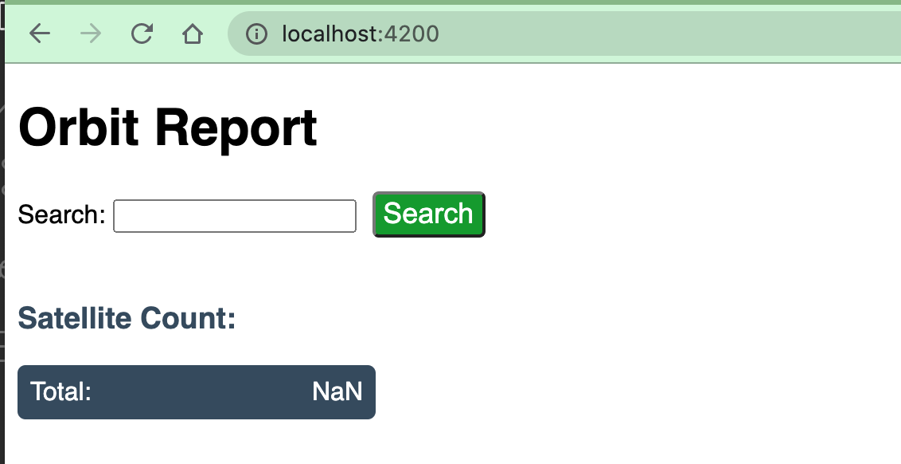

.. _orbit-report:

Assignment #6: Orbit Report
===========================

Sections:
---------

#. :ref:`Introduction and Background <orbit-report-intro>`
#. :ref:`Demo GIFs <orbit-report-demo>`
#. :ref:`Setup and Starter Code <orbit-report-setup>`
#. :ref:`Requirements <orbit-report-steps>`
#. :ref:`Bonus Missions <orbit-report-bonus-missions>`
#. :ref:`Submitting Your Work <orbit-report-submitting>`

.. _orbit-report-intro:

Introduction and Background
---------------------------

There are thousands of satellites orbiting the earth. You are tasked with
updating a searchable, sortable table of satellites. For the purposes of this
assignment, a **satellite** will be defined as any object purposefully placed
into orbit.

Your table will have the following features:

#. **Satellites**: Each row in the table contains data on one satellite.
#. **Search form:** Filters search results based on matches to the entered text.
   Pressing enter or clicking the button triggers the search.
#. **Sortable columns:** ``Name`` and ``Type`` column headers can be
   clicked, which will sort the table using that property.
#. **Counts:** Displays the total number of satellites in the table.

Your completed assignment should look something like this:

.. figure:: figures/orbit-report-table.png
   :scale: 50%
   :alt: Screenshot of orbit report table.

.. admonition:: Warning

   Please do not attempt this assignment until after your first lesson on
   Angular. It can be tempting to dive right in, but Angular is a broad topic,
   and you want to wait to have a solid understanding of the framework before you
   get started.

.. _orbit-report-setup:

Setup and Starter Code
----------------------

In `Canvas <https://launchcode.instructure.com/>`__, Graded Assignment #6: Orbit Report contains a GitHub Classroom assignment invitation link.
Refer back to the GitHub Classroom instructions from Graded Assignment #0: Hello World for submission instructions.

.. admonition:: Note

	Don't forget to run ``npm install`` before trying to run the starter code.

When you first pull down the starter code, your running application will look something like this:

   Example of running the starter code. 

.. _orbit-report-steps:

Requirements
------------

As you accomplish each task, commit and push your changes before
moving on to the next item.

1) Display Orbit List Component
^^^^^^^^^^^^^^^^^^^^^^^^^^^^^^^

The main portion of the orbit report is a table of satellite data. When you
first pull down and serve this angular project, you'll notice there is no such
table on the page. That's because the angular component responsible for this table
hasn't been added to the app's HTML.

To have the satellite table displayed, add the ``orbit-list`` component tag to the ``app``
HTML.

.. figure:: figures/orbit-report-part1-final.png
   :scale: 50%
   :alt: Screen shot of browser showing http://localhost:4200 with a table of 1 satellite.

   Example of running app with the ``orbit-list`` component displayed.

2) Display Live Satellite Data
^^^^^^^^^^^^^^^^^^^^^^^^^^^^^^

Now that you have the ``orbit-list`` component being rendered on the page,
you can have the table change the number of rows displayed depending on the fetched ``Satellite`` data. 
This is a flexible web app!

a. There is an array of ``Satellite`` objects in ``app.component.ts`` named ``displayList``. 
   In order to pass that array into the ``orbit-list``, you need to learn a new Angular feature 
   named `input properties <https://angular.io/guide/component-interaction#pass-data-from-parent-to-child-with-input-binding>`__. 
   Here, the term "input" refers to data being sent into the component. 
   
   .. admonition:: Note
   
      Angular input properties are not related to HTML input elements.

   To pass the ``displayList`` array into the ``orbit-list`` component, you need to learn new syntax.

   Modify the tag you added in the step above as follows:

   .. sourcecode:: html+ng2
   
      <app-orbit-list [satellites]="displayList"></app-orbit-list>

   #. ``[satellites]`` declares a new ``satellites`` property on the ``orbit-list`` component.
   #. ``="displayList"`` sets the value of the ``satellites`` property to be the ``displayList`` array.

b. Now, the ``orbit-list`` component has access to the fetched satellite data. To confirm this, change the 
   ``orbit-list`` component html to use it's  satellites property.

   When you can confirm that ``orbit-list`` has access to the satellite data, remove the single hard-coded
   satellite table row and replace it with code using an ``*ngFor`` directive to loop over all of the 
   fetched satellite objects and display their information. In the new report table, each row represents 
   a different satellite.

   The HTML table you build should look like the following.

View the app in your browser. Your table should look something like:

.. figure:: figures/basic-table-satellites.png
   :alt: Screen shot of browser showing http://localhost:4200 with a table of 5 satellites.

   Example of satellite table.

3) Highlight Space Debris
^^^^^^^^^^^^^^^^^^^^^^^^^

You need to make it easier to spot dangerous space debris in the satellite data. 
Inside of the ``Satellite`` class, there is a broken method called ``isSpaceDebris``. 
This is meant to return ``true`` only when a ``Satellite`` object has this type. 

To highlight space debris, you first need to fix this method. Next,
use the method to add a ``warning`` class onto the table cell. There's already a
css style rule to make any element marked with the ``warning`` class appear red.

a. Repair the ``isSpaceDebris`` method in the ``Satellite`` class. ``isSpaceDebris`` 
   returns ``true`` if the satellite ``type`` is ``'Space Debris'``, and it returns 
   ``false`` otherwise. 

b. Use ``isSpaceDebris`` to add the ``warning`` CSS class to the ``<td>``
   containing the satellite's type. Use an Angular attribute directive to 
   accomplish this. 

   .. admonition:: Tip
   
      Refer to the section on :ref:`changing styles with attribute directives <changing-styles-with-booleans>`.

   .. figure:: figures/table-satellites-with-warning.png
      :alt: Screen shot of browser showing http://localhost:4200 with a table of 9 satellites, with Space Debris cell having a red background.

      Example of warning style adding a red background to Space Debris type.

4) Counting Satellites
^^^^^^^^^^^^^^^^^^^^^^

``orbit-counts`` is a component that shows the total number of satellites currently
displayed in the table. Or at least, that's what it should do. 
Right now, it's just displaying ``NaN``. 

To fix this, you'll need to replace the ``NaN`` string with a structural directive to indicate 
how many satellites are on display in the table. Like ``orbit-list``, the ``orbit-counts`` component
has access to the array of fetched satellites using an input property called ``satellites``.

The desired functionality is that the number displayed with change with the number of satellites displayed.
Checkout :ref:`this gif <orbit-report-demo-counting-satellites>` for reference. Note, you do not need to 
display the counts for each satellite type to pass the autograder, just use the satellite property to show
the total number of satellites displayed.

.. _orbit-report-bonus-missions:

Bonus Missions
--------------

1) Zebra Stripes
^^^^^^^^^^^^^^^^

Alternate the color for every other row in the table. Choose whichever pair
of colors you prefer, but the highlighting for space debris should still be
distinct.

.. figure:: figures/orbit-report-zebra.png
   :alt: Alternating row colors.

2) Update the Search Feature
^^^^^^^^^^^^^^^^^^^^^^^^^^^^

Modify the search feature to find matches using the ``orbitType`` and ``type``
properties.

If you completed the counting satellites bonus, use an ``*ngFor`` to loop over
an array of the different types, instead of explicitly writing a ``<tr>`` for
each satellite type.

.. admonition:: Note

   You may have already completed this mission, depending on how you
   accomplished counting the satellites.

.. _orbit-report-submitting:

Submitting Your Work
--------------------

In Canvas, open the Orbit Report assignment and click the "Submit" button.
An input box will appear.

Copy the URL for your Github repository and paste it into the box, then click
"Submit" again.

