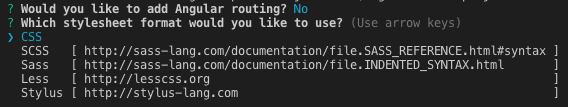
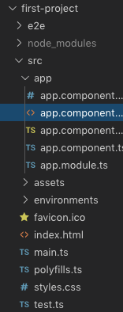
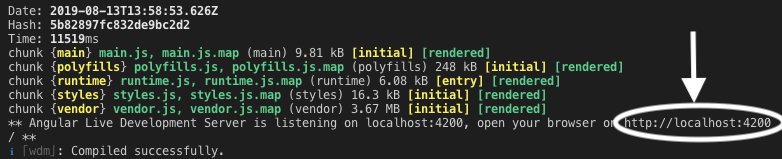
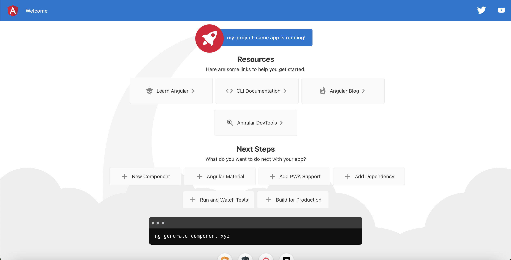

Angular First Steps
====================

The goal here is to create a minimum working template for a webpage. It will
serve as a jumping off point for your later exercises and studios, so take as
much time as you need to get comfortable with the basics.

Starting a New Project
-----------------------

First, use the terminal to create a folder for all of your Angular projects:

.. sourcecode:: bash

   $ mkdir folder_name

Each new project you create will have its own folder inside this container.

.. admonition:: Note

   You can use either the standalone Terminal application on your computer or
   the built-in Terminal panel in VSCode.

   For Angular projects, some programmers find it more convenient to work
   entirely inside VSCode or other code editor. The IDEs provide a visual tree
   for navigating between files and folders, and Angular generates LOTS of
   these.

Next, navigate into the new folder and create your first Angular project.

.. sourcecode:: bash

   $ cd folder_name
   $ ng new my-project-name

This process will take some time, so be patient. You will also be prompted
twice:

Answer "No" to the routing question, and select the default "CSS" for the
stylesheet by pressing "Enter".

Examine the Files Created
^^^^^^^^^^^^^^^^^^^^^^^^^^

#. The ``src`` folder holds the files and source code needed for the project.
#. The ``app`` folder holds the content for the webpage. Although the page is
   treated as a single entity, it actually consists of multiple pieces. ``app``
   holds these different parts and establishes links between them. We will
   modify some of these files soon.
#. ``index.html`` is the highest level for displaying content. Anything added
   to this HTML file will appear on every page within a website.
#. ``main.ts`` imports the core methods required to make everything work. It
   also imports the content from the ``app`` folder.
#. ``styles.css`` holds the global style settings for the entire website.

What To Ignore
^^^^^^^^^^^^^^^

For every new project, Angular automatically sets up the code to make the
different parts communicate with each other. As your skills grow over your
career, you may need to learn how to modify these files. For now, however,
leave the following alone:

#. ``main.ts``, ``test.ts``, and ``polyfills.ts``. No touch!
#. The ``e2e``, ``node_modules``, and ``environments`` folders. No touch!
#. ``.json`` files. No touch!

The ``assets`` folder is a "Maybe touch". It holds user defined files that
support a project. Examples include JavaScript code, images, gifs, or video
clips. The exercises in lesson 2 will use files stored in this folder, but for
this lesson we will leave it empty.

Launch the Page
----------------

``ng new`` creates all of the files required to launch a functioning webpage.
You have not added any content yet, but Angular provides a standard starting
point that allows you to check if everything works.

Before sending an Angular project out into the world, you should preview it
*locally* in a browser. Any changes you make to the project files will be
reflected only on your screen, so you can play around with the code without
worry.

.. admonition:: Note

   Even though you view your work in a browser, "local" means no one else can
   access your webpage, since it is stored on your computer. If you want to
   share your local page with someone else, they must look at your screen over
   your shoulder.

To *launch* your new webpage, use the Terminal to navigate into the project
folder, then enter the command ``ng serve``.

.. sourcecode:: bash

   $ cd my-project-name
   $ ng serve

Be prepared to wait... The compiler requires some time to build and deploy even
small projects, and it may be a few moments before you see any action in the
terminal. If no errors occur, a "Compiled successfully" message appears.

The important part of this feedback is the ``localhost`` line, which provides
a URL for viewing your work in a browser. Copy the URL and paste it into the
address bar of your web browser (Mac shortcut: command-click automatically
opens the URL in your default browser).

Yay! A Webpage!
----------------

Congratulations! You have a functioning webpage. This is the default format
created by ``ng new``, but your chosen project name will replace
``my-project-name`` in the title. The help links lead back to selected pages
from the `angular.io <https://angular.io/>`__ documentation.

Feel free to play around a little bit before continuing. Do not worry about
breaking anything. If necessary, you can always start another new project.

.. _try-it-Angular-intro:

.. admonition:: Try It!

   Examine the four files within the ``app`` folder. Modify the code to
   accomplish the following:

   #. Find where your project name is assigned to the ``title`` variable.
      Replace it with a different string.
   #. Change one ``h2`` heading to an ``h3``.
   #. Change the color for the *Welcome to...* heading.
   #. Change one of the links to send users to your favorite website.
   #. Replace the Angular shield with a different image.

   After making a change and saving your work, your webpage should automatically
   refresh.

   Take a moment to identify the files you modified.

``ng serve`` continues to run until you type "control+c" in the terminal. Go
ahead and interrupt the process.

Now let's take a look at the different project files.

Inside the ``app`` folder
--------------------------

One way to change the color of the *Welcome to...* heading would be to open the
``app.component.css`` file and add some styling:

.. sourcecode:: CSS
   :linenos:

   h1 {
      color: purple;
   }

We can freely modify this file, but the CSS instructions only affect the HTML
files within ``app``. Also, the code in ``app.component.css`` overrides the CSS
found in the higher level ``styles.css`` file.

This is the pattern for Angular. CSS instructions further down in the file tree
have higher priority. If ``app`` contained a subfolder with its own ``.css``
file, then those instructions would be applied to the HTML files within that
subfolder.

Let's examine the code contained in three other ``app`` files.

``app.component.html`` File
^^^^^^^^^^^^^^^^^^^^^^^^^^^^

.. admonition:: Example

   Here is a sample of the default content found in ``app.component.html``:

   .. sourcecode:: html
      :linenos:

      

         <h1>
            Welcome to {{ title }}!
         </h1>
         
      

      <h2>Here are some links to help you start: </h2>
      <ul>
         <!-- List items here... -->
      </ul>

``app.component.html`` contains the structure and some of the text seen on the
"Welcome to..." page. Note that line 3 contains the placeholder ``{{ title }}``
that gets filled with data passed in from another file.

``app.component.html`` serves as the main template for your webpage. This file
will usually NOT hold a lot of HTML code. Instead, it will contain many
placeholders for content defined elsewhere in the project.

Later in this chapter, you will learn how to add new components to the ``app``
folder as well as how to arrange them in the HTML file.

``app.component.ts`` File
^^^^^^^^^^^^^^^^^^^^^^^^^^

.. admonition:: Example

   ``app.component.ts``

   .. sourcecode:: TypeScript
      :linenos:

      import { Component } from '@angular/core';

      @Component({
         selector: 'app-root',
         templateUrl: './app.component.html',
         styleUrls: ['./app.component.css']
      })
      export class AppComponent {
         title = 'my-project-name';
      }

``app.component.ts`` performs several important functions with very few lines.

#. Line 4 defines the tag ``<app-root>``, which we can use in files that have
   imported the ``AppComponent`` class.
#. Line 5 imports ``app.component.html``, which we examined above.
#. Line 6 imports ``app.component.css``, which applies styling to the HTML
   file. (If you set a different color for the *Welcome to...* sentence in the
   Try It tasks above, this is why changing the css file worked).
#. Line 8 makes the styled ``.html`` file and anything defined in the
   ``AppComponent`` class available to other files.

Take a look at ``app.component.html`` again. We mentioned the ``{{ title }}``
placeholder earlier and said that it gets filled with data from a different
file. Line 9 in ``app.component.ts`` supplies this data by assigning the string
``'my-project-name'`` to the ``title`` variable. Changing ``'my-project-name'``
to a different value alters the webpage.

``app.module.ts`` File
^^^^^^^^^^^^^^^^^^^^^^^

.. admonition:: Example

   ``app.module.ts``

   .. sourcecode:: TypeScript
      :linenos:

      import { BrowserModule } from '@angular/platform-browser';
      import { NgModule } from '@angular/core';

      import { AppComponent } from './app.component';

      @NgModule({
         declarations: [ AppComponent ],
         imports: [ BrowserModule ],
         providers: [],
         bootstrap: [AppComponent]
      })
      export class AppModule { }

Just like before, there is a lot going on within very few lines.

#. Lines 1, 2, and 8 import and assign the core modules that make Angular
   work. This is part of the automatic process, so do not play with these
   (yet).
#. Line 4 imports the class ``AppComponent`` from the local file
   ``app.component.ts``.
#. Line 4 also pulls in references to any other files linked to
   ``app.component.ts``.
#. Line 7 declares the imported local files as necessary for the project.
#. Line 12 exports the ``AppModule`` class and makes it available to other
   files.

``app.module.ts`` does the main work of pulling in the core libraries and local
files. As new parts are added to a project, the import statements, ``imports``
array, and ``declarations`` array update automatically. We do not have to worry
about the details for adding this critical code ourselves.

Change The Content
-------------------

Enough detail. Let's explore some more.

If you did not complete all of the :ref:`Try It <try-it-Angular-intro>`
tasks above, attempt them now. After that...

.. admonition:: Try It!

   #. Run ``ng serve`` in the terminal to launch your webpage again.
   #. In ``app.component.ts``, declare and assign two variables in the
      ``AppComponent`` class---one to hold your name, and the second to hold an
      array that contains at least 4 items.
   #. Replace line 4 in ``app.component.html`` with ``<h1>{{name}}'s First
      Angular Project</h1>``. Save your work and then check to make sure the
      webpage shows the new heading.
   #. Modify the ``<li></li>`` elements in ``app.component.html`` to display the
      array items in an unordered list. Be sure to use placeholders.
   #. Define a rectangle object in ``AppComponent`` that has keys of ``length``,
      ``width`` and ``area``. Assign numbers to ``length`` and ``width``, and
      have ``area`` be a function that calculates and returns the area.
   #. Use a ``
`` tag in the html file to display the sentence, "The
      rectangle has a length of ___ cm, a width of ___ cm, and an area of ___
      cm^2." Use placeholders in place of the blanks so the webpage displays
      the correct numbers.

Filename pattern
-----------------

Many of the files we examined on this page contain the word ``component`` in
the name. This results from the fundamental idea behind Angular. Each
*template* for a webpage is constructed from smaller pieces, and these pieces
are the *components*.

Our next step is to take a closer look at these building blocks within a
template.

Check Your Understanding
-------------------------

.. admonition:: Question

   Where would be the BEST place to modify our code if we want a different font
   for any ``
`` text within a template?

   #. ``app.component.ts``
   #. ``app.component.html``
   #. ``app.component.css``
   #. ``app.module.ts``

.. admonition:: Question

   Where would be the BEST place to modify our code if we want to add a heading
   and an unordered list to the template?

   #. ``app.component.ts``
   #. ``app.component.html``
   #. ``app.component.css``
   #. ``app.module.ts``

.. admonition:: Question

   Where do we define a new HTML tag?

   #. ``app.component.ts``
   #. ``app.component.html``
   #. ``app.component.css``
   #. ``app.module.ts``
