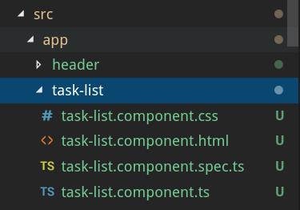
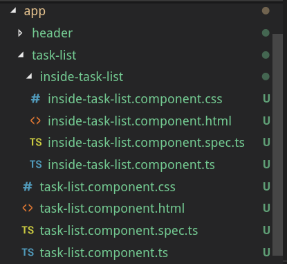

Components
===========

.. index:: ! angular-component

In Angular a **component** controls a patch of screen called a *view*.

Angular builds a web page by combining multiple components together.
Splitting our page into individual components makes our application more
organized. It also increases our ability to focus on one section of our web
application at a time.

Everything in Angular centers on the idea of building a webpage from separate,
smaller pieces. We must understand how to get these pieces to work together,
and that begins by exploring what makes up each individual component. In order
to build a reliable component, we must understand how each of its parts work
and interact.

Start Fresh
------------

In the terminal, navigate back to the ``angular_practice`` folder you created
on the :ref:`Angular First Steps <angular-first-steps>` page. Create a new
project called ``component-practice``.

.. sourcecode:: bash

   $ ng new component-practice

Open the ``app.component.html`` file in VSCode. Remove ALL of the code and
replace it with an empty ``div`` element.

.. sourcecode:: html
   :linenos:

   

   

OK, the stage is set for a closer look at components.

Component Files
---------------

Angular components consist of 4 files:

#. an HTML file (.html)
#. a CSS file (.css)
#. a typescript file (.ts)
#. a test file (.spec.ts)

.. figure:: ./figures/ComponentPieces.png
   :alt: Visual of the files associated with a component.

Looking at the file tree, we see that all four files contain the name of the
component---``header``, in this case. Also, the files are located in a folder
named after the component.

If we add a new component named ``task-list``, the four files created inside
the ``task-list`` folder would be called:

#. ``task-list.component.html``
#. ``task-list.component.css``
#. ``task-list.component.ts``
#. ``task-list.component.spec.ts``

Each file contains information specific to that component.
``task-list.component.html`` holds the HTML required for the task-list and no
other component. ``task-list.component.css`` only styles html within the
``task-list`` folder, the typescript code in ``task-list.component.ts`` only
applies to this component, and all the tests for ``task-list`` will be found
in ``task-list.component.spec.ts``.

Adding a New Component
----------------------

Each component is a smaller part of an overall web application. The main
component, ``app``, serves as a base structure, and it comes standard with all
Angular applications. It is the container that holds all of the other
components, and it organizes them into the web application.

When you generate a new component using the Angular CLI, it is automatically
added to ``app``. Let's explore how this process works.

``ng generate``
^^^^^^^^^^^^^^^^

To create a new Angular component, the terminal syntax is:

.. sourcecode:: bash

   $ ng generate component component-name

.. admonition:: Warning

   A common mistake is to create a new component in the wrong location, say in
   the ``src`` folder instead of in ``app``.

   ``ng generate`` places the new component folder within your current
   directory. Use the terminal to navigate to where you want the component to
   go BEFORE running the generate command.

Creating a ``task-list`` component looks something like this:

.. figure:: ./figures/GenerateComponent.png
   :alt: Visual of the terminal command to create a new Component.

From the output of the command we see that it creates four new files in the
``src/app/task-list`` folder.

Try It
^^^^^^^

#. Use the terminal panel in VSCode to navigate into the ``app`` folder.

   .. sourcecode:: bash

      $ ls
         first-project  component-practice
      $ cd component-practice
      $ cd src
      $ cd app
      $ ls
         app.component.css    app.component.spec.ts   app.module.ts
         app.component.html   app.component.ts

#. Run ``ng generate component task-list``.
#. Add a ``header`` component by running ``ng generate component header``.

When done, your file structure in VSCode should look something like:

``app.module.ts``
------------------

In order to communicate with the new components, ``app.module.ts`` needs new
``input`` statements. Fortunately, ``ng generate`` updates the code
automatically.

Before ``ng generate``:

.. sourcecode:: typescript
   :linenos:

   import { BrowserModule } from '@angular/platform-browser';
   import { NgModule } from '@angular/core';

   import { AppComponent } from './app.component';

   @NgModule({
      declarations: [ AppComponent ],
      imports: [ BrowserModule ],
      providers: [],
      bootstrap: [AppComponent]
   })
   export class AppModule { }

After generating the ``header`` and ``task-list`` components:

.. sourcecode:: typescript
   :linenos:

   import { BrowserModule } from '@angular/platform-browser';
   import { NgModule } from '@angular/core';

   import { AppComponent } from './app.component';
   import { TaskListComponent } from './task-list/task-list.component';
   import { HeaderComponent } from './header/header.component';

   @NgModule({
      declarations: [
         AppComponent,
         TaskListComponent,
         HeaderComponent
      ],
      imports: [ BrowserModule ],
      providers: [],
      bootstrap: [AppComponent]
   })
   export class AppModule { }

.. admonition:: Note

   Generating new components automatically updates ``app.module.ts``. However,
   if you *delete* a component, you must MANUALLY remove its ``import``
   statement and its name in the ``declarations`` array.

Arranging Components
---------------------

Run ``ng serve`` to launch the webpage. The page shows up empty because we
removed all of the code from ``app.component.html`` except for the ``div``
tags.

Modify ``app.component.html`` as follows:

.. sourcecode:: html
   :linenos:

   

      <app-header></app-header>
   

Save your change and wait for the webpage to refresh. You should now see the
text "header works!". This is another feature with Angular to let you know that
you properly added a new component.

Why ``<app-header></app-header>``? Open ``header.component.ts`` in VSCode:

.. sourcecode:: typescript
   :linenos:

   import { Component, OnInit } from '@angular/core';

   @Component({
      selector: 'app-header',
      templateUrl: './header.component.html',
      styleUrls: ['./header.component.css']
   })
   export class HeaderComponent implements OnInit {

      constructor() { }

      ngOnInit() {
      }
   }

Line 4 defines the HTML tag for the ``header`` component to be ``app-header``.
If we try changing the string to ``'orange'``, we would see the "header
works!" text disappear from the webpage. This is because the HTML tag
``<app-header>`` can no longer find the component.

Open ``header.component.html`` in VSCode:

.. sourcecode:: html
   :linenos:

   
header works!

Ah ha! The html file contains the text that appeared on our webpage. Anything
added to this file will appear between the ``<app-header></app-header>`` tags
in ``app.component.html``.

.. admonition:: Try It

   Replace line 1 in ``header.component.html`` with:

   .. sourcecode:: html
      :linenos:

      <h1>My header works!</h1>
      
This is not a header, but I'm adding it anyway.

      

         <h2>Look! A centered h2.</h2>
         
More centered text.

      

      
Not centered text.

Line 4 in ``header.component.ts`` defined the ``app-header`` tag, and
``task-list.component.ts`` does something similar for the ``task-list``
component.

Modify ``app.component.html`` as follows:

.. sourcecode:: html
   :linenos:

   

      <app-header></app-header>
      <app-task-list></app-task-list>
   

Your webpage should look similar to:

   TODO: Add screenshot.

.. admonition:: Try It

   Move ``<app-task-list></app-task-list>`` above ``<app-header></app-header>``
   and see what on the webpage.

Component Nesting
-----------------

Components can be put inside of other components. In essence, this is how the
main component works. It is the component that holds all other components.

However, sometimes you may want to nest a new component inside of another one
rather than in main.

Let's assume we want to add a new component within our ``task-list`` folder. In
this case we simply change into the ``task-list`` directory from our terminal
and then run the ``ng generate component`` command.

.. figure:: ./figures/GenerateNestedComponent.png
   :alt: Visual of the terminal command(s) to create a nested component.

Running this command nests our new folder inside of the ``task-list`` folder,
and it contains the four files we would expect.

When we nest a component inside of another, we still have all the files for
the nested component at our disposal. Any CSS, HTML, or JavaScript we write
will only affect the nested component and not the parent. However, the parent
component DOES influence the nested one. For example, any CSS within
``task-list.component.css`` will apply to both ``task-list.component.html`` and
``inside-task-list.component.html``. If we want ``inside-task-list`` to have
different styling, we need to add code to the ``inside-task-list`` CSS file to
override the parent.
