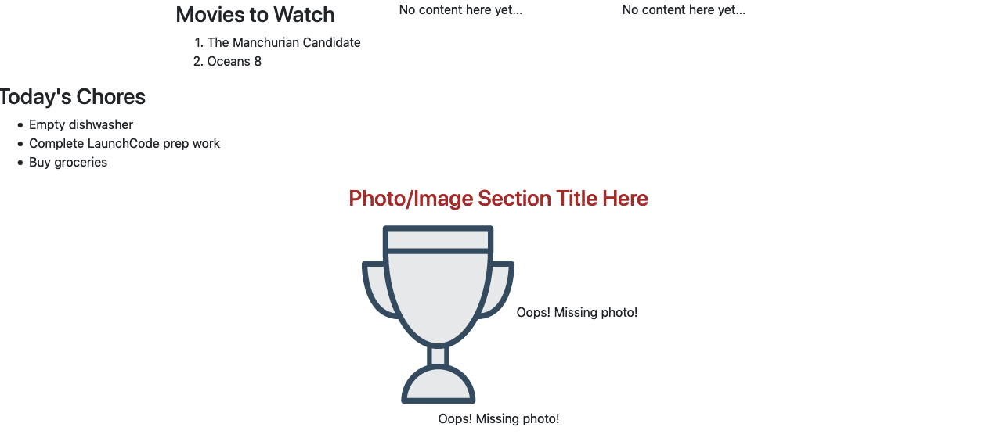
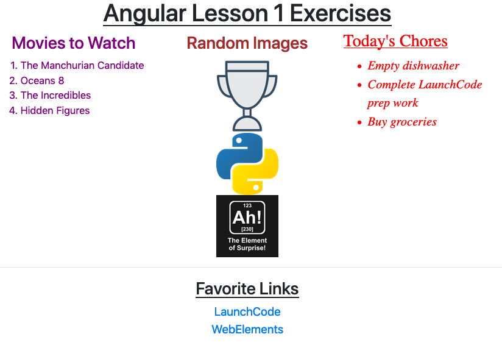

.. _angular-exercises-1:

Exercises: Angular, Lesson 1
=============================

The following exercises walk you through the process of modifying existing
components and generating new ones.

Starter Code
-------------

For this set of exercises, you will need a copy of the LaunchCode Angular
projects repository:

#. Login to your `GitHub account <https://github.com>`__.
#. Follow this link to the
   `angular-lc101-projects <https://github.com/LaunchCodeEducation/angular-lc101-projects>`__
   repo on GitHub.
#. Click the *Fork* button to copy the project to your GitHub account.
#. Click the *Clone* button and copy the project URL.

   .. figure:: ./figures/clone-Angular-repo.png
      :alt: Clone and fork buttons for Angular repository.

#. Open VSCode and use the terminal panel to navigate into your
   ``angular_practice`` folder.
#. Run ``git clone <project URL>``. Be sure to paste in the copied URL instead
   of typing ``<project URL>``.

The repository contains all of the starter code you will need for the examples
and exercises in Angular lessons 1, 2, and 3. Each lesson has its own folder,
so navigate into the lesson 1 exercises now:

.. sourcecode:: bash

   $ pwd
      angular_practice/angular-lc101-projects
   $ ls
      lesson1 lesson2 lesson3
   $ cd lesson1
   $ ls
      exercises
   $ cd exercises

The repository contains code but NOT the Angular modules necessary to launch
the webpage. In the terminal, run ``npm install`` to add these modules. Next,
enter ``ng serve`` and open the ``localhost`` URL in your browser.

The starter page should look like this:

The page is not pretty yet, but you get to fix that.

Part 1: Modify the CSS
-----------------------

The ``movie-list`` and ``chores-list`` components have been created, but so far
they appear pretty bland. Let's change that.

#. Change the movie list text by adjusting the code in
   ``movie-list.component.css`` to accomplish the following:

   #. The text for the heading and list items can be any color EXCEPT black.
      (HINT: Take advantage of the ``movies`` class).
   #. The movie list should have a centered heading.
   #. There should be at least 4 movie titles in an ordered list. Find the
      ``movies`` array in the ``MovieListComponent`` class and add more titles.
      Next, modify ``movies.component.html`` to display all the array entries.
   #. The font size should be large enough to easily read.

#. Change the chore list text by adjusting the code in
   ``chores-list.component.css`` to accomplish the following:

   #. Use a different font, with a size large enough to easily read.
   #. The text color should be different from the movie list, but not black.
   #. The chores list should have an underlined heading.
   #. The chores in the list should be italicized.

Complete the ``fav-photos`` Component
^^^^^^^^^^^^^^^^^^^^^^^^^^^^^^^^^^^^^^

3. The ``fav-photos`` component has been generated, but it is incomplete. The
   page needs more images, which also need to be smaller in size.

   #. In the ``FavPhotosComponent`` class, assign a better section heading to
      the ``photosTitle`` variable.
   #. The ``image`` variables should hold URLs for images, but only one is
      is filled in. Complete at least one more, which can be from the web or
      personal pictures. To copy the URL for an image on the web, right-click
      (or control-click) on the image and select the "Copy Image Location" menu
      option.
   #. In the ``.html`` file for this component, use placeholders in the ``img``
      tags to display your chosen images.
   #. Adjust the HTML to display one image per line.
   #. Use the ``.css`` file for this component to make all the images be the
      same size.
   #. Refresh the webpage to check the updated content.

Before moving on, save and commit your work.

Part 2: Add More Components
----------------------------

.. admonition:: Note

   You will be adding and modifying HTML elements for this project. If you need
   to review this topic, look back at the :ref:`HTML Tags <html-tags>` page, or
   try `W3Schools <https://www.w3schools.com/tags/>`__.

4. The page needs a title.

   #. Use the terminal to navigate into ``app`` folder.
   #. Generate the new component ``page-title``:

      .. sourcecode:: bash

         ng generate component page-title

   #. Open ``page-title.component.ts`` and note that the ``app-page-title`` tag
      has been defined next to ``selector``. Shorten the tag name to just
      ``page-title``.
   #. In the ``PageTitleComponent`` class, define a ``title`` variable and
      assign it a string.
   #. Add an ``<h1>`` to the ``page-title.component.html`` file. Use
      ``{{title}}`` as a placeholder for the title you defined. Style the text
      to be underlined and centered on the screen.
   #. Add the ``<page-title></page-title>`` element to ``app.component.html``.
   #. Save all of your changes and refresh the page to see your new content.

#. The page needs a set of links to favorite websites.

   #. Generate a ``fav-links`` component. Open ``fav-links.component.ts`` and
      shorten the tag name to just ``fav-links``.
   #. In the ``FavLinksComponent`` class, define the variable ``favLinks`` and
      assign it an array that contains two or more URLs.
   #. In the ``.html`` file for this component, add a set of ``<a>`` tags for
      the web links. Each link should be on its own line.
   #. Inside each ``<a>`` tag, set the ``href`` attribute equal to a
      placeholder for an element in the ``favLinks`` array:

      .. sourcecode:: html

         <a href = "{{placeholder}}">Link text...</a>

   #. Add ``<fav-links></fav-links>`` to ``app.component.html``. Save all of
      your changes, then refresh the page to see your new content.

.. admonition:: Note

   Opening the ``app.module.ts`` file shows that the components for the movies,
   chores, title, links, and photos have all been automatically imported and
   declared.

   Angular automatically takes care of updating ``app.module.ts`` when you
   generate new components. However, *deleting* a component does NOT remove the
   references from the file.

Part 3: Rearrange the Components
---------------------------------

The content on the page appears quite jumbled, since we gave you no guidance on
where to put the custom tags in ``app.component.html``. Fortunately, templates
allow us to easily move items around the framework.

6. Rearrange the tags ``fav-photos``, ``fav-links``, ``page-title``, etc. to
   create a specific page layout:

   #. ``app.component.html`` has ``
`` tags to set up a three-column row.
      Use this to arrange the movie list, images, and chore list.
   #. Center the title at the top of the page.
   #. Add a horizontal line below the three lists with the ``
`` tag.
   #. Center the links below the horizontal line.

Your final page should have this format (the dashed lines are optional):

.. figure:: ./figures/AngularLesson1Layout.png
   :alt: Angular Lesson 1 Exercises project.

Optional Final Touches
^^^^^^^^^^^^^^^^^^^^^^^^

7. To boost your practice, complete one or more of the following:

   #. Change the background to a decent color, image or pattern.
   #. Add a border around one or more of the components on the page.
   #. Add a fun, coding related gif to the page.

Sanity Check
-------------

The ``angular-lc101-projects`` repository contains two branches:

#. A ``master`` branch with all the starter code for lessons 1, 2, and 3.
#. A ``solutions`` branch with completed code.

If you get stuck on a particular exercise:

#. Try again.
#. Try again again.
#. Ask your TA, instructor, classmates, or Google for tips.
#. Try again.
#. Take a break and give your brain a chance to rest.
#. Try again.
#. Feel completely justified in switching to the ``solutions`` branch to check
   the code.

.. admonition:: Note

   If you jumped right to step 7, you missed out on a stellar learning
   opportunity.

