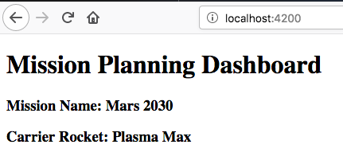
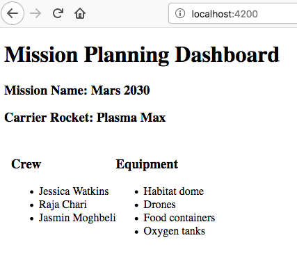

Studio: Angular, Part 1
=========================

In this chapter, you learned about the Angular file structure, templates, and
components. Over the next three classes, you will build a Mission Planning
Dashboard using your Angular skills.

Mission Planning Dashboard
---------------------------

A useful and common front end application is a *dashboard*. It shows a summary of
information about a topic, helping users of the web app make informed decisions.

You will create a Space Mission Planning Dashboard.

Setup
------

#. Fork the `Angular Lesson 1 Studio repository <https://github.com/LaunchCodeEducation/angular-lc101-mission-planner>`_.
#. Clone your fork to your computer.
#. Use ``git status`` to verify that you are on branch ``studio-1``.

   * Note that ``studio-1`` is a mostly empty branch.

Create Angular Project
^^^^^^^^^^^^^^^^^^^^^^^

#. Open a terminal at the root of the ``angular-lc101-mission-planner`` repository you just cloned.
#. Create a new Angular project by running ``ng new mission-planning-dashboard``.

   a. When prompted about using routing, enter "N" for No.
   b. When prompted to select the stylesheet format, select CSS.

::

   $ ng new mission-planning-dashboard
   ? Would you like to add Angular routing? No
   ? Which stylesheet format would you like to use? CSS

3. Navigate into the new folder by running ``cd mission-planning-dashboard``
#. Install dependencies by running ``npm install``
#. Verify that the application will run by running ``ng serve``
#. View the site in your browser at http://localhost:4200

   a. You should see a header that says "Welcome to mission-planning-dashboard!"

#. Stage and commit the files before starting on the features.

.. tip::

   You will likely still have ``ng serve`` running in your terminal. You can
   stop ``ng serve`` by pressing the keys "control+c", or you can open an
   additional terminal window to run the git commands.

Requirements
-------------

The mission dashboard you are creating will eventually look like this.

.. figure:: ./figures/example-mission-dashboard.png
   :alt: Screen shot showing the mission dashboard with mission name, rocket name, crew members, equipment, and experiments.

Update Starter Page Content
^^^^^^^^^^^^^^^^^^^^^^^^^^^^

The default stater page created by Angular contains default text, images, and links. Your job is to remove the default content.

#. Clear out the contents of file ``app.component.html``.
#. Type in the text ``Add components here...`` into ``app.component.html``.
#. Run ``ng serve`` if it's not already running.
#. View the app in your browser to verify the words "Add components here..." is the only thing that appears on the page.

Header Component
^^^^^^^^^^^^^^^^^

You need to create a component that shows the title, mission name, and carrier rocket.

#. In terminal navigate to the folder ``src/app`` folder.
#. Create a header component using ``ng g component header``.
#. In the file ``header.component.html`` add HTML:

.. sourcecode:: html+ng2
   :linenos:

   <h1>Mission Planning Dashboard</h1>
   <h3>Mission Name: {{ missionName }}</h3>
   <h3>Carrier Rocket: {{ rocketName }}</h3>

4. Add the variables ``missionName`` and ``rocketName`` to the header component in ``header.component.ts``

.. sourcecode:: TypeScript

   export class HeaderComponent implements OnInit {

       missionName: string = "Mars 2030";
       rocketName: string = "Plasma Max";

5. Add a reference to the header component in ``app.component.html``.

.. sourcecode:: html+ng2

   <app-header></app-header>

6. View the app in your browser to verify that the title, mission name, and rocket name are visible.

Crew Component
^^^^^^^^^^^^^^^

Next you need to make a component to show a list of crew members.

#. Create the component by running ``ng g component crew``.
#. Set the contents of ``crew.component.html`` to be:

   .. sourcecode:: html
      :linenos:

      <h3>Crew</h3>
      <ul>
         <li>Jessica Watkins</li>
         <li>Raja Chari</li>
         <li>Jasmin Moghbeli</li>
      </ul>

3. Add a reference to the header component in ``app.component.html``.

   .. sourcecode:: html+ng2

      <app-header></app-header>
      <app-crew></app-crew>

.. figure:: ./figures/example-crew-component.png
   :alt: Screen shot of browser showing address localhost:4200, which has a title of Mission Planning Dashboard, a Mission Name,a Carrier Rocket, a Crew header, and a list of crew members in an unordered list.

Equipment Component
^^^^^^^^^^^^^^^^^^^^

Now you need to create a component to show a list of equipment.

#. Create an equipment component named ``equipment``.
#. The component should display the following:

   a. An ``<h3>`` that contains "Equipment"
   b. A ``<ul>`` that contains ``<li>`` for: Habitat dome, Drones, Food containers, Oxygen tanks

#. Add the equipment component to ``app.component.html`` using the HTML below. Notice the ``
`` surrounding the crew and equipment components.

   .. sourcecode:: html+ng2
      :linenos:

      <app-header></app-header>
      

         <app-crew></app-crew>
         <app-equipment></app-equipment>
      

4. Add CSS to file ``app.component.css`` to horizontally align the crew and equipment lists. Without this CSS, the equipment list will appear below the crew list.

   .. sourcecode:: css
      :linenos:

      .box {
         display: flex;
         padding: 10px;
      }

.. note::

   A full explanation of ``display: flex;`` is beyond the scope of this book. For more information
   see `MDN flex box docs <https://developer.mozilla.org/en-US/docs/Web/CSS/CSS_Flexible_Box_Layout/Basic_Concepts_of_Flexbox>`_
   and `CSS Tricks flex box guide <https://css-tricks.com/snippets/css/a-guide-to-flexbox/>`_.

Experiments Component
^^^^^^^^^^^^^^^^^^^^^^

#. Finally, add an experiments component that contains the HTML below:

   .. sourcecode:: html
      :linenos:

      <h3>Experiments</h3>
      <ul>
         <li>Mars soil sample</li>
         <li>Plant growth in habitat</li>
         <li>Human bone density</li>
      </ul>

#. Make the list of experiments show up to the right of equipment list.

When done your dashboard should look like this:

.. figure:: ./figures/example-mission-dashboard.png
   :alt: Screen shot showing the mission dashboard with mission name, rocket name, crew members, equipment, and experiments.

Commit Your Work
-----------------

This repository will be used for the next two studios. Be sure to stage, commit, and push your changes. The next studio will start with a different branch.

#. Verify the branch and status of the files.
#. Commit your changes.
#. Push your commits to origin.

Bonus Mission
--------------

#. Display crew members by adding an array of crew names.

   a. In ``crew.component.ts`` add ``crew: string[] = ["Jessica Watkins", "Raja Chari", "Jasmin Moghbeli"];``
   b. In ``crew.component.html`` use references like ``<li>{{crew[0]}}</li>`` to
      display the crew names.

#. Use CSS to add different colors, fonts, borders, etc. to your dashboard.
#. Move the components around to see how that affects the display of the data.
