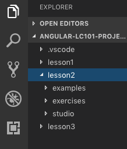

Angular Directives
===================

In the :ref:`DOM chapter <DOM-and-events>` you learned how to wait for *events*
and then change the appearance of the webpage in response. You practiced these
skills in the :ref:`DOM studio <DOM-studio>`. By waiting for the users to click
specific buttons, your code launched, guided, and landed the LaunchCode rocket.

.. index:: ! directive

Angular helps us manage website content and manipulate the DOM through the use
of *directives*. These simplify DOM changes by giving us alternatives to
``getElementById``, ``addEventListener``, ``innerHTML``, etc.

There are three types of Angular directives:

#. **Components**: These control how a set of data gets displayed within a
   template.
#. **Structural directives**: These change the layout of the DOM by adding or
   removing elements (``div``, ``ul``, ``a``, ``li``, etc.).
#. **Attribute directives**: These change the appearance of a specific element
   within the DOM.

We learned how to generate and modify components in the
:ref:`last chapter <angular-1>`. In this lesson, we will focus on how to use
structural directives to enhance our work.

Open the Lesson 2 Folder
-------------------------

If you have not yet forked the Angular lessons repo, follow the directions
given in :ref:`lesson 1 <angular-1>`.

Open the ``angular-lc101-projects`` folder in VSCode and find ``lesson2`` in
the sidebar.

Open the terminal panel and navigate to the lesson2 folder. You should find
subfolders for the examples, exercises, and studio used in this chapter. Also,
solutions to some of the tasks are located in the ``example-solutions`` branch.

.. sourcecode:: bash

   $ ls
      lesson1 lesson2 lesson3
   $ cd lesson2
   $ ls
      examples        exercises
   $ git branch
      example-solutions
      * master
