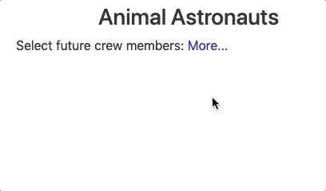

Events
=======

Recall that *events* are actions that allow users to interact with the
content on a webpage. Events include clicks, key presses, typing into an input
box, hovering over images, etc.

*Handling* an event performs an action that influences the DOM.

Structural directives like ``*ngFor`` and ``*ngIf`` can be combined with events
in order to add or remove content in response to user input. The image below
shows an example of this idea.

When the user clicks "More" the hidden part of the text will be displayed. The
layout of the page responds to the user's actions. The click *event* is
*handled* by showing more text.

.. _angular-events:

Angular Events
---------------

In the :ref:`Event Listeners <event-listeners>` section of the DOM chapter, we
learned the syntax for using ``addEventListener`` and choosing the event we
want.

Angular uses a different approach to listen for events. The event name is
placed in parentheses ``()`` and added inside an HTML tag. This *binds* the
event to that element.

The more common events include:

#. ``(click)``: Waits for the user to click on the element.
#. ``(keyup)``: Waits for the user to release a key.
#. ``(keydown)``: Waits for the user to press a key.
#. ``(mouseover)``: Waits for the user to move the cursor over the element.

Syntax
^^^^^^^

To bind an event to an HTML tag, the general syntax is:

::

   <tag (event) = "statement"></tag>

The ``statement`` is the action we want to take when the event occurs. This
could be a function call, a variable assignment, or just a value.

.. admonition:: Examples

   #. This code waits for the user to click the "Submit" button and then calls the
      ``addData`` function:

      .. sourcecode:: html+ng2

         <button (click) = "addData(arguments)">Submit</button>

   #. This code waits for the user to move the mouse over the element and then
      sets the ``choice`` variable equal to the value of ``option``:

      .. sourcecode:: html+ng2

         
{{option}}

   #. This code just waits for any key to be pressed:

      .. sourcecode:: html+ng2

         
Press Any Key

