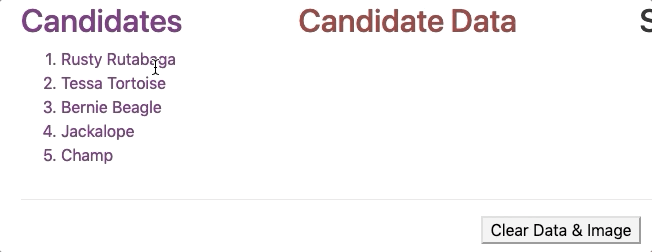

.. _exercises-angular-lsn2:

Exercises: Angular, Lesson 2
============================

Let's build an interactive web page that allows us to review data for our
astronaut candidates and select crew members for a space mission.

Starter Code
------------

The starter code for the exercises is in the same
`repository <https://github.com/LaunchCodeEducation/angular-lc101-projects>`_ that you cloned
for the chapter examples.

.. admonition:: Note

   Remember that the repository contains a ``master`` branch with all the
   starter code as well as a ``solutions`` branch showing the completed
   exercises.

   The solutions provide a resource for you to check if you get stuck. However,
   for best results you should make a *valiant* attempt at solving the tasks
   before looking at "the answers".

   Also, if your code works but is different from the solutions, that is OK.
   There are usually multiple ways of solving the same problem.

From the ``lesson2`` folder in VSCode, navigate into the
``exercises/src/app/candidates`` folder. Open the
``candidates.component.html`` and ``candidates.component.ts`` files.

.. figure:: ./figures/lesson2-exercises-menu.png
   :alt: Access lesson 2 exercises in VSCode.

In the terminal, navigate into the lesson 2 ``exercises`` folder. Enter
``npm install`` to add the Angular modules, then run ``ng serve``. When you
open the web page in your browser, it should look like this:

.. figure:: ./figures/lesson2-exercises-start.png
   :alt: Starting setup for exercises.


.. _exercises-angular-lsn2-candidates-column:

Candidates Column
-----------------

Examine the ``candidates`` array in ``candidates.component.ts``. It contains
one object for each animal astronaut. We want to start by listing the names of
the animals in the "Candidates" column of the web page.

#. Find the "Candidates" section in ``candidates.component.html``. Use
   ``*ngFor`` in the ``<li>`` tag to loop over the ``candidates`` array and
   display each name in an ordered list.

   :ref:`Check your solution <angular-lsn2-exercise-solutionsA>`.

#. We want each name to be interactive. Add a ``click`` event to the ``<li>``
   tag. When a user clicks on a name, set the variable ``selected`` to be equal
   to the chosen candidate.

Properly done, your output should behave something like this:

.. figure:: ./figures/lesson2-exercises-candidates.gif
   :alt: Candidate results.


.. _exercises-angular-lsn2-candidate-data-column:

Candidate Data Column
----------------------

When we click on a candidate's name, we want their information to appear in the
"Candidate Data" column. If no candidate is selected, we want the space under
the heading to remain blank.

#. In the ``<p></p>`` element underneath the "Candidate Data" heading, add
   labels for a candidate's ``Name``, ``Age``, ``Mass``, and ``Sidekick``.

   :ref:`Check your solution <angular-lsn2-exercise-solutionsB1>`.

#. Add placeholders to display the candidate's data next to each label.
#. Use ``*ngIf`` inside the ``<p>`` tag to check if a candidate has been
   selected. If so, display the labels and the data.

   :ref:`Check your solution <angular-lsn2-exercise-solutionsB3>`.
   
#. Next, create a way to clear the data. In the ``<button>`` tag for "Clear
   Data & Image", add a ``click`` event that sets ``selected`` to ``false``.

Properly done, your output should behave something like this:




.. _exercises-angular-lsn2-sidekick-image-column:

Sidekick Image Column
----------------------

Every good hero needs a loyal sidekick, and our candidates are no exception!

When we click on a candidate's name, we want an image of their sidekick to
appear under the "Sidekick" column. If no candidate is selected, we want this
area to remain blank.

#. In the ```` tag, use ``*ngIf`` to check if a candidate has been
   selected.

   :ref:`Check your solution <angular-lsn2-exercise-solutionsC>`.

#. Replace the generic ``{{placeholder}}`` with the ``image`` property of the
   candidate.

Properly done, your output should behave something like this:

.. figure:: ./figures/lesson2-exercises-sidekicks.gif
   :alt: Sidekick image results.


.. _exercises-angular-lsn2-selected-crew-column:

Selected Crew Column
--------------------

Once we select a candidate, we want an option to add them to the crew of the
next space mission.

#. In ``candidates.component.ts``, code an ``addToCrew`` function that takes an
   *object* as a parameter.

   :ref:`Check your solution <angular-lsn2-exercise-solutionsD1>`.

#. If the candidate is NOT part of the crew, the function should push them into
   the ``crew`` array. Candidates who are already part of the crew should be
   ignored.
#. In ``candidates.component.html``, add a "Send on Mission" button next to the
   "Clear Data & Image" button.

   :ref:`Check your solution <angular-lsn2-exercise-solutionsD3>`.

#. Add a ``click`` event to the button to call the ``addToCrew`` function. When
   clicked, pass the selected candidate as the argument.
#. Under the "Selected Crew" section, use ``*ngFor`` to loop over the ``crew``
   array and display each name.

   :ref:`Check your solution <angular-lsn2-exercise-solutionsD5>`.
   

Clear Crew List
^^^^^^^^^^^^^^^

6. Add a "Clear Crew List" button under the "Selected Crew" list.
#. This button should only appear when the ``crew`` array contains data. Use
   ``*ngIf`` to make this happen.

   :ref:`Check your solution <angular-lsn2-exercise-solutionsD7>`.

#. Add a ``click`` event that clears the ``crew`` array.

Properly done, your output should behave something like this:

.. figure:: ./figures/lesson2-exercises-crew.gif
   :alt: Crew list results.

Bonus Missions
--------------

Fine Tune the Buttons
^^^^^^^^^^^^^^^^^^^^^

#. Update the ``Send on Mission`` button to appear only if a candidate has been
   selected.
#. Make the ``Send on Mission`` button disappear if the selected candidate is
   already part of the crew.
#. Make the ``Send on Mission`` button disappear once three crew members have
   been assigned to the mission.

Change the Mission Name
^^^^^^^^^^^^^^^^^^^^^^^^

We can make the Mission Name heading interactive. When clicked, we want to
present the user with an input box to enter a new name.
For this exercise, the ``ng-template`` code you need is at the bottom of ``candidates.component.html``.

#. Replace line 2 in ``candidates.component.html`` with
   ``<h2 class="centered" *ngIf = "!editMissionName; else editMission" (click)="editMissionName = true">Mission Name: {{missionName}}</h2>``.
#. When clicked, the ``ng-template`` code executes. Update the ``input`` tag
   with a ``keyup.enter`` event. The event should call the
   ``changeMissionName`` function and pass the new name as an argument.
#. In ``candidates.component.ts``, code a ``changeMissionName`` function to
   update the name of the mission.
#. After changing the mission name, set ``editMissionName`` to ``false``.

Bonus Results
--------------

After finishing the bonus missions, your output should behave something like
this:

.. figure:: ./figures/lesson2-exercises-full-solution.gif
   :alt: Bonus content behavior.
