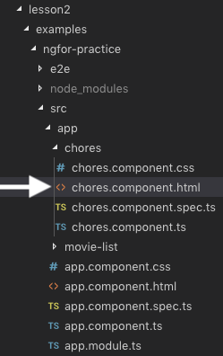
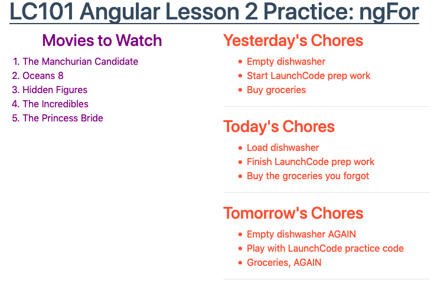

``ngFor``
==========

In the :ref:`Angular lesson 1 exercises <angular-exercises-1>`, you modified
a ``movie-list`` component to display a series of titles. The final code
within ``movie-list.component.html`` probably looked something like:

.. sourcecode:: html
   :linenos:

   

      <h3>Movies to Watch</h3>
      <ol>
         <li>{{movies[0]}}</li>
         <li>{{movies[1]}}</li>
         <li>{{movies[2]}}</li>
         <li>{{movies[3]}}</li>
      </ol>
   

``movies[0]`` - ``movies[3]`` reference an array assigned within the
``movie-list.component.ts`` file.

To change the number of movie titles displayed in the ordered list, we could
manually add or remove ``li`` tags, or we could use the structural directive
``ngFor`` to iterate through the movie options.

``ngFor`` Syntax
-----------------

The example below shows the basic approach for using ``ngFor`` to iterate
through the contents of an array. For a more detailed guide to using ``ngFor``
and all of its variations, refer to the following resources:

#. `Angular documentation <https://angular.io/guide/template-syntax#ngFor>`__,
#. `Malcoded website <https://malcoded.com/posts/angular-ngfor/>`__.

Just like a ``for`` loop in JavaScript requires a specific syntax in order to
operate, loops in Angular must follow a set of rules. Let's explore these rules
by adding ``ngFor`` to our movie list code.

.. sourcecode:: html+ng2
   :linenos:

   

      <h3>Movies to Watch</h3>
      <ol>
         <li *ngFor = "let movie of movies">{{movie}}</li>
      </ol>
   

Some items to note:

#. Structural directives all begin with the ``*`` symbol.
#. The string ``"let movie of movies"`` provides the instructions
   for running the loop.

   a. The ``let`` keyword declares the ``movie`` variable.
   b. ``of movies`` sets ``movie`` equal to the first element of the ``movies``
      array. Each iteration of the loop sets ``movie`` equal to the next title
      in the array.

#. The ``*ngFor`` statement is placed INSIDE the ``<li>`` tag.
#. ``{{movie}}`` is the placeholder for the current value of ``movie``.

By placing the ``*ngFor`` statement inside the tag, the loop generates
multiple ``<li></li>`` elements. Each iteration adds a new list item to the
HTML code, one for each title in the ``movies`` array.

.. admonition:: Warning

   The ``*ngFor`` statement generates a new HTML tag for each item in the
   array. *Be careful where you put the statement!* If we had added
   ``*ngFor = "let movie of movies"`` to the ``<h3>`` tag, then the ``Movies
   To Watch`` title would have been repeated multiple times.

In general, the syntax for ``*ngFor`` is:

::

   *ngFor = "let variableName of arrayName"

Where ``variableName`` is the loop variable, and ``arrayName`` represents the
array to iterate through.

.. admonition:: Note

   ``*ngFor`` only operates over the contents of an array. If we want to
   iterate over the characters in a string, we must first convert it into an
   array.

   There is a technique for iterating over the key/value pairs of an object,
   but that is a more advanced topic. We will not discuss that method here.

Try It
-------

From the ``lesson2`` folder in VSCode, open the
``examples/ngfor-practice/src/app/chores`` folders and select the
``chores.component.html`` file.

The starter code should match this:

.. sourcecode:: html
   :linenos:

   

      <h3>Chores To Do Today</h3>
      <ul>
         <li>{{chores[0]}}</li>
         <li>{{chores[1]}}</li>
         <li>{{chores[2]}}</li>
      </ul>
      

   

In the VSCode terminal window, navigate to the ``ngfor-practice`` folder.

.. sourcecode:: bash

   $ pwd
      angular-lc101-projects/lesson2
   $ ls
      examples        exercises
   $ cd examples
   $ ls
      input-practice  ngfor-practice  ngif-practice
   $ cd ngfor-practice

Once you are in the folder, enter ``npm install`` in the terminal. This will
add all of the Angular modules needed to run the project.

Enter ``ng serve`` to launch the project, then:

#. Modify ``chores.component.html`` with ``*ngFor`` to loop over the ``chores``
   array:

   a. Replace line 4 with
      ``<li *ngfor = "let chore of chores">{{chore}}</li>``.
   b. Delete lines 5 and 6.
   c. Save your changes.
   d. Reload the web page to verify that all the chores are displayed.

#. Open ``chores.component.ts``. Add "Clean bathroom" to the ``chores``
   array, then save. Reload the web page to make sure the new chore appears.
   Your output should look like this:

   .. figure:: ./figures/clean-bathroom-solution.png
      :alt: *ngFor first solution.

#. Remove two chores from the array. Reload the web page to make sure these
   items disappear from the list.
#. Use ``*ngFor`` within the ``
`` tag to loop over the ``todoTitles``
   array:

   a. Replace line 1 with
      ``
``.
   b. Replace "Chores To Do Today" in line 2 with a placeholder for ``title``.
   c. Save your changes, then reload the page. Properly done, your page should
      look something like:

   .. figure:: ./figures/chore-list-solution.png
      :alt: *ngFor practice solution.

#. Return to ``chores.component.ts``. Add an item to the ``todoTitles`` array,
   then save. Check to make sure another list appears on the web page. Next,
   remove two items from the ``todoTitles`` array. Save and make sure the page
   reflects the changes.

What If
^^^^^^^^

#. What if you placed the ``*ngFor`` statement inside the ``<h3>`` tag instead
   of the ``
`` tag? Try it and see what happens!
#. What if you placed the statement inside the ``<ul>`` tag instead? Try it!

Bonus What If
^^^^^^^^^^^^^^

What if we want to have different chores listed for Yesterday, Today, and
Tomorrow?

Accomplishing this task is OPTIONAL, but it boosts your skill level and makes
your page look better.

#. In the ``chores.component.ts`` file, replace the ``chores`` and
   ``todoTitles`` arrays with the following array of *objects*:

   .. sourcecode:: JavaScript
      :linenos:

      chores = [
         {title: "Yesterday's Chores", tasks: ['Empty dishwasher', 'Start LaunchCode prep work', 'Buy groceries']},
         {title: "Today's Chores", tasks: ['Load dishwasher', 'Finish LaunchCode prep work', 'Buy the groceries you forgot']},
         {title: "Tomorrow's Chores", tasks: ['Empty dishwasher AGAIN', 'Play with LaunchCode practice code', 'Groceries AGAIN']},
      ]

#. Update line 1 in ``chores.component.html`` to access each *object* in the
   ``chores`` array:

   a. ``
``
   b. Each iteration, ``list`` will be assigned a new object with ``title``
      and ``tasks`` properties.

#. Update the placeholder in line 2 to access the ``title`` property of
   ``list``.
#. Update line 4 to loop over the ``tasks`` array:
   ``<li *ngFor = 'let chore of list.tasks'>``.

Check Your Understanding
--------------------------

The following questions refer to this code sample:

.. sourcecode:: html
   :linenos:

   

      <h3>My Pets</h3>
      <ul>
         <li>{{pet}}</li>
      </ul>
   

Assume that we have defined a ``pets`` array that contains 4 animals.

.. admonition:: Question

   Adding ``*ngFor = 'let pet of pets'`` to the ``<li>`` tag produces:

   #. 4 headings
   #. 4 unordered lists
   #. 4 list items
   #. 4 headings each with 4 list items

.. admonition:: Question

   Moving ``*ngFor = 'let pet of pets'`` from the ``<li>`` tag to the ``
``
   tag produces:

   #. 1 heading and 4 unordered lists with 4 pets each
   #. 4 headings and 4 unordered lists with 4 pets each
   #. 1 heading and 4 unordered lists with 1 pet each
   #. 4 headings and 4 unordered lists with 1 pet each
