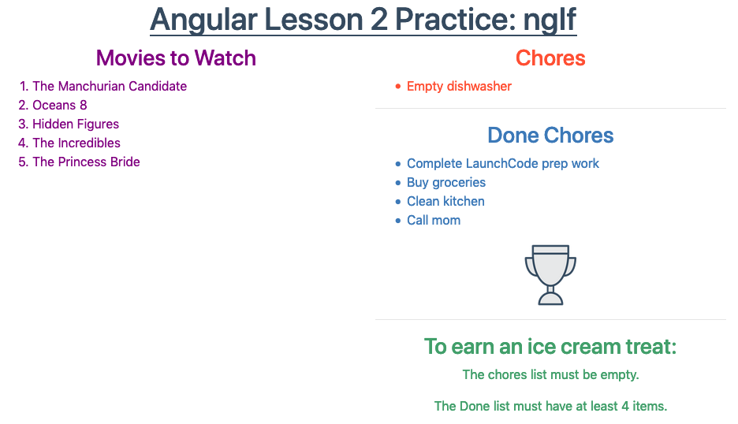

``ngIf``
=========

The ``*ngIf`` structural directive evaluates a boolean expression and then
adds or removes elements from the DOM based on the result.

The examples below show the basic usage of ``*ngIf``. If you want to explore
more details about this directive, refer to the following resources:

#. `Angular documentation <https://angular.io/guide/template-syntax#ngif>`__.,
#. `Malcoded website <https://malcoded.com/posts/angular-ngif-else/>`__.

``*ngIf`` Syntax
-----------------

In general, the syntax for ``*ngIf`` is:

::

   *ngIf = "condition"

``*ngIf`` statements are added inside an HTML tag. The ``condition`` can either
be a boolean or an expression that returns a boolean. If ``condition``
evaluates to ``true``, then the HTML tag is added to the webpage, and the
content gets displayed. If ``condition`` returns ``false``, then the HTML tag
is NOT generated, and the content stays off the webpage.

.. admonition:: Note

   ``*ngIf`` determines if content is *added or removed* from a page. This is
   different from determining if content should be *displayed or hidden*.

   *Hidden* content still occupies space on a page and requires some amount of
   memory. *Removed* content is absent from the page---requiring neither space
   on the page nor memory. This is an important consideration when adding
   items like images or videos to your website.

.. admonition:: Example

   Let's modify our movie list code as follows:

   .. sourcecode:: html+ng2
      :linenos:

      
 3">
         <h3>Movies to Watch</h3>
         <ol>
            <li *ngFor = "let movie of movies">{{movie}}</li>
         </ol>
      

Adding the ``*ngIf`` statement inside the ``
`` tag determines whether
that element and any content it contains gets added to the webpage. If the
condition ``movies.length > 3`` evaluates to ``true``, then the ``div``,
``h3``, ``ol``, and ``li`` tags all get generated. If the condition returns
``false``, then none of the tags are added to the HTML code.

Logical Operators With ``*ngIf``
^^^^^^^^^^^^^^^^^^^^^^^^^^^^^^^^^

Just like ``if`` statements, we can use the operators AND (``&&``), OR
(``||``), and NOT (``!``) to modify the condition checked by ``*ngIf``.

.. admonition:: Examples

   Logical AND:

   .. sourcecode:: html+ng2

      
Some text

   ``Some text`` appears on the webpage only if ``conditionA`` and
   ``conditionB`` both return ``true``.

   Logical OR:

   .. sourcecode:: html+ng2

      
Some text

   ``Some text`` appears on the page if either ``conditionA`` or ``conditionB``
   return ``true``.

   Logical NOT:

   .. sourcecode:: html+ng2

      
Some text

   ``Some text`` appears when ``arrayName.length == 0`` returns ``false``,
   since the ``!`` operator flips the result. If the array is empty, then
   nothing gets added to the webpage.

   Note that the Angular syntax uses ``==`` rather than the ``===`` we prefer
   in JavaScript.

What About ``if/else``?
^^^^^^^^^^^^^^^^^^^^^^^^

With JavaScript, we know how to use an ``if/else`` block to decide which set of
code to execute:

.. sourcecode:: JavaScript
   :linenos:

   if (num >  5) {
      //Execute this code if num is greater than 5.
   } else {
      //Execute this code if num is NOT greater than 5.
   }

We can do the same thing in Angular to decide which set of HTML tags to
generate. Unfortunately, setting this up with ``*ngIf`` is not as efficient.

The general syntax for adding an ``else`` block in Angular is:

.. sourcecode:: html+ng2
   :linenos:

   <someTag *ngIf = "condition; else variableName">
      <!-- HTML tags and content --->
   </someTag>

   <ng-template #variableName>
      <!-- Alternate HTML tags and content --->
   </ng-template>

Note that the ``#`` is required inside the ``ng-template`` tag.

.. admonition:: Example

   Let's modify the movie list example to create an alternate set of HTML tags
   if ``movies.length > 3`` returns ``false``.

   .. sourcecode:: html+ng2
      :linenos:

      
 3; else needMoreMovies">
         <h3>Movies to Watch</h3>
         <ol>
            <li *ngFor = "let movie of movies">{{movie}}</li>
         </ol>
      

      <ng-template #needMoreMovies>
         

            <h3>Not Enough Movies!</h3>
            
You only have {{movies.length}} movies on your watch list!

            
What's up with that?

            
You need to purchase expensive popcorn more often.

         

      </ng-template>

In line 1, the condition for ``*ngIf`` specifies what to do if
``movies.length > 3`` returns ``true`` or ``false``:

#. If ``true``, Angular executes lines 1 - 6.
#. If ``false``, Angular searches for alternate code labeled with the name
   ``needMoreMovies``. In this case, Lines 9 - 14 hold the alternate HTML tags.

``<ng-template></ng-template>`` is a special Angular element. It contains
content that *might* be required for a webpage. When the ``else`` statement in
line 1 executes, Angular searches for an ``ng-template`` block labeled with the
matching variable name. Angular then ignores the original ``div`` tags and
anything they contain, and it replaces that content with lines 9 - 14.

Try It
-------

In VSCode, return to your Angular Lesson 2 project. Use the terminal panel to
commit any changes to your ``*ngFor`` work, then switch to the
``ngif-practice`` folder.

.. sourcecode:: bash

   $ cd ..
   $ ls
      ngfor-practice  ngif-practice
   $ cd ngif-practice

In VSCode, open the ``chores.component.html`` file from the ``ngif-practice``
folder:

.. figure:: ./figures/ngif-menu.png
   :alt: Find the ngIf practice file in VSCode.

The code should look like this:

.. sourcecode:: html+ng2
   :linenos:

   

      <h3>Chores</h3>
      <ul>
         <li *ngFor = 'let chore of chores'>{{chore}}</li>
      </ul>
   

   

   

      <h3>Done Chores</h3>
      <ul>
         <li *ngFor = 'let done of finishedChores'>{{done}}</li>
      </ul>
   

   

Enter ``ng serve`` in the terminal to launch the project, then use ``*ngIf`` to
do the following:

#. Display the text "Work harder!" under the ``Chores`` list if the length of
   the ``chores`` array is longer than the length of the ``finishedChores``
   array. Use a ``p`` tag for the text and make the words a different color.
#. Find the ``chores`` and ``finishedChores`` arrays in ``chores.component.ts``
   and modify the number of items. Save your changes and reload the page to
   verify that your code works.
#. If the ``chores`` array is empty OR the ``finishedChores`` array has at
   least 3 more items than the ``chores`` array, display ``trophyImage`` under
   the ``Done`` list. Otherwise, use a ``p`` tag to display the text, "No
   allowance yet."
#. Return to ``chores.component.ts`` and change the number of items in the
   arrays again. Check to make sure the webpage correctly responds to your
   changes.
#. Finally, if the ``chores`` array is empty AND ``finishedChores`` contains
   4 or more items, display an ``h1`` underneath the lists with the text "Ice
   cream treat!". Otherwise, display ``h3`` and ``p`` elements that describe
   how to earn ice cream.

Properly done, your page should look something like:

Check Your Understanding
--------------------------

Lorem ipsum...
