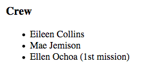
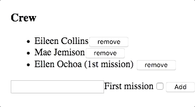

Studio: Angular, Part 2
=======================
At the end of the first mission planner studio, multiple components display data about the mission.
Your job is to allow the user to update the mission plan by adding user interaction.

Getting Started
---------------
This studio uses the same mission planner repository as Angular studio part 1.

#. Open the `mission planner repository <https://github.com/LaunchCodeEducation/angular-lc101-mission-planner>`_ in VSCode
#. Run ``git status`` to see if you have any uncommitted work, if you do resolve it
#. Checkout the ``studio-2`` branch
#. Run ``npm install`` to download dependencies

Review the Starter Code
-----------------------
The starter code for this studio is similar to the *solution* for first mission planner studio, with a few changes.

Editable Mission Name
^^^^^^^^^^^^^^^^^^^^^
The mission name can now be edited by clicking on the text, changing the text in the input box, and then updated by clicking save
or pressing the enter key. Review the code in ``src/app/header/header.component.html`` and ``src/app/header/header.component.ts`` to see how this
feature was implemented.

.. figure:: figures/edit-mission-name.gif
       :alt: Animated gif of mission name being clicked, edited, and then saved.

       Example of mission name being edited.

Crew Array of Objects
^^^^^^^^^^^^^^^^^^^^^
Open ``src/app/crew/crew.component.ts`` in VSCode.
Notice on line 10 that a crew array is defined. This array of objects will be used to display
the crew. Each crew member has a ``name`` and ``firstMission`` property. If ``firstMission`` is ``true``,
it means this is the first mission for that person.

.. sourcecode:: TypeScript
   :linenos:

   import { Component, OnInit } from '@angular/core';

   @Component({
      selector: 'app-crew',
      templateUrl: './crew.component.html',
      styleUrls: ['./crew.component.css']
   })
   export class CrewComponent implements OnInit {

      crew: object[] = [
         {name: "Eileen Collins", firstMission: false},
         {name: "Mae Jemison", firstMission: false},
         {name: "Ellen Ochoa", firstMission: true}
      ];

      constructor() { }

      ngOnInit() {
      }

   }

Requirements
------------

.. note::  All of these features only temporarily alter the data. If you refresh the page, the original data will appear.

Edit Rocket Name
^^^^^^^^^^^^^^^^
The rocket name should be clickable and editable like the mission name. Alter ``src/app/header/header.component.html``
and ``src/app/header/header.component.ts`` to allow the user to edit the rocket name.

Use ``*ngFor`` to Display Crew
^^^^^^^^^^^^^^^^^^^^^^^^^^^^^^
Replace the static list of ``<li>`` tags in ``src/app/crew/crew.component.html`` with an ``*ngFor`` that loops over the ``crew`` array.

Add this code to ``src/app/crew/crew.component.html``.

.. sourcecode:: html+ng2
   :linenos:

   <li *ngFor="let member of crew">{{member.name}}</li>

Display 1st Mission Status
^^^^^^^^^^^^^^^^^^^^^^^^^^
If a crew member's ``firstMission`` property is ``true``, then display the text - 1st next to their name.

       Example of first mission status being shown.

Add Crew Members
^^^^^^^^^^^^^^^^
Allow crew members to be added to the list. To create a new crew member, two pieces of information need to be input first is a name and
second is the first mission status. To capture that data an input and a checkbox need to be added to ``src/app/crew/crew.component.html``.

.. figure:: figures/add-crew.gif
       :alt: Animated gif of crew member being added to list after add button is clicked.

       Example of crew member being added.

Add this code to the *bottom* of ``src/app/crew/crew.component.html``.

.. sourcecode:: html+ng2
   :linenos:

   <input #name type="text"/>
   <label>First mission<input #firstMission type="checkbox"/></label>
   <button (click)="add(name.value, firstMission.checked)">Add</button>

On line 1 there is an input that declares a local variable named ``#name``. On line 2 a checkbox is defined that declares a ``#firstMission``
variable. On line 3 there is a button that when clicked sends the value of the name input and checkbox value to a function defined in ``src/app/crew/crew.component.ts``.

Add the below ``add`` function to the crew component in file ``src/app/crew/crew.component.ts``.

.. sourcecode:: TypeScript
   :linenos:

   add(memberName: string, isFirst: boolean) {
     this.crew.push({name: memberName, firstMission: isFirst});
   }

Remove Crew Members
^^^^^^^^^^^^^^^^^^^
Allow removing of crew members by adding a remove button next to each person in the crew list.
When the remove button is clicked a remove function in the crew component will be called which
will remove that person from the crew array.

.. figure:: figures/remove-crew.gif
       :alt: Animated gif of crew member disappearing from the list after the remove button for that item is clicked.

       Example of crew member being removed.

Add line 3 to file ``src/app/crew/crew.component.ts``. Be sure to put it before the closing ``</li>``,
so that the button appears next to each item in the crew list.

.. sourcecode:: html+ng2
   :linenos:

   <li *ngFor="let member of crew">
      {{member.name}}
      <button (click)="remove(member)">remove</button>
   </li>

Add the below ``remove`` function to the crew component in file ``src/app/crew/crew.component.ts``.

.. sourcecode:: TypeScript
   :linenos:

   remove(member: object) {
     let index = this.crew.indexOf(member);
     this.crew.splice(index, 1);
   }

Edit Crew Members
^^^^^^^^^^^^^^^^^
Finally we are going to allow the user to edit crew members that have already been added.
If the crew member name is clicked, then the crew member name should be replaced with a text
input and a save button. This means that the crew member name can be displayed in display state
or in edit state. Only one crew member can be edited at once.

       Example of crew member name being edited.

We need to add a click event to the member name. To do that, put ``{{member.name}}`` inside of a
```` that has a ``(click)`` handler. Make your ``<li>`` in ``src/app/crew/crew.component.html``
look like the below code.

.. sourcecode:: html+ng2
   :linenos:

   <li *ngFor="let member of crew">
      {{member.name}}
      <button (click)="remove(member)">remove</button>
   </li>

Add this property to the crew component. ``memberBeingEdited`` represents the crew
member that is currently being edited.

.. sourcecode:: TypeScript

   memberBeingEdited: object = null;

Next we need to add the below ``edit`` function to the crew component file ``src/app/crew/crew.component.ts``.
This function will set a ``memberBeingEdited`` variable to be equal to the crew member that was clicked.

.. sourcecode:: TypeScript

   edit(member: object) {
      this.memberBeingEdited = member;
   }

Now we need to add an ``*ngIf`` that will show the two versions of the member, the display state or the edit state.
In the edit state an input box with a save button will appear, but for now the input and save won't have any functionality.
Make your ``src/app/crew/crew.component.html`` file look like the below code.

.. sourcecode:: html+ng2
   :linenos:

   <h3>Crew</h3>
   <ul>
      <li *ngFor="let member of crew">

         
            <!-- display state of member -->
            {{member.name}}
            
               - 1st
            
            <button (click)="remove(member)">remove</button>
         

         <ng-template #elseBlock>
            <!-- edit state of member -->
            <input />
            <button>save</button>
         </ng-template>

      </li>
   </ul>
   <input #name type="text"/>
   <label>First mission<input #firstMission type="checkbox"/></label>
   <button (click)="add(name.value, firstMission.checked)">Add</button>

Finally we are going to make the edit state of the member update the member name when save is clicked.
Update the ``<input>`` and ``<button>`` tags to look like the below.

.. sourcecode:: html+ng2
   :linenos:

   <ng-template #elseBlock>
      <!-- edit state of member -->
      <input #updatedName (keyup.enter)="save(updatedName.value, member)" [value]="member.name"/>
      <button (click)="save(updatedName.value, member)">save</button>
   </ng-template>

The last step is to add the ``save`` function to the crew component. This function will be called
when the ``<button>`` is clicked or when the enter keys is pressed when the ``<input>`` is focused.

.. sourcecode:: TypeScript
   :linenos:

   save(name: string, member: object) {
     member['name'] = name;
     this.memberBeingEdited = null;
   }

Bonus Missions
--------------
Before starting on any of these bonus features, be sure to commit and push your work.

#. Don't allow duplicate names to be added to the crew.
#. Allow user to add equipment.
#. Allow the user to edit equipment.
#. Allow the user to remove equipment.
#. Allow user to add experiments.
#. Allow the user to edit experiments.
#. Allow the user to remove experiments.
