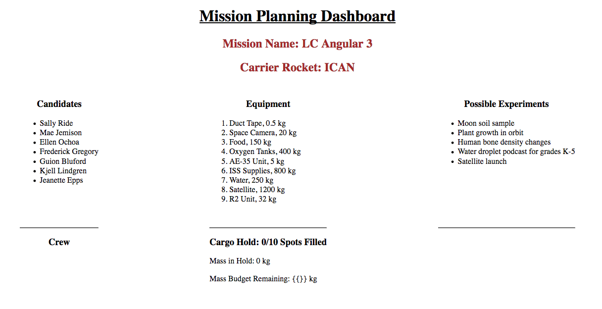
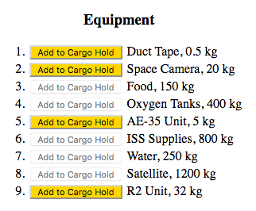

Studio: Angular, Part 3
========================

In this studio, you must combine data-binding and attribute directives to
dynamically change the appearance or behavior of HTML elements.

Getting Started
----------------

This studio uses the same mission planner repository as Angular studio part 2.
There is no need to fork and clone new starter code.

#. Open your work from Part 2 in Visual Studio Code.
#. Run ``git status`` to see if you have any uncommitted work. If you do,
   resolve it.
#. Checkout the ``studio-3`` branch:  ``git checkout studio-3``.
#. Run ``npm install`` to download dependencies.
#. Run ``ng serve`` to build and serve the project.

When viewed in your browser, the project should look like this:

*Mission Name* and *Carrier Rocket* are still editable, but the functionality
for the crew, equipment, and experiments have been removed.

Part 1: Select Cargo
---------------------

We want to add items from the equipment list to the cargo hold, but we must NOT
exceed the values of the ``maximumAllowedMass`` or ``maxItems`` variables.

The interactive equipment list will eventually behave as follows:

#. When clicked, an *Add to Cargo Hold* button adds the selected equipment to
   the ``cargoHold`` array and updates the ``cargoMass`` variable.
#. As items are added to the hold, their names should appear in the Cargo Hold
   section of the page. Also, the *Mass in Hold*, *Mass Budget Remaining*, and
   *Spots Filled* values should update.
#. The *Add to Cargo Hold* buttons should be disabled if all of the spots in
   the hold have been filled.
#. If the mass of a particular item will push the cargo hold over
   ``maximumAllowedMass``, that item's button should be disabled.
#. If ``cargoMass`` comes within 200 kg of ``maximumAllowedMass``, then the
   *Mass Budget Remaining* text should turn red.

The following sections will guide you through completing Part 1.

Code the ``addItem`` Function
^^^^^^^^^^^^^^^^^^^^^^^^^^^^^^

Open ``equipment.component.ts`` and create the ``addItem`` function:

#. It should take an equipment object as a parameter.
#. It should add the equipment object to the ``cargoHold`` array.
#. It should increase the ``cargoMass`` variable by the mass of the new
   equipment.
#. It should return ``true`` or ``false`` depending on whether ``cargoMass`` is
   within 200 kg of ``maximumAllowedMass``.

Make the ``Add to Cargo Hold`` Buttons Work
^^^^^^^^^^^^^^^^^^^^^^^^^^^^^^^^^^^^^^^^^^^^

Open ``equipment.component.html`` and do the following:

#. Include an *Add to Cargo Hold* button within each list item.

   .. figure:: figures/minimal-addtocargo-buttons.png
      :alt: Minimal *Add to Cargo Hold* button style.

#. Add a ``(click)`` event to each button that calls the ``addItem`` function
   and passes the selected equipment as the argument.
#. Bind the ``disabled`` attribute to the following conditions:

   a. If all of the cargo hold spots are full
      (``cargoHold.length === maxItems``), disable the button.
   b. If adding the item to the cargo hold would exceed ``maximumAllowedMass``,
      disable the button.

#. If active, make the button an attractive color.

Update the ``Cargo Hold`` Display
^^^^^^^^^^^^^^^^^^^^^^^^^^^^^^^^^^

Open ``equipment.component.html`` and ``equipment.component.css`` and do the
following:

#. Add a ``nearMaxMass`` class in the CSS file that styles the text to be:

   a. Bold OR italic,
   b. Red.

#. Bind ``[class.nearMaxMass]`` to a boolean that will change the style of
   the *Mass Budget Remaining* text whenever the cargo hold gets within 200 kg
   of ``maximumAllowedMass``.
#. Add an *Empty Hold* button that clears the ``cargoHold`` array and resets
   ``cargoMass``. As a side effect, clearing the hold should reactivate all
   of the buttons and return *Mass Budget Remaining* to its original style.

Status Check
^^^^^^^^^^^^^

At this point, the equipment component should behave something like:

.. figure:: figures/equipment-list-interactions.gif
   :alt: Gif of Equipment list and Cargo Hold interactivity.

Before moving on to part 2, be sure to commit and push your work.

Part 2: Select Crew Members
----------------------------

We want to add up to three astronauts to the mission crew, and we want to do
this by clicking on their names rather than creating more buttons.

The interactive candidates list will eventually behave as follows:

#. When clicked, the candidate's name will change color and will appear in the
   *Crew* list.
#. If a candidate is already part of the crew, clicking their name again in the
   *Candidates* list will remove them from the crew.
#. When the mouse pointer hovers over an astronaut's name in the *Crew* list,
   their photo appears below the list. When the pointer leaves their name,
   their photo disappears.
#. When the crew size reaches 3 members, the heading changes to *Crew Full* and
   clicking on more candidate names will not do anything.

The following sections will guide you through completing Part 2.

Code the ``addCrewMember`` Function
^^^^^^^^^^^^^^^^^^^^^^^^^^^^^^^^^^^^

Open ``crew.component.ts`` and create the ``addCrewMember`` function:

#. It should take a candidate object as a parameter.
#. It should check if the candidate is already part of the crew.
#. If the crew size is less than 3 AND the candidate is not part of the crew,
   then their data should be added to the ``crew`` array.
#. If the candidate is already part of the crew, then their data should be
   removed from the ``crew`` array.

Update the Candidates List
^^^^^^^^^^^^^^^^^^^^^^^^^^^

Open ``crew.component.html`` and ``crew.component.css`` and do the following:

#. Add a ``(click)`` event to each ``li`` element that calls the
   ``addCrewMember`` function and passes the selected candidate as the
   argument.
#. Add a ``selected`` class in the CSS file that styles the text to be a
   different color from the other list items.
#. Bind ``[class.selected]`` to a boolean statement that will change the color
   of a candidate's name when they are selected or de-selected for the crew.

Update the Crew List
^^^^^^^^^^^^^^^^^^^^^

#. When the crew size reaches 3, the heading should change to "Crew Full".
#. Add ``(mouseover)`` and ``(mouseout)`` events to the ``li`` tags to
   determine if the mouse pointer is currently over a name in the *Crew* list.
#. If a crew member is selected by moving the mouse over their name:

   a. Use an ``img`` tag with ``*ngIf`` to display a photo of the astronaut
      below the crew list.
   b. Bind the ``.photo`` property of the astronaut to the ``src``
      attribute.
   c. When the mouse pointer moves off of a name, the photo should disappear.

Status Check
^^^^^^^^^^^^^

At this point, the crew component should behave something like:

.. figure:: figures/crew-list-interactions.gif
   :alt: Gif of the Candidates and Crew list interactivity.

Before moving on to the bonus missions, be sure to commit and push your work.

Bonus Missions
---------------

To boost your Angular skills, add one or more of the following features:

#. Update the CSS files to make the web page look a little less bland.
#. Don't allow more than two of the same item in the cargo hold.
#. Allow the user to remove individual items from the hold.
#. Complete the ``experiments`` component with features similar to the ``crew``
   and ``equipment`` components.
#. Add other data to the astronaut objects, and center this data below the
   crew photo.

Sanity Check
-------------

Complete code for this studio can be found in the ``studio-3-solution`` branch
of the repository.
