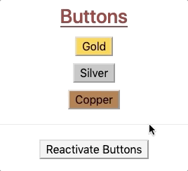

Dynamic Style Changes
======================

By adding :ref:`event listeners <angular-events>` to our Angular projects, we
can make any element on our webpage interactive. This allows us to change the
styling on the page in response to user actions.

Before we add functionality to the buttons, let's first update our text styling
a little bit.

Interactive Elements
---------------------

Let's make one of the paragraph elements respond to user clicks.

#. Open ``skill-set.component.ts``. Define the boolean variable ``changeColor``
   in the ``SkillSetComponent`` class. Initialize it as ``false``.
#. Change line 7 in ``skill-set.component.html`` by adding a ``(click)`` event:

   .. sourcecode:: html+ng2
      :linenos:

      

         <h3>{{listHeading}}</h3>
         <ul>
            <li *ngFor="let skill of skills">{{skill}}</li>
         </ul>
         
Here is some practice text...

         
Here is some more practice text...

      

   Since ``changeColor`` is a boolean, ``(click)="changeColor = !changeColor"``
   flips the value of the variable between ``true`` and ``false`` whenever the
   text is clicked.

   .. figure:: ./figures/lesson3-partially-interactive-text-styling.gif
      :alt: Interactive text styling.

.. admonition:: Try It

   #. Replace ``(click)`` with ``(mouseover)`` in line 7 and examine how the
      interactivity changes.
   #. What happens if we add ``[class.pcentered]="changeColor" (click)="changeColor = !changeColor"``
      to the ``<li>`` tag in line 4?

Button Styling
---------------

The ``button`` tag accepts ``class`` and ``style`` just like other HTML
elements, but ``button`` also has its own set of special attributes. Detailed
lists of these attributes reside on
`W3 schools <https://www.w3schools.com/tags/tag_button.asp>`__ and
`MDN <https://developer.mozilla.org/en-US/docs/Web/HTML/Element/button>`__.
However, for these examples we will focus on ``disabled``.

Adding the ``disabled`` attribute inside the tag deactivates the button. Any
time you see a greyed out button on a webpage, ``disabled`` is the cause.

.. admonition:: Example

   Code:

   .. sourcecode:: html+ng2
      :linenos:

      <button [style.background]="lcLightBlue">Click Me!</button>
      <button disabled>Can't Click Me!</button>

   Result:

   .. figure:: ./figures/lesson3-disabled-example.png
      :alt: Result of ``disabled`` attribute.

The ``disabled`` attribute overrides any other function calls or events within
the ``button`` tag.

Dynamic Button Activation
^^^^^^^^^^^^^^^^^^^^^^^^^^

Data-binding lets us activate or deactivate buttons based on user actions or
variables we control.

Open the ``buttons.component.html`` and ``buttons.component.ts`` files and
examine the code.

.. admonition:: Examples

   HTML file:

   .. sourcecode:: html+ng2
      :linenos:

      

         <h3>{{buttonHeading}}</h3>
         <button class="gold">Gold</button>  
         <button class="silver">Silver</button>  
         <button class="copper">Copper</button> 

         <button>Activate/Deactivate Buttons</button>
      

   ``ButtonsComponent`` class in the ``.ts`` file:

   .. sourcecode:: typescript
      :linenos:

      export class ButtonsComponent implements OnInit {
         buttonHeading: string = "Buttons"
         inactive: boolean = false;

         constructor() { }

         ngOnInit() { }

      }

To dynamically activate or deactivate a button, we need to bind the attribute
to a boolean. In this case, we can use the ``inactive`` variable defined in the
``buttons.component.ts`` file.

#. Modify line 3 in the HTML file as follows:

   .. sourcecode:: html+ng2

      <button [class.gold]="!inactive" [disabled]="inactive" (click)="inactive = true">Gold</button>  

   Save your changes and refresh the webpage. Now when you click on the
   "Gold" button, ``inactive`` gets set to ``true``. This adds the ``disabled``
   attribute to the HTML tag, turing it off. In addition, the ``gold`` class is
   removed, changing the color of the button.
#. Since the "Gold" button is no longer active, clicking on it again will not
   trigger any events. To re-enable the button, we need to tie ``inactive`` to
   another tag and event.

#. Modify line 6 in the HTML file as follows:

   .. sourcecode:: html+ng2

      <button (click)="inactive = !inactive">Activate/Deactivate Buttons</button>

The buttons on the page should now behave something like:

.. figure:: ./figures/lesson3-one-button-activation.gif
   :alt: Activating and deactivating a button on click.

Silver and Copper
~~~~~~~~~~~~~~~~~~

Modify the ``button`` tags for "Silver" and "Copper" so that they also depend
on ``inactive``. Properly done, clicking ANY of the buttons deactivates ALL of
them:

.. figure:: ./figures/lesson3-three-button-activation.gif
   :alt: Activating and deactivating multiple buttons on click.

If we want to disable only the button that gets clicked, then we will need
to create a separate boolean variable for each element. We must also update the
"Activate/Deactivate" button to reset all of the booleans to ``true``. (Hint:
How about setting the ``(click)`` event to a function call?)

Try It!
--------

Modify the code in ``buttons.component.html`` and ``buttons.component.ts`` to
make the buttons behave like this:

.. admonition:: Note

   If you find yourself stuck after trying, and trying, and TRYING, remember that
   there is a ``solutions`` branch in the repository.

Bonus Try It!
---------------

Just for fun, use what you have learned about events and data binding to create
buttons that behave like this:

.. figure:: ./figures/lesson3-joke-buttons.gif
   :alt: Fun but frustrating buttons.

.. admonition:: Warning

   These bonus options are ONLY FOR FUN. Using any of these on a business
   website would be a poor choice.

Check Your Understanding
-------------------------

Lorem ipsum...
