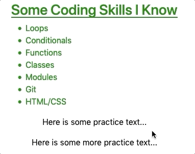

Dynamic Style Changes
======================

By adding :ref:`event listeners <angular-events>` to our Angular projects, we
can make any element on our webpage interactive. This allows us to change the
styling on the page in response to user actions.

Before we add functionality to the buttons, let's first update our text styling
a little bit.

Interactive Elements
---------------------

Let's make one of the paragraph elements respond to user clicks. Change line 7
in ``skill-set.component.html`` by adding a ``(click)`` event:

.. sourcecode:: html+ng2
   :linenos:

   

      <h3>{{listHeading}}</h3>
      <ul>
         <li *ngFor="let skill of skills">{{skill}}</li>
      </ul>
      
Here is some practice text...

      
Here is some more practice text...

      
Here is another line of practice text...

   

Since ``changeColor`` is a boolean, ``(click)="changeColor = !changeColor"``
flips the value of the variable between ``true`` and ``false`` whenever the
text is clicked.

.. admonition:: Try It

   Replace ``(click)`` with ``(mouseover)`` in line 7 and examine how the
   interactivity changes.

Button Styling
---------------

The ``button`` tag accepts ``class`` and ``style`` just like other HTML
elements, but ``button`` also has its own set of special attributes. Detailed
lists of these attributes reside on
`W3 schools <https://www.w3schools.com/tags/tag_button.asp>`__ and
`MDN <https://developer.mozilla.org/en-US/docs/Web/HTML/Element/button>`__.
However, for these examples we will focus on ``disabled``.

Adding the ``disabled`` attribute inside the tag deactivates the button. Any
time you see a greyed out button on a webpage, ``disabled`` is the cause.

.. admonition:: Example

   Code:

   .. sourcecode:: html+ng2
      :linenos:

      <button [style.background]="lcLightBlue">Click Me!</button>
      <button disabled>Cant' Click Me!</button>

   Result:

   .. figure:: ./figures/lesson3-disabled-example.png
      :alt: Result of ``disabled`` attribute.

The ``disabled`` attribute overrides any other function calls or events within
the ``button`` tag.

Dynamic Button Activation
^^^^^^^^^^^^^^^^^^^^^^^^^^

Data-binding lets us activate or deactivate buttons based on user actions or
variables we control.

Open the ``buttons.component.html`` and ``buttons.component.ts`` files and
examine the code.

.. admonition:: Examples

   HTML file:

   .. sourcecode:: html+ng2
      :linenos:

      

         <h3>{{buttonHeading}}</h3>
         <button class="gold">Gold</button>  
         <button class="silver">Silver</button>  
         <button class="copper">Copper</button> 

         <button>Activate/Deactivate Buttons</button>
      

   ``ButtonsComponent`` class in the ``.ts`` file:

   .. sourcecode:: typescript
      :linenos:

      export class ButtonsComponent implements OnInit {
         buttonHeading: string = "Buttons"
         inactive: boolean = false;

         constructor() { }

         ngOnInit() { }

      }

Do dynamically activate or deactivate a button, we need to bind the attribute
to a boolean. In this case, we can use the ``inactive`` variable defined in the
``buttons.component.ts`` file.

Modify line 3 in the HTML file as follows:

.. sourcecode:: html+ng2

   <button [class.gold]="!inactive" [disabled]="inactive" (click)="inactive = true">Gold</button>  

Save your changes and refresh the webpage. Now when you click on the
"Gold" button, ``inactive`` gets set to ``true``, which adds the ``disabled``
attribute to the HTML tag. In addition, the ``gold`` class is removed.