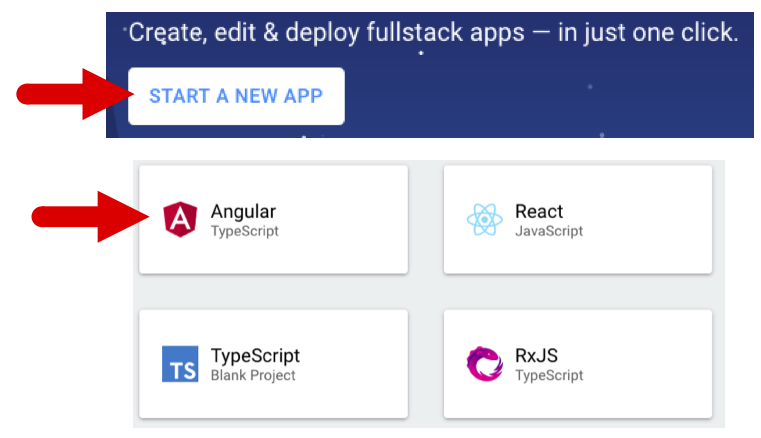
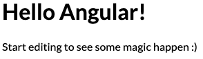

Angular First Steps
====================

The goal here is to create a minimum working webpage template. It will serve as
a jumping off point for your later exercises and studios, so be sure you are
logged into your GitHub account.

Starting a New Project
-----------------------

Navigate to the `StackBlitz homepage <https://stackblitz.com>`__. Click "Start
New App", then select the "Angular (TypeScript)" option.

Examine the files created:

.. figure:: ./figures/NewProjectFiles.png
   :alt: File tree for new StackBlitz Angular project.

#. The ``src`` folder holds all the files needed to make the template function.
#. The ``app`` folder holds the instructions for displaying the smaller pieces
   of a webpage. We will modify these files soon.
#. ``index.html`` is the highest level for displaying content. Anything added
   to this HTML file will appear on every page within a website.
#. ``main.ts`` imports the core methods required to make everything work. It
   also imports the content from the ``app`` folder.
#. ``styles.css`` holds the global style settings for the entire website.

Yay! A Webpage!
----------------

For a better view, go ahead and close the preview panel, then click the button
to open that preview in a new browser window. You should see some simple
content.

Congratulations! You have a functioning webpage. Feel free to play around a
little bit before continuing, and do not worry about breaking anything. If
necessary, you can always start another new project.

.. _try-it-StackBlitz-intro:

.. admonition:: Try It!

   #. Add a nose to the emoticon.
   #. Find where "Angular" is assigned to the heading, and then replace it
      with your name.
   #. Change the color for the *Start editing...* sentence.

   You will need to refresh the preview page after each attempt to see if any
   changes occur.

Now let's take a look at the different project files.

What To Ignore
^^^^^^^^^^^^^^^

For every new project, StackBlitz includes the practice file
``hello.component.ts``. It plays a role in generating the "Hello Angular"
heading, but it does not do anything other than that. For our discussion here,
we will ignore the file.

.. admonition:: Warning

   Do NOT delete ``hello.component.ts`` yet. There are some lines of code in
   ``app.module.ts`` that depend on this file. For now, leave
   ``hello.component.ts`` in place. Later, we will see how to remove it from a
   new project.

StackBlitz simplifies project creation by hiding many of the support files, and
Angular itself automatically sets up the code to make the different parts of a
project communicate with each other. ``main.ts`` and ``polyfills.ts`` are part
of this automated process, so you should leave these files alone.

Inside the ``app`` folder
--------------------------

If we open ``app.component.css``, we see three lines of code that styles the
``
`` tag. We can freely modify this file, but any CSS instructions only
affect the HTML files within ``app``. Also, the code in ``app.component.css``
overrides the CSS found in the higher level ``styles.css`` file.

This is a pattern for Angular. CSS instructions further down in the file tree
have higher priority. If ``app`` contained a subfolder with its own ``.css``
file, then those instructions would be applied to the HTML files within that
subfolder.

Let's examine the code contained in other three ``app`` files.

``app.component.html`` File
^^^^^^^^^^^^^^^^^^^^^^^^^^^^^^

.. admonition:: Example

   ``app.component.html``

   .. sourcecode:: html
      :linenos:

      <hello name="{{ name }}"></hello>
      

         Start editing to see some magic happen :)
      

``app.component.html`` contains the structure and some of the text seen on the
"Hello Angular!" page. Note that the file contains a placeholder,
``{{ name }}``, that will be filled with data passed in from another file.

The strange tag ``<hello>`` represents a key idea behind building templates.
Angular allows us to define our own tags, which are also used as placeholders
in an HTML file. In this case, ``<hello>`` reserves space on the webpage for
information supplied by the ``hello.components.ts`` file.

As we add more and more pieces to our template, we will define specific tags to
help us arrange the different items on the screen. This makes it easier for us
to keep track of our content. We can think, *OK, put the movie list here, the
grocery list there, and the kids' photos on the next page*, and then define
``<movies>``, ``<grocery-list>``, and ``<kids-photos>`` tags to pull in the
data and clearly place it where we want.

``app.component.ts`` File
^^^^^^^^^^^^^^^^^^^^^^^^^^

.. admonition:: Example

   ``app.component.ts``

   .. sourcecode:: TypeScript
      :linenos:

      import { Component } from '@angular/core';

      @Component({
         selector: 'my-app',
         templateUrl: './app.component.html',
         styleUrls: [ './app.component.css' ]
      })
      export class AppComponent  {
         name = 'Angular';
      }

``app.component.ts`` performs several important functions with very few lines.

#. Line 5 imports ``app.component.html``, which we examined above.
#. Line 6 imports ``app.component.css``, which applies styling to the HTML
   file. (For those of you who changed the color of the *Start editing...*
   sentence in the Try It challenge above, this is why changing the css file
   worked).
#. Line 8 makes the styled ``.html`` file and anything defined in the
   ``AppComponent`` class available to other files.
#. Line 4 defines the tag ``<my-app>``, which we can use in files that have
   imported ``AppComponent``.

Take a look at ``app.component.html`` again. We mentioned the ``{{ name }}``
placeholder earlier and said that it gets filled with data from a different
file. Line 9 in ``app.component.ts`` supplies this data by assigning the value
``'Angular'`` to the ``name`` variable. Changing ``'Angular'`` to a different
value alters the webpage.

``app.module.ts`` File
^^^^^^^^^^^^^^^^^^^^^^^

.. admonition:: Example

   ``app.module.ts``

   .. sourcecode:: TypeScript
      :linenos:

      import { NgModule } from '@angular/core';
      import { BrowserModule } from '@angular/platform-browser';
      import { FormsModule } from '@angular/forms';

      import { AppComponent } from './app.component';
      import { HelloComponent } from './hello.component';

      @NgModule({
         imports:      [ BrowserModule, FormsModule ],
         declarations: [ AppComponent, HelloComponent ],
         bootstrap:    [ AppComponent ]
      })
      export class AppModule { }

Just like before, there is a lot going on within very few lines.

#. Lines 1 - 3 and line 9 import and assign the core modules that make Angular
   work. This is part of the automatic process, so do not play with these
   (yet).
#. Lines 5, 6, and 10 import local files and declare them as necessary for the
   project. These lines are the reason why we cannot just delete the
   ``hello.component.ts`` file. Line 6 tries to import it, and line 10 says
   that the ``HelloComponent`` class defined in the file is needed.
#. Line 13 exports the ``AppModule`` class and makes it available to other
   files.

``app.module.ts`` does the main work of pulling in the core libraries and local
files. As new parts are added to a project, ``app.module.ts`` updates the
import statements, the ``imports`` array, and the ``declarations`` array
automatically. We do not have to worry about the details for adding this
critical code ourselves.

Change The Content
-------------------

Now that we have taken a

If you did not complete all of the :ref:`Try It <try-it-StackBlitz-intro>`
tasks above, attempt them now. After that...

.. admonition:: Try It!

   Lorem ipsum...

Wrap-Up
--------

   TODO: Finish this.

Check Your Understanding
-------------------------

   TODO: Add questions.
