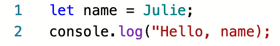

Diagnosing Error Messages
=========================

Syntax and runtime errors *always* produce error messages. Reading and
understanding error messages is a crucial first step in fixing these types of
bugs.

**Error messages are your friends.** This idea can seem foreign to new
programmers, because an error message is a signal that your program is broken.
When we are working with a broken program, we might feel frustrated, like we do
not fully understand the concepts at hand.

However, the reality is that *all* programmers, no matter how experienced,
regularly make simple mistakes. If you run your program and it produces an
error message, your first reaction should be, "Great! My program has an error,
but I have a helpful message to help me fix it."

Let's consider a small program with a couple of syntax errors.

.. admonition:: Example

   ::

      let name = Julie;
      console.log("Hello, name);

While you can spot one or more errors just by looking at the code, let's
examine the error messages produced.

.. _syntax-error:

A Syntax Error
--------------

Running the program at this stage results in the message:

::

   /Users/chris/dev/sandbox/js/syntax.js:2
   console.log("Hello, name);
               ^^^^^^^^^^^^^^

   SyntaxError: Invalid or unexpected token
      at new Script (vm.js:85:7)
      at createScript (vm.js:266:10)
      at Object.runInThisContext (vm.js:314:10)
      at Module._compile (internal/modules/cjs/loader.js:698:28)
      at Object.Module._extensions..js (internal/modules/cjs/loader.js:749:10)
      at Module.load (internal/modules/cjs/loader.js:630:32)
      at tryModuleLoad (internal/modules/cjs/loader.js:570:12)
      at Function.Module._load (internal/modules/cjs/loader.js:562:3)
      at Function.Module.runMain (internal/modules/cjs/loader.js:801:12)
      at internal/main/run_main_module.js:21:11

While there is a lot of text in this message, the first few lines tell us
everything we need to know.

The first portion identifies where in our code the error exists:

::

   console.log("Hello, name);
               ^^^^^^^^^^^^^^

For many simple syntax errors, we will quickly be able to spot the mistake once
JavaScript points out its location to us.

If knowing the location of the error isn't enough, the next line provides more
information:

::

   SyntaxError: Invalid or unexpected token

This line identifies that actual issue that JavaScript found. It makes it clear
that we are dealing with a ``SyntaxError``, and it provides a message that
describes the issue.

If you are scratching your head at the message, "Invalid or unexpected token,"
don't worry. Programming languages often report errors in ways that are not
always easy to decipher at first glance. However, a second look at the line in
question helps us make sense of this message.

::

   console.log("Hello, name);
               ^^^^^^^^^^^^^^

.. index:: ! token

JavaScript is telling us that in the area of ``"Hello, name);`` it encountered
an invalid token. **Token** is a fancy word that means a symbol, variable, or
other atomic element of a program. In this case, the invalid token is ``"Hello,
name);``. JavaScript sees the double-quote character and expects a string.
However, the string does not have a closing ``"``, making it invalid.

Fixing this error gives us a program with correct syntax:

.. sourcecode:: js
   :linenos:

   let name = Julie;
   console.log("Hello", name);

.. note:: Error messages may differ depending on where you run your code. The same program run in a `repl.it <https://repl.it/>`_ and Node.js on your computer will generate slightly different error messages. However, these differences are minor and generally unimportant. The main cause of the error will be reported in the same way.

Syntax Errors and Code Highlighting
-----------------------------------

.. index::
   single: syntax; highlighting

Most code editors provide a feature known as **syntax highlighting**. Such
editors highlight different types of tokens in different ways. For example,
strings may be red, while variables may be green. This useful feature gives you
a quick, visual way to identify syntax errors.

For example, here is a screenshot of our flawed code taken within an `editor at repl.it <https://repl.it/@launchcode/Syntax-Highlighting>`_.

      highlighting to differ from what is expected. On line 1, the string "Julie"
      is green instead of red, because it is missing quotes. On line 2, the
      symbols ); are red instead of black, because the preceding string "Hello,
      World" doesn't have a closing double-quote.

   Screenshot of a program with two syntax errors

Notice that the string ``Hello`` is colored red, while *most* of the symbols
(``=``, ``;``, ``.``, and ``(``) are colored black. At the end of line 2,
however, the final ``)`` and ``;`` are both red rather than black. Since we
haven't closed the string, the editor assumes that these two symbols are *part
of* the string. Since we expect ``);`` to be black in this editor, the
difference in color is a clue that something is wrong with our syntax.

A Runtime Error
---------------

Having fixed the syntax error, we can now run our program again. Doing so displays yet another error.

::

   Hello
   /Users/chris/dev/sandbox/js/syntax.js:1
   let name = Julie;
            ^

   ReferenceError: Julie is not defined
      at Object.<anonymous> (/Users/chris/dev/sandbox/js/syntax.js:1:74)
      at Module._compile (internal/modules/cjs/loader.js:738:30)
      at Object.Module._extensions..js (internal/modules/cjs/loader.js:749:10)
      at Module.load (internal/modules/cjs/loader.js:630:32)
      at tryModuleLoad (internal/modules/cjs/loader.js:570:12)
      at Function.Module._load (internal/modules/cjs/loader.js:562:3)
      at Function.Module.runMain (internal/modules/cjs/loader.js:801:12)
      at internal/main/run_main_module.js:21:11

We have a new error message, this time involving line 1 of our code. We didn't see this error before because it is a runtime error. Due to the syntax error on line 2, the program stopped during the parsing phase. Even though the current error involves the line *before* the original syntax error, the syntax error still gets reported first.

Once again, we are told where the error occurs:

::

   let name = Julie;
            ^

There appears to be an issue with the assignment statement. You might be able to see what it is, but let's inspect the error message anyway. Doing so will help us understand JavaScript errors more generally.

The message is:

::

   ReferenceError: Julie is not defined

The type of error is ``ReferenceError``. If we search the web for "JS ReferenceError" then one of the first results is the `MDN documentation for ReferenceError <https://developer.mozilla.org/en-US/docs/Web/JavaScript/Reference/Global_Objects/ReferenceError>`_. No need to read the entire document, however. The first sentence on this page tells us what we need to know:

.. pull-quote:: The ``ReferenceError`` object represents an error when a non-existent variable is referenced.

This information, along with the rest of the message, "Julie is not defined," makes it clear what JavaScript is complaining about. The error message is saying, *Hey, check your variables!*

To us, we see that we forgot to enclose the string ``Julie`` in quotes, because we know that we intended to assign the variable ``name`` a string value. However, to JavaScript there is nothing in the program to indicate that ``Julie`` should be a string. In fact, JavaScript sees ``Julie`` as a variable. Since there is no such defined variable in our program, it returns a ``ReferenceError``.

This is one of many examples when we, as humans, describe the same error slightly differently than JavaScript. Usually, neither description is better than the other. Humans and computers simply view information differently.
