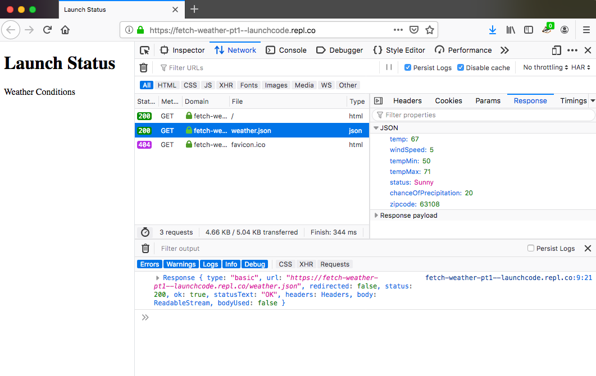

Fetching Data
=============

Now that we know what an API is, let's use one to update a web page. Let's use
a weather API to add weather data to a web page. The URL for this special
LaunchCode weather API is `<https://handlers.education.launchcode.org/static/weather.json>`__.

Example JSON returned from our weather API.

.. sourcecode:: js

   {
      "temp": 67,
      "windSpeed": 5,
      "tempMin": 50,
      "tempMax": 71,
      "status": "Sunny",
      "chanceOfPrecipitation": 20,
      "zipcode": 63108
   }

We can see that this API returns useful information like ``temp`` and
``windSpeed``. Our goal is to add that data to a Launch Status web page. Note,
this API is for instruction purposes and does not contain real time data.

.. admonition:: Example

   Launch Status web page, which we will add weather data to.

   .. sourcecode:: html
      :linenos:

      <!DOCTYPE html>
      <html>
         <head>
            <title>Launch Status</title>
         </head>
         <body>
            <h1>Launch Status</h1>
            <h3>Weather Conditions</h3>
            

               <!-- TODO: dynamically add html about weather using data from API -->
            

         </body>
      </html>

.. warning::

   Before going through the ``fetch`` examples, please know that ``fetch`` does
   NOT work in Internet Explorer.
   `List of alternative browsers <https://browsehappy.com/>`_

``fetch`` Function
------------------

.. index:: !fetch

To request the weather data, we will use the ``fetch`` function. ``fetch`` is a
global function that requests, or fetches, resources such as data from an API.

Take note of two necessary aspects of the ``fetch`` function:

#. The URL of where the data is located.

   a. For this example, it will be ``"https://handlers.education.launchcode.org/static/weather.json"``

#. A response handler function to utilize the data that is being fetched.

   a. For this example, it will be ``function(response){...};``

.. admonition:: Example

   Notice a string URL is passed to ``fetch``. Also notice the anonymous
   *request handler function* that has a ``response`` parameter. The ``.then``
   method will be explained soon.

   .. sourcecode:: js

      fetch("https://handlers.education.launchcode.org/static/weather.json").then(function(response) {
         console.log(response);
      } );

   In this example, we are requesting data from
   ``https://handlers.education.launchcode.org/static/weather.json`` and our
   response handler (the anonymous function) simply logs the response to the
   console.

``fetch`` Example
-----------------

Now let's add ``fetch`` in the Launch Status web page.

.. admonition:: Example

   A ``
         </head>
         <body>
            <h1>Launch Status</h1>
            <h3>Weather Conditions</h3>
            

               <!-- TODO: dynamically add html about weather using data from API -->
            

         </body>
      </html>

Let's break down how ``fetch`` works:

#. A URL is passed to ``fetch`` as a parameter.
#. This causes an HTTP GET request to be sent from the browser to the API.
#. The API processes the request and sends back a response, which contains
   data.
#. Once the browser receives the response, the ``.then()`` statement executes.
#. The anonymous *response handler function* called by
   ``.then(function(response)`` runs, and this function deals with the data
   sent back from the API.
#. Based on the code in the handler function, the web page gets updated using
   DOM methods.

.. note::

   In this section, ``fetch`` is used to make GET requests. ``fetch`` can also
   be used to make other types of HTTP requests such as POST and PUT.

View the GET Request
^^^^^^^^^^^^^^^^^^^^

We can see evidence of the GET request by following these steps:

#. Open the `Launch Status web page <https://fetch-weather-pt1--launchcode.repl.co/>`__ in its own tab.
#. Open developer tools.
#. Open the *Network* tab in developer tools.

   The GET request to the Weather API highlighted in developer tools.

In the image above, you can see the web page has been rendered on the left. In
the developer tools, the GET request to the Weather API has been highlighted
along with the response from that request. The response shows the JSON data
that was received. In the console output, you can see the ``Response`` object
has been logged. We will use that object next.

Response Object
^^^^^^^^^^^^^^^^

The response to the GET request is contained in a ``Response`` object, which is
an instance of the
`Response class <https://developer.mozilla.org/en-US/docs/Web/API/Response>`__.
The class contains methods that allow us to access the status of an API request
and the data returned in the response.

.. admonition:: Example

   On line 8, the ``json()`` method is used to gain access to the JSON data
   contained in the ``response`` object.

   Line 9 logs the JSON to the console. We'll discuss ``.then()`` later.

   .. replit:: html
      :linenos:
      :slug: fetch-weather-pt2

      <html>
         <head>
            <title>Launch Status</title>
            
         </head>
         <body>
            <h1>Launch Status</h1>
            <h3>Weather Conditions</h3>
            

               <!-- TODO: dynamically add html about weather using data from API -->
            

         </body>
      </html>

   **Console Output**
   ::

      Object {
         temp: 67,
         windSpeed: 5,
         tempMin: 50,
         tempMax: 71,
         status: "Sunny",
         chanceOfPrecipitation: 20,
         zipcode: 63108
      }

Use the DOM and JSON Data to Update the Page
^^^^^^^^^^^^^^^^^^^^^^^^^^^^^^^^^^^^^^^^^^^^^

Now that we have JSON weather data, we can add HTML elements to the page to
display that data.

.. admonition:: Example

   #. On line 8, the ``div`` object is defined and linked to the HTML element
      with the id ``weather-conditions``.
   #. On line 10, the ``innerHTML`` property of the ``div`` object is set to be
      the HTML elements in lines 11 - 16.

   .. replit:: html
      :linenos:
      :slug: fetch-weather-pt3

      <html>
         <head>
            <title>Launch Status</title>
            
         </head>
         <body>
            <h1>Launch Status</h1>
            <h3>Weather Conditions</h3>
            

               <!-- Weather data is added here dynamically. -->
            

         </body>
      </html>

Let's take a look at the expected sequence of events:

#. In line 6, the ``fetch`` command sends a request to the URL.
#. When the API returns a response, the ``then`` method calls the anonymous
   handler function and passes in the ``response`` object (also line 6).
#. On line 7, the handler function tries to retrieve the JSON data from the
   ``response`` object. When this is successful, the anonymous
   ``function(json)`` gets called.

   a. On line 8, the ``div`` object is defined and linked to the HTML element
      with the id ``weather-conditions``.
   b. On line 10, the ``innerHTML`` property of the ``div`` object is set to be
      the HTML elements in lines 11 - 16.
   c. The HTML in lines 11 - 16 gets filled in using weather data stored in the
      ``json`` object.

#. The two anonymous functions end, and the HTML defined in lines 11 - 16
   gets added to the ``div`` element on line 26.

Opening the developer tools on the web page shows the added HTML:

.. figure:: figures/weather-data-on-page.png
   :alt: Screen shot of browser showing Launch Status web page with the weather data in HTML.

   Weather data added to web page.

.. note::

   ``fetch`` was chosen as the tool to request data because it's supported in modern browsers by default
   and is simple to use. When viewing resources other than this book, you will see various other ways to
   request data in a web page with JavaScript. Other ways include, but are not
   limited to, ``jQuery.get``, ``jQuery.ajax``, and ``XMLHttpRequest``.

Check Your Understanding
-------------------------
.. admonition:: Question

   What is the correct syntax for ``fetch``?

   a. ``fetch("GET", "https://api.url").then(...);``
   b. ``fetch("https://api.url").doStuff(...);``
   c. ``fetch("https://api.url").then(...);``
