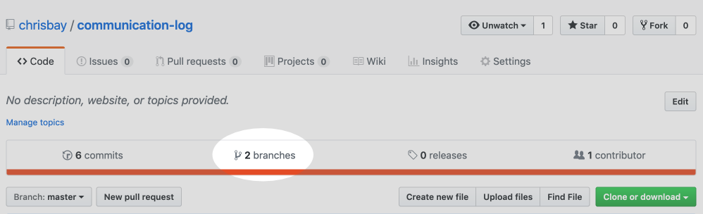

.. _comm-log-part2:

Studio: Communication Log (cont.)
=================================

.. admonition:: Tip

   As you go through these steps, you'll be working with *branches*.
   
   It's very likely you will make changes to the code only to realize that you
   did so in the wrong branch. When this happens (and it happens to all of us)
   you can use ``git stash`` to cleanly move your changes to another branch.
   Read about how to do this in our :ref:`git-stash` tutorial.

Step 5: First Message Exchange
------------------------------

#. **Pilot**: Use the *File* menu in Visual Studio Code to open the cloned
   ``communication-log-control`` directory. Double click the ``index.html``
   file to open it in the editor.

   Modify the HTML to add your response to mission control. Be creative, the
   communication can go anywhere! Just don't ask your partner what you should
   write.
#. **Pilot**: After you finish, commit your change with the usual
   ``git status/git add ./git commit -m`` process.
#. **Pilot**: Push up your changes up to GitHub so **Control** can see them as
   well. Use the command:

   ::

      $ git push origin main
      Counting objects: 9, done.
      remote: Resolving deltas: 100% (8/8), completed with 8 local objects.
      To git@github.com:username/communication-log.git
         511239a..679de77  main -> main

#. **Control**: Pull Pilot's changes down from GitHub with the command

   ::

      $ git pull origin main
      From github.com:username/communication-log
         e0de62d..e851b7e  main     -> origin/main
      Updating e0de62d..e851b7e
      Fast-forward
      index.html | 1 +
      1 file changed, 1 insertion(+)

#. **Control**: Notice that the code your local ``index.html`` file changes to
   reflect the line(s) Pilot added. Cool!

   Respond by adding a new HTML element and some text. Save, commit, and push
   your changes up to GitHub.
#. **Pilot and Control**: Play with the ``pull/edit/push`` process for a while!
   Repeat the cycle a few more times to add to your story.

.. admonition:: Tip

   In VS Code, right-click on the ``index.html`` tab. Choose the *Copy Path*
   option.

   .. figure:: figures/studio/copy-path.png
      :alt: Menu options that appear after right-clicking a file tab in VS Code. "Copy Path" is highlighted.
      :width: 30%

   Next, open a web browser and paste the path into the address bar. Ta da!
   Your webpage appears. Opening ``index.html`` in your browser lets you track
   your progress by refreshing the page.
   
   Notice that the path in the address bar looks very similar to the result we
   would see from the ``pwd`` command in the terminal.

Step 6: Create a Branch In Git
------------------------------

This back-and-forth workflow is nice, but it can get in the way. After all,
professional developers don't sit around waiting for their teammates to commit
and push a change before starting their own work. Fortunately, Git branches
allow partners to work on a project at the same time and at their own pace.

#. **Pilot**: While Control is working on the next part of the story, use the
   terminal to create a new branch called ``open-mic``. Recall that a *branch*
   is a separate copy of the codebase. This lets you commit changes without
   affecting the code in the ``main`` branch.

   ::

      $ git checkout -b open-mic
      Switched to a new branch 'open-mic'

      $ git branch
        main
      * open-mic

#. **Pilot**: In VS Code, create a new file called ``style.css`` and add the
   following CSS style rule:

   .. sourcecode:: css
      :linenos:

      body {
         color: white;
         background-color: black;
      }

#. **Pilot**: Next, open ``index.html`` and link to the stylesheet. Your HTML
   should look something like this:

   .. sourcecode:: html
      :linenos:

      <!DOCTYPE html>
      <html>
         <head>
            <link rel="stylesheet" type="text/css" href="style.css">
         </head>
         <body>
            
Radio check. Pilot, please confirm.

            <!-- Your ongoing conversation here... -->
         </body>
      </html>

#. **Pilot**: Save and commit your changes, then push the new branch up to
   GitHub with the command:

   ::

      $ git push origin open-mic

   Note that the command is a little different than what you used before
   (``git push origin main``). The final part is the name of the branch that
   you want to push to GitHub.

#. **Control**: To pull down the new ``open-mic`` branch, enter the command:

   ::

      $ git pull origin open-mic

   .. admonition:: Note

      If you don't know the name of the new branch, then just enter ``git pull``.
      This will pull down *all* new branches and show you a list of the options.

#. **Pilot and Control**: If you haven't already done so, open ``index.html``
   in a browser to see what it looks like.

Good! Now let's take a look at GitHub and find the new ``open-mic`` branch.

View Branches in GitHub
^^^^^^^^^^^^^^^^^^^^^^^

**Pilot and Control**: To view the available branches on GitHub, select
*Branches* from the navigation section just below the repository title.

   The branches Button in GitHub

Great progress! Now let's figure out how to merge two branches in GitHub.

Step 7: Open a Pull Request in GitHub
-------------------------------------

#. **Pilot**: In your browser, go to the GitHub project and click on *Branches*
   and make sure you see the new branch name, *open-mic*.

   .. figure:: figures/studio/new-pr-button.png
      :alt: The Branches page of a repo, with a button to open a new pull request to the right of each feature branch.
      :width: 80%

      The branches page in GitHub.

#. **Pilot**: Click *New Pull Request* to ask Control to review your changes in
   the ``open-mic`` branch before merging them into ``main``. Add some text in
   the description box to let Control know what you did and why.

   .. admonition:: Note

      The branch selected in the *base* dropdown is the one you want to merge
      *into*, while the selected branch in the *compare* dropdown is the one
      you want to merge *from*.

      .. figure:: figures/studio/PR-window.png
         :alt: The form for creating a new pull request.
         :width: 80%

         Open a PR in GitHub.

This is what an opened pull request looks like:

.. figure:: figures/studio/open-pr.png
   :alt: An open pull request.
   :height: 500px

   An open PR in GitHub

Step 8: Merge the Pull Request
------------------------------

#. **Control**: Go to your repo in GitHub. Click on *Pull Requests*. Next,
   click on the title for the one and only PR.

   .. figure:: figures/studio/check-pr-info.png
      :alt: Review the PR details.
      :width: 40%

      PR Open in GitHub

#. **Control**: The page that opens shows the history of all the commits made
   to the ``open-mic`` branch. When ready, click the green *Merge Pull Request*
   button, followed by *Confirm Merge*.

   .. figure:: figures/studio/confirm-merge.png
      :alt: Confirm the merge request.
      :width: 80%

      Finally! Merge the pull request.

#. Upon a successful merge, you should see a screen similar to the following:

   .. figure:: figures/studio/pr-merged.png
      :alt: The screen displayed after a PR is merged
      :width: 65%

      PR Merged in GitHub

#. **Pilot and Control**: The changes from ``open-mic`` are now in the ``main``
   branch, but only in the remote repository on GitHub. You will need to pull
   the updates to your ``main`` for them to be present locally.

   ::

      $ git checkout main
      $ git pull origin main

   Git is able to merge these files on its own.

Notice that the changes made in the ``open-mic`` branch now appear in ``main``.
Refreshing the tab in your browser should display the styled webpage!

.. admonition:: Tip

   When you save a change to our HTML code, clicking the *Refresh* button in
   the browser displays the new layout. However, this doesn't always work for
   changes made to the CSS. Browsers often save the stylesheet in memory to
   speed up reloading. If the browser continues to use the old code, you won't
   see your new styles.

   To fix this, force a clean reload of the page. For most browsers (like
   Firefox, Chrome, and Safari), hold down the ``Shift`` key and click
   *Refresh*. For Microsoft Edge, use the ``Control`` key plus *Refresh*.

Resources
---------

Before moving on to the bonus studio content, here are some external resources
for using Git and GitHub.

#. `Git Branching - Basic Branching and Merging <https://Git-scm.com/book/en/v2/Git-Branching-Basic-Branching-and-Merging>`__
#. `Adding Another Person To Your Repository <https://help.Github.com/articles/inviting-collaborators-to-a-personal-repository/>`__
#. `Resolving Conflicts In the Command Line <https://help.Github.com/articles/resolving-a-merge-conflict-using-the-command-line/>`__

Bonus: Merge Conflicts!
-----------------------

When teaming up on a project, things won't always go smoothly. It's common for
two people to change the same line(s) of code on their separate machines. This
prevents Git from being able to automatically finish a merge.

.. figure:: figures/studio/git-merge.gif
   :alt: An animated GIF file showing two opposing armies colliding in a mess.

   Merge conflicts!

Merge conflicts often occur, and they are not a big deal. To see how to handle
this situation, you will intentionally create a merge conflict and then resolve
it.

#. **Pilot**: In VS Code, switch back to the ``main`` branch.
#. **Pilot**: Change the ``style.css`` file. The webpage is looking pretty
   plain, so spice up the ``body`` style rule to look like this:

   .. sourcecode:: css
      :linenos:

      body {
         color: white;
         background-color: #333;
         font-size: 150%;
         font-family: 'Satisfy', cursive;
         margin: 5em 25%;
      }

   The result:

   .. figure:: figures/studio/fancy-text.png
      :alt: Our HTML page with a fancy font.
      :width: 80%

      Satisfying!

#. **Pilot**: Save and commit the changes, then push them up to GitHub.

   ::

      $ git push origin main

Meanwhile...

#. **Control**: In VS Code, switch back to the ``main`` branch.
#. **Control**: In your local ``style.css`` file, change the ``body`` rule to
   look like this:

   .. sourcecode:: css
      :linenos:

      body {
         color: white;
         background-color: black;
         font-family: 'Sacramento', cursive;
         font-size: 32px;
         margin-top: 5%;
         margin-left: 20%;
         margin-right: 20%;
      }

#. **Control**: Save and commit your changes to ``main``.

Resolve the Merge Conflicts
^^^^^^^^^^^^^^^^^^^^^^^^^^^

#. **Control**: Try to push your changes up to GitHub. You should get an error
   message. How exciting!

   ::

      $ git push origin main

      To git@github.com:username/communication-log.git
      ! [rejected]        main -> main (fetch first)
      error: failed to push some refs to 'git@github.com:username/communication-log.git'
      hint: Updates were rejected because the remote contains work that you do
      hint: not have locally. This is usually caused by another repository pushing
      hint: to the same ref. You may want to first integrate the remote changes
      hint: (e.g., 'git pull ...') before pushing again.

      There's a lot of text in the message. However, the main idea is clear:
      ``Updates were rejected because the remote contains work that you do not have
      locally.``

#. Somebody (**Pilot**, in this case), pushed changes to ``main``, and you
   don't have those commits on your computer. To fix this, begin by pulling
   those changes down from GitHub:

   ::

      $ git pull
      
      From github.com:username/communication-log
         7d7e42e..0c21659  main     -> origin/main
      Auto-merging style.css
      CONFLICT (content): Merge conflict in style.css
      Automatic merge failed; fix conflicts and then commit the result.

   Since **Pilot** and **Control** both made changes to the same lines of code,
   Git cannot automatically merge the changes.

#. **Control**: The specific locations where Git could not automatically merge
   files are indicated by lines that begin with ``CONFLICT``. You will have to
   edit these files yourself to incorporate Pilot's changes. Open the
   ``style.css`` file.

   .. figure:: figures/studio/conflicts-css.png
      :alt: VS Code shows merge conflicts in the editor window
      :width: 80%

      Merge conflicts in ``style.css``, viewed in VS Code

   At the top and bottom, there is some code that could be merged without
   issue. Between the ``<<<<<<< HEAD`` and ``=======`` symbols is the version
   of the code that exists locally. These are *your* changes.
   
   Between ``=======`` and ``>>>>>>> a48e8a75...`` are the changes that
   **Pilot** made (the hash ``a48e8a75...`` will be unique to the commit, so
   you'll see something slightly different on your screen).

#. **Control**: To fix the conflicts, you need to tell Git what code to keep.
   You can use the provided buttons to either ``Accept Current Change`` (which
   is your code), ``Accept Incoming Change`` (from **Pilot**), or you can
   update the highlighted statements directly in the editor. We'll let you
   decide how to handle this!
#. **Control**: Save, commit, and push your changes. You should see no error
   message this time.
#. **Pilot**: Pull down the new updates. Notice that since **Control** dealt
   with the merge conflicts, you don't have to!

Congratulations! You just fixed your first merge conflict!

More Merge Conflicts!
^^^^^^^^^^^^^^^^^^^^^

Turn the tables so **Pilot** can practice resolving a merge conflict.

#. **Control and Pilot**: Decide which file and lines of code you will both
   change. Make *different* changes in those places.
#. **Control**: Save, commit, and push your changes up to GitHub.
#. **Pilot**: Try to pull down the changes, and notice that there are merge
   conflicts. Resolve them, then save, commit, and push the result.
#. **Control**: Pull down the final, resolved code.

Avoiding Conflicts
------------------

Git happens. Merge conflicts will pop up, but they're not a big deal. Still,
the best way to handle them is to try to avoid them in the first place. Here
are some tips:

#. Deal with any uncommitted work before trying to merge.
#. Partners should avoid working on the same file at the same time.
#. Try to avoid adding code directly into ``main``. New ideas should be
   explored in a different branch first and then merged.
