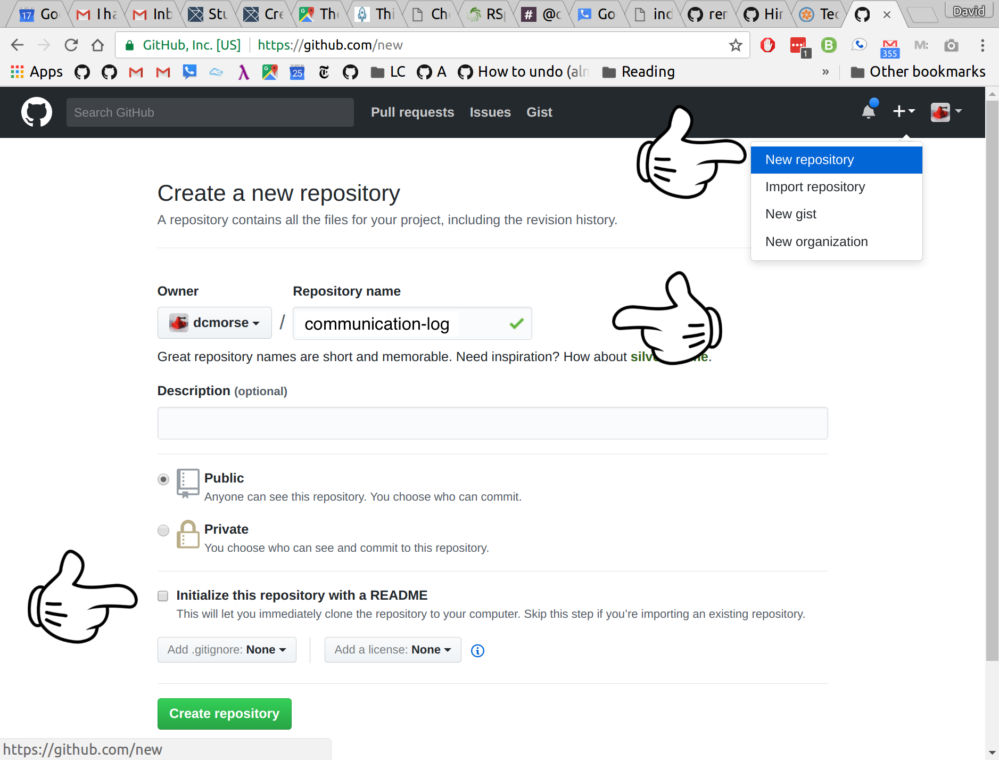
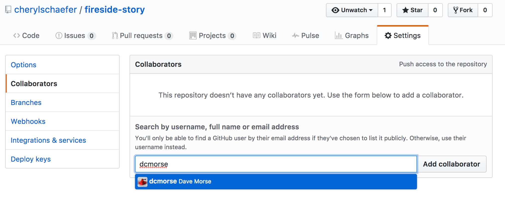
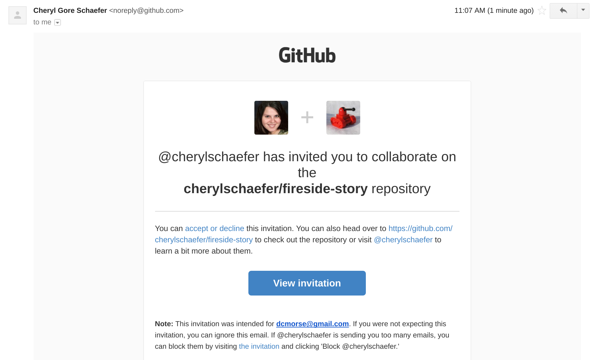
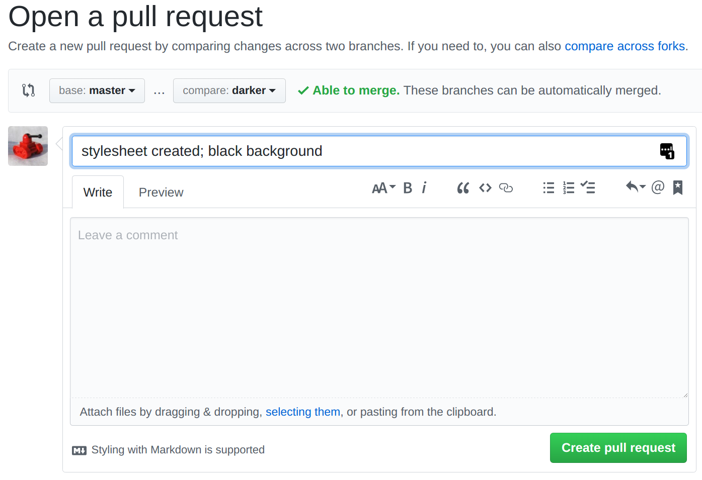
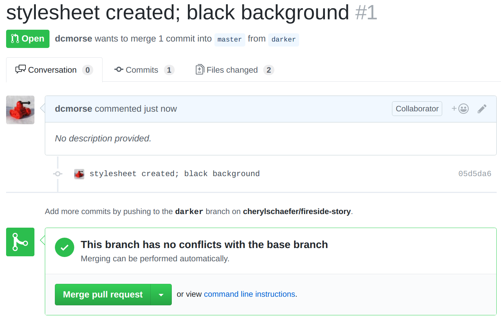
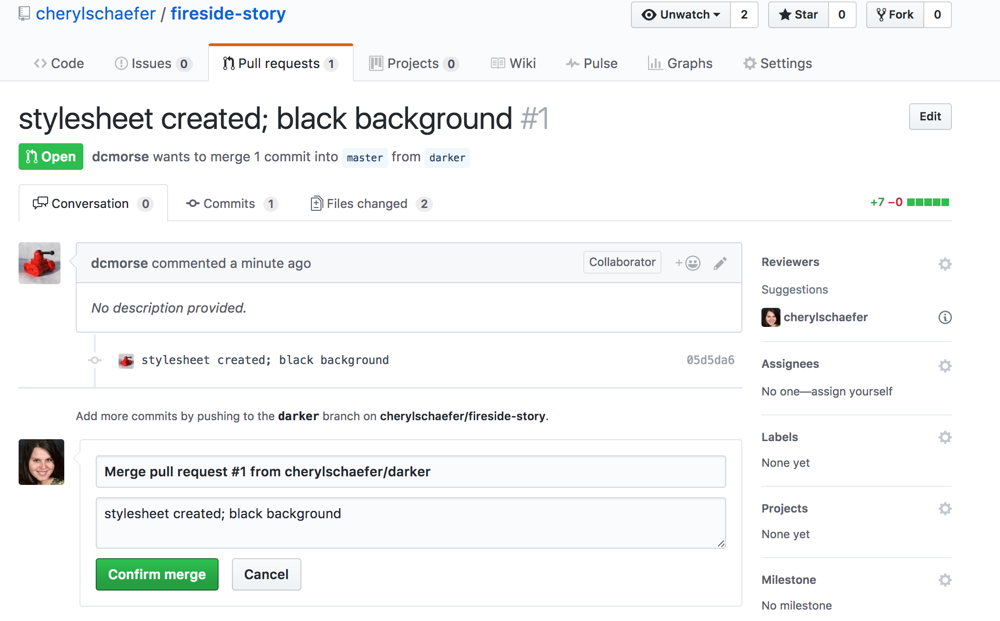
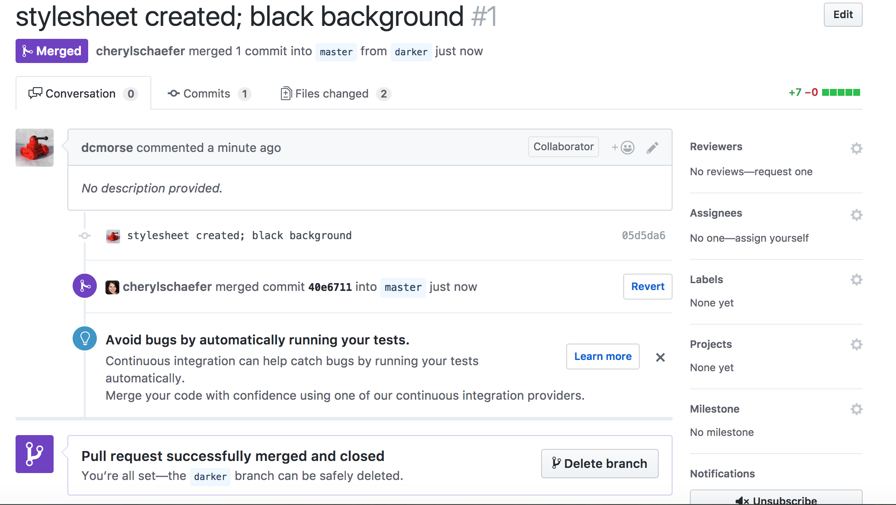
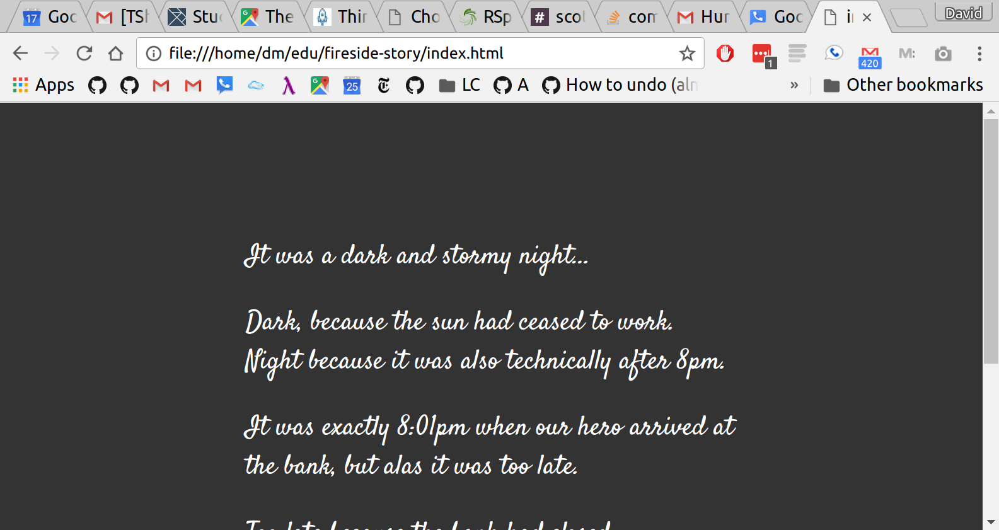

Studio: Fireside Story
======================

Getting Ready: Code Together
----------------------------

Coding together allows you to work as a team so you can build bigger projects, faster.

In this studio, we will practice common Git commands necessary when
multiple people are developing on the same code base. Today, you will
start out coding in tag-team shifts, and by the end you should have
a good idea of how to both be working on the same code at the same
time. You will learn how to:

- Quickly add Code in Pull + Push Cycles *(Important! This is the fundamental process we'll be practicing!)*
- Add a Collaborator to a GitHub Project
- Sharing Repositories on GitHub
- Create a Branch in Git
- Create a Pull Request in GitHub
- Resolve Merge Conflicts

This lesson reinforces:

- Creating Repositories
- Cloning Repositories
- Working with Git Concepts: Staging, Commits, and Status

Walkthrough
-----------

The instructor will discuss why GitHub is worth their study. You already know how to use a local Git repository with one branch, giving you the ability to move your code forward and backward in time. Working with branches on GitHub allows multiple people to build features at the same time. Pull Requests act as a checkpoint when code flows from branch to branch.

Students *must* pair off for this exercise. If you have trouble finding a partner, ask your TA for help.

Studio
------

We are going to play a game. We will play it just like you'd play around a campfire, but on a web page.

First, find a new friend to play the game with.

Feel free to share your story in the `#showcase` channel on Slack, and see what others have created!

You and your partner will alternate tasks, so designate one of you as **Player 1** and the other as **Player 2**. Even when it is not your turn to complete a task, read and observe what your partner is doing to completed theirs. The steps here mimic how a real-world collaborative Git workflow can be used within a project.

.. warning:: 

   As you go through these steps, you'll be working with branches, and it's very likely that you will make changes to the code only to realize that you did so in the wrong branch. If this happens to you (and it has happened to all of us) you can use ``Git stash`` to cleanly move your changes to another branch. Read about how to do so in our Git Stash Tutorial.

.. todo:: Migrate Git stash tutorial

Step 1: Create a New Repository
^^^^^^^^^^^^^^^^^^^^^^^^^^^^^^^

**Player 1**: Navigate to your development folder. Follow these instructions to create a new project.

::

   $ mkdir fireside-story
   $ cd fireside-story
   $ Git init

In that directory, open a new file `index.html` in the editor of your choice. Paste in this code:

.. sourcecode:: html

   <html>
   <body>
      <p>It was a dark and stormy night...</p>
   </body>
   </html>

Let's check that our html looks okay by opening it in a browser. You can do this by selecting File > Open File in your web browser, and navigating to the location of your new HTML file. The URL will look something like this: ``file:///Users/cheryl/Development/fireside-story/index.html``.

Once you've seen this file in the browser, let's stage and commit it.

::

   $ Git status
   On branch master

   Initial commit

   Untracked files:
   (use "Git add <file>..." to include in what will be committed)

      index.html

   nothing added to commit but untracked files present (use "Git add" to track)

The file is not staged. Let's add everything in this directory.

::

   $ Git add .
   $ Git status
   On branch master

   Initial commit

   Changes to be committed:
   (use "Git rm --cached <file>..." to unstage)

      new file:   index.html

We see that the file is staged. Let's commmit.

::

   $ Git commit -m 'started story'
   [master (root-commit) e1c1719] started story
   1 file changed, 5 insertions(+)
   create mode 100644 index.html
   $ Git log
   commit 679de772612099c77891d2a3fab12af8db08b651
   Author: Cheryl <cherylschaefer@gmail.com>
   Date:   Wed Apr 5 10:55:56 2017 -0500

      started story


Great! We've got our project going locally, but we're going to need to make it accessible for Player 2 also. Let's push this project up to GitHub.

Step 2: Share Your Repository On GitHub
^^^^^^^^^^^^^^^^^^^^^^^^^^^^^^^^^^^^^^^

**Player 1**: Go to your GitHub profile in a web browser. Click on the + button to add a new repository ('repo').



   Create a new repository in GitHub

Fill in the name and description. Uncheck the "initialize with README". Click *Create Repository*.

<aside class="aside-warning" markdown="1">If you initialize with a README, in the next step Git will refuse to merge this repo with the local repo. There's ways around that, but it's faster and easier to just create an empty repo here. </aside>

.. figure:: figures/StartingARepo.png

   Connecting to a repository in GitHub

Now go back to your terminal and follow the instructions shown on GitHub which should be very similar to this:

::

   $ Git remote add origin https://Github.com:cherylschaefer/fireside-story.Git
   $ Git push origin master

.. warning::

   Unless you've set up an SSH key with GitHub, make sure you've selected the HTTPS clone URL. If you don't know whether or not you've done this, you almost certainly haven't.

Now you should be able to confirm that GitHub has the same version of the project you have locally. (File contents in browser match those in terminal.) Click around and see what is there. You can read all your code through GitHub's web interface.

.. figure:: figures/Repo1Commit.png

   A repository with one commit in GitHub

Step 3: Clone a Project from GitHub
^^^^^^^^^^^^^^^^^^^^^^^^^^^^^^^^^^^

**Player 2:** Go to Player 1's GitHub profile and find the fireside-story repo. Click on the green *Clone or download* button. Please use HTTPS (not SSH). Copy the url to your clipboard.

!`Cloning a repository in GitHub <figures/CloneRepo2.png>`_

In your terminal, navigate to your development folder and clone down the repo. The command should look something like this.

:: 
   
   Git clone https://Github.com/cherylschaefer/fireside-story.Git

Now you can add a line to the story! Open the `index.html` file in your editor and add the next line of the story. Be creative -- the story can go anywhere! Just don't talk about what to write with your partner. Then commit your change.

::
   $ Git status
   On branch master
   Your branch is up-to-date with 'origin/master'.
   nothing to commit, working directory clean
   $ Git add index.html
   $ Git commit -m 'added second line of story'

Now we need to push up your changes so Player 1 can use them as well.

::

   $ Git push origin master
   ERROR: Permission to cherylschaefer/fireside-story.Git denied to player2.
   fatal: Could not read from remote repository.

   Please make sure you have the correct access rights
   and the repository exists.

Great error message! It let us know exactly what went wrong - Player 2 does not have security permissions to write to Player 1's repo. Let's go fix that.

Step 4: Add A Collaborator To A GitHub Project
^^^^^^^^^^^^^^^^^^^^^^^^^^^^^^^^^^^^^^^^^^^^^^

**Player 1**: In your web browser, go to your `fireside-story` repo. Click the *Settings* button then click on *Collaborators*. Enter in Player 2's GitHub username and click *Add Collaborator*.



   Add a collaborator to your repo in GitHub

Step 5: Join the Project and Push
^^^^^^^^^^^^^^^^^^^^^^^^^^^^^^^^^

**Player 2**: You should receive an email invitation to join this repository. View and accept the invitation.

.. note:: 

   If you don't see an email (it may take a few minutes to arrive in your inbox), check your Spam folder. If you still don't have an email, visit the repository page for the repo that Player 1 created (ask them for the link), and you'll see a notification at the top of the page.



   Invited to collaborate email in GitHub 

Now let's go enter that command again to push up our code.

::

   $ Git push origin master
   Counting objects: 9, done.
   Delta compression using up to 4 threads.
   Compressing objects: 100% (9/9), done.
   Writing objects: 100% (9/9), 1.01 KiB | 0 bytes/s, done.
   Total 9 (delta 8), reused 0 (delta 0)
   remote: Resolving deltas: 100% (8/8), completed with 8 local objects.
   To Git@Github.com:player2/fireside-story.Git
      511239a..679de77  master -> master

Anyone reading the HTML through GitHub's browser interface should now see the new second line.

Step 6: Pull Player 2's Line and Add Another Line
^^^^^^^^^^^^^^^^^^^^^^^^^^^^^^^^^^^^^^^^^^^^^^^^^

**Player 1:** You might notice you don't have the second line of code in your copy of the project on your computer. Let's fix that. Go to the terminal and enter this command to pull down the updated code into your local Git repository.

::

   $ Git pull origin master
   remote: Counting objects: 3, done.
   remote: Compressing objects: 100% (2/2), done.
   remote: Total 3 (delta 1), reused 3 (delta 1), pack-reused 0
   Unpacking objects: 100% (3/3), done.
   From Github.com:cherylschaefer/fireside-story
      e0de62d..e851b7e  master     -> origin/master
   Updating e0de62d..e851b7e
   Fast-forward
   index.html | 1 +
   1 file changed, 1 insertion(+)


Now, in your editor, add a third line to the story and. Then add, commit, and push it up.

You can have your story go anywhere! Try to tie it in with what the other player wrote, without discussing with them any plans on where the story will go.

Step 7: Do It Again: Pull, Change, and Push!
^^^^^^^^^^^^^^^^^^^^^^^^^^^^^^^^^^^^^^^^^^^^

**Player 2:** You might notice now *you* don't have the third line on your computer. Go to the terminal and enter this command to pull in the changes that Player 1 just made.

::

   $ Git pull origin master
   remote: Counting objects: 3, done.
   remote: Compressing objects: 100% (2/2), done.
   remote: Total 3 (delta 1), reused 3 (delta 1), pack-reused 0
   Unpacking objects: 100% (3/3), done.
   From Github.com:cherylschaefer/fireside-story
      e851b7e..167684c  master     -> origin/master
   Updating e851b7e..167684c
   Fast-forward
   index.html | 1 +
   1 file changed, 1 insertion(+)

Now add a fourth line of story. Again, be creative, but no planning!

Then add, commit, and push your change.

You can both play like this for a while! Feel free to repeat this cycle a few times to add to the story.

Step 8: Create a Branch In Git
^^^^^^^^^^^^^^^^^^^^^^^^^^^^^^

This workflow is a common one in team development situations. You might wonder, however, if professional developers sit around waiting for their teammates to commit and push a change before embarking on additional work on their own. That would be a drag, and thankfully, there is a nice addition to this workflow that will allow for simultaneous work to be carried out in a reasonable way.

**Player 2:** While Player 1 is working on an addition to the story, let's make another change simultaneously. In order to do that, we'll create a new branch. Recall that a branch is a separate "copy" of the codebase that you can commit to without affecting code in the ``master`` branch.

::

   $ Git checkout -b darker
   Switched to a new branch 'darker'

This command creates a new branch named ``darker``, and switches your local repository to use that branch.

Create a new file named ``style.css`` and add the following rules:

.. sourcecode:: css

   body {
      color: white;
      background-color: black;
   }

Then link it in ``index.html``. It should look something like this:

.. sourcecode:: html

   <html>
      <head>
         <link rel="stylesheet" type="text/css" href="style.css">
      </head>
      <body>
         <p>It was a dark and stormy night...</p>
         ... your content here
      </body>
   </html>

Now stage and commit these changes.

::

   $ Git add .
   $ Git commit -m 'Added style.css'
   $ Git push origin darker

Note that the last command is a bit different than what we've used before (`Git push origin master`). The final piece of this command is the name of the branch that we want Git to push up to the origin repository (that is, to GitHub).

You should both now see a second branch present on the GitHub project page. To view branches on GitHub, select *Branches* from the navigation section just below the repository title.

.. figure:: figures/BranchesButton.png

   Branches Button in GitHub

In your terminal, you can type this command to see a list of the available branches:

::

   $ Git branch
   * darker
   master

Note that creating and being able to see a branch in your local repository via this command does *not* mean that the branch is on GitHub. You'll need to push the branch for it to appear on GitHub.

.. note::

   The \* to the left of ``darker`` indicates that this is the active branch.


Great! Now let's show the other player your work in GitHub and ask them to merge it in to the main branch.

Create a Pull Request In GitHub
^^^^^^^^^^^^^^^^^^^^^^^^^^^^^^^

**Player 2:** If you haven't already, in your browser, go to the GitHub project and click on *Branches* and make sure you see the new branch name, *darker*.

..figure:: figures/pr-new.png

   Branches Page in GitHub

Click *New Pull Request* to begin the process of requesting that your changes in the ``darker`` branch be incorporated into the ``master`` branch. Add some text in the description box to let Player 1 know what you did and why. Note that the branch selected in the `base` dropdown is the branch that you want to merge _into_, and the selected in the *compare* dropdown is the branch you want to merge _from_.


   
   Open a PR in GitHub

This is what an opened pull request looks like:



   Create a PR in GitHub

Step 10: Make a Change in the New Branch
^^^^^^^^^^^^^^^^^^^^^^^^^^^^^^^^^^^^^^^^

**Player 1:** You will notice that you do not see this new ``style.css`` file locally. Type this command to see what branches are on your local computer:

::

   $ Git branch
   * master

If you want to work with the branch before merging it in, you can do so by typing these commands:

::

   $ Git fetch origin darker
   ...
   $ Git branch
   darker
   * master

::

   $ Git checkout darker
   Switched to branch 'darker'
   Your branch is up-to-date with 'origin/darker'.

Make a change, commit, and push this branch--you will see that the pull request in GitHub is updated to reflect the changes you've added. The context in the description box is _not_ updated, however, so be sure to add comments to the pull request to explain what you did and why.

Now switch back to the ```master``` branch:

::

   $ Git checkout master
   Switched to branch 'master'
   Your branch is up-to-date with 'origin/master'.

You will see your files no longer have the changes made in the ``darker`` branch. Let's go merge those changes in, so that the ```master``` branch adopts all the changes in the ``darker`` branch.

Step 11: Merge the Pull Request
^^^^^^^^^^^^^^^^^^^^^^^^^^^^^^^

**Player 1:** Go to the repo in GitHub. Click on *Pull Requests*.

.. figure:: figures/RepoPR1.png

   PR Open in GitHub

Explore this page to see all the information GitHub shows you about the pull request.

.. figure:: figures/RepoMergePR.png

   Merge a Pull Request in GitHub

When you're happy with the changes, merge them in. Click *Merge Pull Request* then *Confirm Merge*.



   Confirm PR Merge in GitHub

Upon a successful merge, you should see a screen similar to the following:



   PR Merged in GitHub 

The changes from ``darker`` are now in the ```master``` branch, but only in the remote repository on GitHub. You will need to pull the updates to your ```master``` for them to be present locally.

::

   $ Git checkout master
   $ Git pull origin master

Git is able to merge these files on its own.

Step 12: Merge Conflicts!
^^^^^^^^^^^^^^^^^^^^^^^^^

When collaborating on a project, things won't always go so smoothly. It's common for two people to make changes to the same line(s) of code, at roughly the same time, which will prevent Git from being able to merge the changes together.

.. figure:: figures/Git-merge.gif

   Git Merge Conflicts

This isn't such a big scary deal. In fact, it's very common. To see how we can handle such a situation we'll intentionally create a situation that involves a merge conflict, and then resolve it.

**Player 2:** Let's change something about the style file. Our HTML is looking pretty plain, so let's pick a nice font and add some margins.

First, switch back to the ``master`` branch.

::

   $ Git checkout master

Let's change our font. To do so, add this link to your ``index.html`` file, right by the first stylesheet link:

.. sourcecode:: html
     
     <link href="https://fonts.googleapis.com/css?family=Satisfy" rel="stylesheet">


And spice up your ``style.css`` file to look like this:

.. sourcecode:: css

   body {
   color: white;
   background-color: #333;
   font-size: 150%;
   font-family: 'Satisfy', cursive;
   margin: 5em 25%;
   }

The result:



   Satisfying! 

Stage and commit your changes and push them up to GitHub. If you don't remember how to do this, follow the instructions above. Make sure you're back in the ``master`` branch--if you're still in ``darker``, then your changes will be isolated and we won't get the merge conflict you want to learn about.

Meanwhile...

**Player 1:** Let's change something about the style file that Player 2 just edited. Change it to look like this:

.. sourcecode:: css

   body {
      color: white;
      background-color: black;
      font-family: 'Sacramento', cursive;
      font-size: 32px;
      margin-top: 5%;
      margin-left: 20%;
      margin-right: 20%;
   }

Don't forget to link the new font in your ``index.html`` file, beside the other link:

.. sourcecode:: html
  
  <link href="https://fonts.googleapis.com/css?family=Sacramento" rel="stylesheet">

Commit your changes to branch ``master``.


Step 13: Resolving Merge Conflicts
^^^^^^^^^^^^^^^^^^^^^^^^^^^^^^^^^^

**Player 1:** and push it up to GitHub. You should get an error message. How exciting!

:: 

   $ Git push origin master

   To Git@Github.com:cherylschaefer/fireside-story.Git
   ! [rejected]        master -> master (fetch first)
   error: failed to push some refs to 'Git@Github.com:cherylschaefer/fireside-story.Git'
   hint: Updates were rejected because the remote contains work that you do
   hint: not have locally. This is usually caused by another repository pushing
   hint: to the same ref. You may want to first integrate the remote changes
   hint: (e.g., 'Git pull ...') before pushing again.
   hint: See the 'Note about fast-forwards' in 'Git push --help' for details.


There's a lot of jargon in that message, including some terminology we haven't encountered. However, the core of the message is indeed understandable to us: "Updates were rejected because the remote contains work that you do not have locally." In other words, somebody (Player 2, in this case), pushed changes to the same branch, and you don't have those changes on your computer. Git will not let you push to a branch in another repository unless you have incorporated all of the work present in that branch.

Let's pull these outstanding changes into our branch and resolve the errors.

:: 

   $ Git pull
   remote: Counting objects: 4, done.
   remote: Compressing objects: 100% (3/3), done.
   remote: Total 4 (delta 1), reused 4 (delta 1), pack-reused 0
   Unpacking objects: 100% (4/4), done.
   From Github.com:cherylschaefer/fireside-story
      7d7e42e..0c21659  master     -> origin/master
   Auto-merging style.css
   CONFLICT (content): Merge conflict in style.css
   Auto-merging index.html
   CONFLICT (content): Merge conflict in index.html
   Automatic merge failed; fix conflicts and then commit the result.


Since Player 2 made changes to some of the same lines that you did, Git was unable to automatically merge the changes.

The specific locations where Git could not automatically merge files are indicated by the lines that begin with ``CONFLICT``. You will have to edit these files yourself to incorporate Player 1's changes. Let's start with ``style.css``.

::

   body {
      color: white;
   <<<<<<< HEAD
      background-color: black;
      font-family: 'Sacramento', cursive;
      font-size: 32px;
      margin-top: 5%;
      margin-left: 20%;
      margin-right: 20%;
   =======
      background-color: #333;
      font-size: 150%;
      font-family: 'Satisfy', cursive;
      margin: 5em 25%;
   >>>>>>> 0c2165931f5f668959bad92d2f744efb402e049d
   }

At the top and bottom, there is some code that could be merged without issue.

``<<<<<<< HEAD`` to ``=======`` is the version of the code that existed locally. In other words, these are _your_ changes.

``=======`` to ``>>>>>>> 0c2165931f5f668959bad92d2f744efb402e049d`` indicates the changes that Player 2 made (the hash will be unique to the commit, so you'll see something slightly different here).

Let's unify our code. Change the CSS to look like this, making sure to remove the Git markers so that only valid CSS remains in the file.

.. sourcecode:: css

   body {
   color: white;
   background-color: black;
   font-family: 'Sacramento', cursive;
   font-size: 150%;
   margin: 5em 25%;
   }

You will need to do the same thing for the ``index.html`` file. You only need the link for the Sacramento font, not the Satisfy font. Then stage, commit, and push your changes; you should not see an error message this time.

Step 14: Pulling the Merged Code
^^^^^^^^^^^^^^^^^^^^^^^^^^^^^^^^

**Player 2:** Meanwhile, Player 2 is sitting at home, minding their own business. A random ``Git status`` seems reassuring:

::

   $ Git status
   On branch master
   Your branch is up-to-date with 'origin/master'.
   nothing to commit, working directory clean


Your local Git thinks the status is quo. Little does it know that up at GitHub, the status is not quo. We'd find this out by doing either a ``Git fetch``, or if we just want the latest version of this branch, ``Git pull``:

::

   $ Git pull
   remote: Counting objects: 13, done.
   remote: Compressing objects: 100% (8/8), done.
   remote: Total 13 (delta 4), reused 13 (delta 4), pack-reused 0
   Unpacking objects: 100% (13/13), done.
   From Github.com:cherylschaefer/fireside-story
      0c21659..e0de62d  master     -> origin/master
   Updating 0c21659..e0de62d
   Fast-forward
   index.html | 3 ++-
   style.css  | 4 ++--
   2 files changed, 4 insertions(+), 3 deletions(-)

Great Scott! Looks like Player 1 changed both ``index.html`` and ``style.css``. Note that *Player 2* didn't have to deal with the hassle of resolving merge conflicts. Since Player 1 intervened, Git assumes that the team is okay with the way they resolved it, and *fast forwards* our local repo to be in sync with the remote one. Let's look at ``style.css`` to make sure:

.. sourcecode:: css

   body {
      color: white;
      background-color: black;
      font-family: 'Sacramento', cursive;
      font-size: 150%;
      margin: 5em 25%;
   }

Step 15: More Merge Conflicts!
^^^^^^^^^^^^^^^^^^^^^^^^^^^^^^

Let's turn the tables on the steps we just carried out, so Player 2 can practice resolving merge conflicts.

- **Players 1 and 2**: Confer to determine the particular lines in the code that you will both change. Make different changes in those places.
- **Player 1**: Stage, commit, and push your changes.
- **Player 2**: Try to pull in Player 1's changes, and notice that there are merge conflicts. Resolve these conflicts as we did above (ask Player 1 for help, if you're uncertain about the process). Then stage, commit, and push your changes.
- **Player 1**: Pull in the changes that Player 2 pushed, including the resolved merge conflicts.

Merge conflicts are a part of the process of team development. Resolve them carefully, so that they don't cause bugs in your code.

Resources
^^^^^^^^^

* `Git Branching - Basic Branching and Merging <https://Git-scm.com/book/en/v2/Git-Branching-Basic-Branching-and-Merging>`_
* `Adding Another Person To Your Repository <https://help.Github.com/articles/inviting-collaborators-to-a-personal-repository/>`_
* `Resolving Conflicts In the Command Line <https://help.Github.com/articles/resolving-a-merge-conflict-using-the-command-line/>`_
