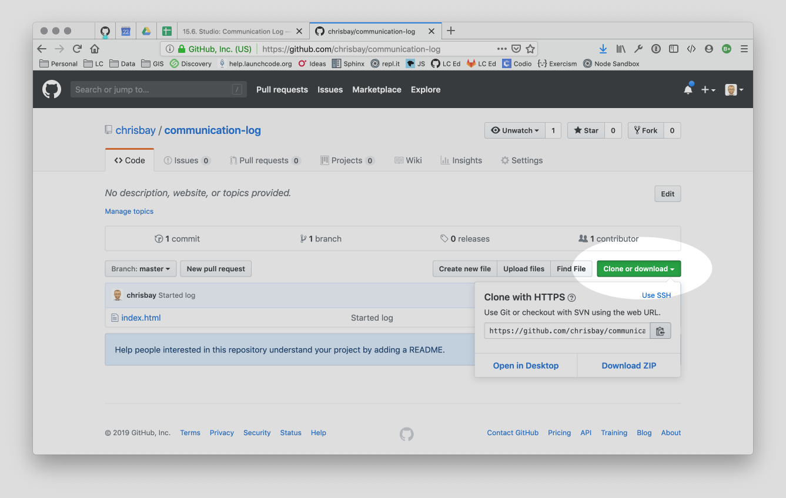

.. _comm-log-part2:

Studio: Communication Log (cont.)
=================================

We are going to simulate a radio conversation between a shuttle pilot and
mission control.

You and your partner will alternate tasks, so decide who will be the **Pilot**
and who will be the **Control**. Even when it is not your turn to complete a
task, read and observe what your partner is doing. The steps here mimic a
real-world collaborative Git workflow.

.. admonition:: Warning

   As you go through these steps, you'll be working with *branches*.
   
   It's very likely you will make changes to the code only to realize that you
   did so in the wrong branch. When this happens (and it happens to all of us)
   you can use ``git stash`` to cleanly move your changes to another branch.
   Read about how to do this in our :ref:`git-stash` tutorial.

Step 3: Clone a Project from GitHub
-----------------------------------

**Pilot**: Go to Control's GitHub profile and find their ``communication-log``
repo. Click on the green *Clone or download* button. Use HTTPS (not SSH). Copy
the URL to your clipboard.

   
   Cloning a repository in GitHub

.. todo:: Replace clone repo image with one focused on the active buttons.

In your terminal, navigate to your development folder and clone down the repo.
The command should look something like this.

::

   $ git clone https://github.com/chrisbay/communication-log.git

Now you can respond to Control! Open the ``index.html`` file in your editor and
add your response to mission control. Be creative, the communication can go
anywhere! Just don't ask your partner what you should write. After you finish,
commit your change.

::

   $ git status
   On branch main
   Your branch is up-to-date with 'origin/main'.
   nothing to commit, working directory clean
   $ git add index.html
   $ git commit -m 'Added second line to log.'

Now we need to push up your changes so Control can use them as well.

::

   $ git push origin main
   ERROR: Permission to chrisbay/communication-log.git denied to pilot.
   fatal: Could not read from remote repository.

   Please make sure you have the correct access rights
   and the repository exists.

Great error message! It let us know exactly what went wrong: Pilot does not
have security permissions to write to Control's repo. Let's fix that.

Step 4: Add A Collaborator To A GitHub Project
----------------------------------------------

Lorem ipsum...

Step 5: Join the Project and Push
---------------------------------

Lorem ipsum...

Step 6: Pull Pilot's Line and Add Another Line
----------------------------------------------

Lorem ipsum...

