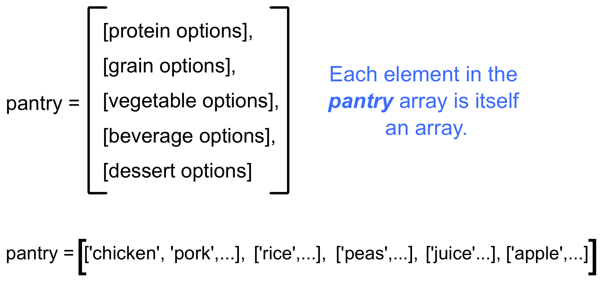

.. _loop-studio:

Studio: Loops
=============

Now that we've launched our shuttle, let's use loops (iteration) to
automate some tasks.

Before You Start
----------------

If you are enrolled in a LaunchCode program, access this studio by following the repl.it classroom links posted in your class at `learn.launchcode.org <https://learn.launchcode.org/>`_.

If you are working through this material on your own, use the repl.it links contained on this page.

Part A (Put dinner together)
----------------------------
#. First, initialize variables to store the following arrays.  Remember to use descriptive names.

   - Protein options:

     ::

        ['chicken', 'pork', 'tofu', 'beef', 'fish', 'beans']

   - Grain options:

     ::

        ['rice', 'pasta', 'corn', 'potato', 'quinoa', 'crackers']

   - Vegetable options:

     ::

        ['peas', 'green beans', 'kale', 'edamame', 'broccoli', 'asparagus']

   - Beverage options:

     ::

        ['juice', 'milk', 'water', 'soy milk', 'soda', 'tea']

   - Dessert options

     ::

        ['apple', 'banana', 'more kale', 'ice cream', 'chocolate', 'kiwi']

`Code it at replt.it <https://repl.it/@launchcode/LoopstudiopartsAandC>`__

2. Use a ``for`` loop to assemble 6 meals.

   a. The meals must include one item from each of the source arrays.
   b. Each ingredient can only be used ONCE.
   c. Print out each meal.

#. *Skill boost!* (Optional): To enhance your learning, modify your code to:

   a. Use string formatting to print something more interesting than "['chicken', 'rice', 'peas', 'juice', 'apple']" for the meal outputs.
   b. Use an "array of arrays" to store the food options in a 'pantry'.

Part B (Self-destruct system)
-----------------------------

If the shuttle gets hijacked by space pirates, the astronauts can activate
a self-destruct sequence to provide some drama for the viewers at home.

In order to prevent a rogue astronaut from activating the code, it takes
*two* crew members to begin the countdown.  Each person must enter a
different code, after which the computer will "zip" them together before
overloading the engines.

4. Construct a ``for`` loop that combines two strings together, alternating the characters from each source.

   .. admonition:: Examples

      #. If ``string = "1234"`` and ``otherString = "5678"``, then the output will be "15263748".
      #. If ``code1 = "ABCDEF"`` and ``code2 = "notyet"``, then the output will be "AnBoCtDyEeFt".
      #. If ``ka = "LoOt"`` and ``blam = "oku!"``, then the output will be ``"LookOut!"``.

   `Code it at replt.it <https://repl.it/@launchcode/LoopstudiopartB>`__

Part C (Refinements)
--------------------

Update your code from part A to add user input and validation.

5. Using a ``while`` loop, ask the user to select the number of meals to assemble. Validate the input to make sure it is an integer from 1 - 6.

Bonus Mission
-------------

Modify your code to check each meal for kale. If present, after the meal output add, "Don't worry, you can have double chocolate tomorrow."
