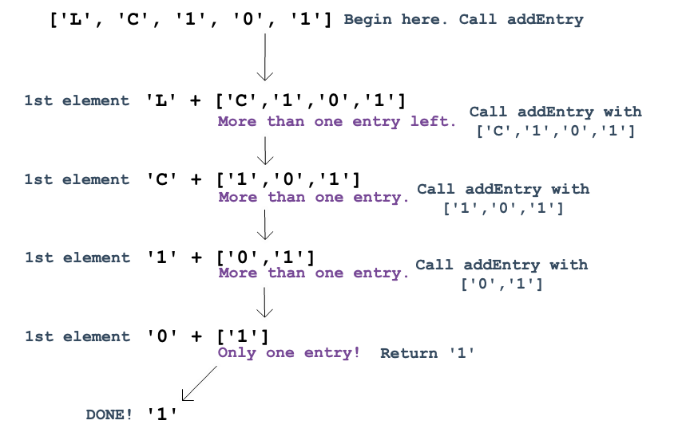

Making A Function Call Itself
==============================

Congratulations! Identifying the base case is a very important part of setting
up a recursive function.

We've made it this far with ``addEntry``:

.. sourcecode:: js

   function addEntry(arrayName){
      if (arrayName.length === 1){
         return arrayName[0];
      } else {
         //solve next small step
         //call addEntry again
      }
   }

Now we are ready to take the next step.

Looping Without **for** or **while**
-------------------------------------

For arrays with more than one entry, we need to make ``addEntry`` consider the
first element and then *check what is left in the array*. If the rest of the
array contains more than one item, ``addEntry`` calls iteslf again and repeats
the process with a smaller set of entries.

We can visualize the process for ``['L', 'C', '1', '0', '1']`` as
follows: (Yes, I know there is a mistake in the diagram.)

So how do we code this in ``addEntry``? Recall the requirements:

a. Make ``addEntry`` consider the first element,
b. If the rest of the array has more than one entry, call ``addEntry`` with
   a smaller array.

Bracket notation takes care of part a: ``arrayName[0]``.

| For part b, remember that the :ref:`slice method <slice-examples>` returns
   selected entries from an array. To return everything BUT the first entry in
| ``arr = ['L', 'C', '1', '0', '1']``, use ``arr.slice(1)``.

Let's add the bracket notation and the ``slice`` method to our function:

.. sourcecode:: js

   function addEntry(arrayName){
      if (arrayName.length === 1){
         return arrayName[0];
      } else {
         return arrayName[0]+addLetter(arrayName.slice(1));
      }
   }

See it in action **here** (TODO: Repl.it link).

A Visual Representation
------------------------

This is the first attempt at the figure. Not 80% happy with it yet.
Suggestions?

.. figure:: figures/Recursion-diagram.png
   :alt: Visual representation of calling addEntry multiple times.

Concept Checks
---------------

Coming soon...
