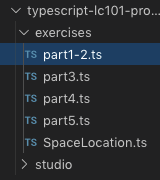

Exercises: TypeScript
=====================

.. _TS-repo:

Part 0 - Get the Starter Code
------------------------------

#. Login to your GitHub account.
#. Fork the
   `typescript-lc101-projects repository <https://github.com/LaunchCodeEducation/typescript-lc101-projects>`__.
#. Use the terminal to clone your fork from GitHub. If you need a reminder for
   how to do this, refer to the :ref:`Git studio <clone-from-git>`.
#. Use the terminal to navigate into the ``typescript-lc101-projects`` folder,
   then into the ``exercises`` subfolder.

   .. sourcecode:: bash

      $ ls
         typescript-lc101-projects
      $ cd typescript-lc101-projects
      $ ls
         exercises       studio
      $ cd exercises
      $ ls
         SpaceLocation.ts     parts1-5.ts    tsconfig.json

Part 1 - Declare Variables With Type
------------------------------------

Run VSCode and open the ``typescript-lc101-projects`` folder. From the file
tree, select the ``parts1-5.ts`` file.

   VSCode file tree

In the space indicated, declare and assign a variable for each of the
following:

.. list-table::
   :widths: auto
   :header-rows: 1

   * - Variable Name
     - Type
     - Value
   * - spacecraftName
     - string
     - ``'Determination'``
   * - speedMph
     - number
     - 17500
   * - kilometersToMars
     - number
     - 225000000
   * - kilometersToTheMoon
     - number
     - 384400
   * - milesPerKilometer
     - number
     - 0.621

:ref:`Check your solution <typescript-exercise-solutions1>`

Part 2 - Print Days to Mars
---------------------------
In the *same* file you opened in Part 1, do the following.

#. Declare and assign these variables.

   a. Remember: variable declarations in TypeScript include the type!
   b. ``milesToMars`` is a number with the value of
      ``kilometersToMars * milesPerKilometer``.
   c. ``hoursToMars`` is a number with the value of
      ``milesToMars / speedMph``.
   d. ``daysToMars`` is a number with the value of ``hoursToMars / 24``.

#. Write a ``console.log`` statement that prints out the days to Mars.

   a. Use template literal syntax and the variables ``${spacecraftName}`` and
      ``${daysToMars}``.

#. Use the terminal in VSCode to compile your ``.ts`` file, then use the
   command ``node parts1-5.js`` to run the JavaScript file created during the
   build process.

**Terminal**

::

   $ tsc parts1-5.ts
   $ node parts1-5.js
      Determination would take 332.67857142857144 days to get to Mars.

:ref:`Check your solution <typescript-exercise-solutions2>`

Part 3 - Create a Function
---------------------------

#. In the space indicated, define a function that calculates the days it would
   take to travel to a location.

   a. Function name ``getDaysToLocation``
   b. Parameter

      * ``kilometersAway`` must be a number.

   c. Returns the number of days to a location.

      * Use the same calculations as in Part 2.1.
      * Inside the function, make the variable names generic. Use ``milesAway``
        and ``hoursToLocation`` instead of ``milesToMars`` and ``hoursToMars``.
      * The function should declare that it returns a ``number``.

#. Print out the days to Mars.

   a. Move the output statement from part 2 below your new function.
   b. Refactor the template literal to use ``${getDaysToLocation(kilometersToMars)}``
      and ``${spacecraftName}``.

#. Print out the days to the Moon.

   a. Add another output statement and template literal using
      ``${getDaysToLocation(kilometersToTheMoon)}`` and ``${spacecraftName}``.

#. Use the terminal in VSCode to recompile your ``.ts`` file, then run the
   ``parts1-5.js`` file again.

**Terminal**

::

   $ tsc parts1-5.ts
   $ node parts1-5.js
      Determination would take 332.67857142857144 days to get to Mars.
      Determination would take 0.5683628571428571 days to get to the Moon.

:ref:`Check your solution <typescript-exercise-solutions3>`

Part 4 - Create a Spacecraft Class
-----------------------------------

Organize ``getDaysToLocation`` and the variables for name, speed, and miles per
kilometer by moving them into a *class*.

#. Define a class named ``Spacecraft``.

   a. Properties

      * ``milesPerKilometer: number = 0.621;``
      * ``name: string;``
      * ``speedMph: number;``

   b. Constructor

      * ``name`` is the first parameter and it MUST be a string.
      * ``speedMph`` is the second parameter and it MUST be a number.
      * Sets the class properties using ``this.name`` and ``this.speedMph``.

   .. admonition:: Note

      Once you complete the constructor, be sure to remove the variables you
      defined in part 1 (``spacecraftName``, ``milesPerKilometer``, and
      ``speedMph``.

#. Move the function ``getDaysToLocation``, defined in Part 3, into the
   ``Spacecraft`` class.

   a. Remember to place the function after the constructor.
   b. Update the function to reference the class properties
      ``this.milesPerKilometer`` and ``this.speedMph``.

#. Create an instance of the ``Spacecraft`` class.

   a. ``let spaceShuttle = new Spacecraft('Determination', 17500);``

#. Print out the days to Mars.

   a. Use template literals,
      ``${spaceShuttle.getDaysToLocation(kilometersToMars)}`` and
      ``${spaceShuttle.name}``.

#. Print out the days to the Moon.

   a. Use template literals,
      ``${spaceShuttle.getDaysToLocation(kilometersToTheMoon)}`` and
      ``${spaceShuttle.name}``.

#. Use the terminal in VSCode to recompile your ``.ts`` file, then run the
   ``.js`` file again.

**Terminal**

::

   $ tsc parts1-5.ts
   $ node parts1-5.js
      Determination would take 332.67857142857144 days to get to Mars.
      Determination would take 0.5683628571428571 days to get to the Moon.

:ref:`Check your solution <typescript-exercise-solutions4>`

Part 5 - Export and Import the SpaceLocation Class
---------------------------------------------------

#. From the file tree in VSCode, open the ``SpaceLocation.ts`` file.
#. Paste in the code provided below.

   a. Notice the ``export`` keyword. That is what allows us to import it later.

   .. sourcecode:: js
      :linenos:

      export class SpaceLocation {
         kilometersAway: number;
         name: string;

         constructor(name: string, kilometersAway: number) {
            this.name = name;
            this.kilometersAway = kilometersAway;
         }
      }

#. Add the function ``printDaysToLocation`` to the ``Spacecraft`` class.

   a. Notice that it takes a parameter of type ``SpaceLocation``.

   .. sourcecode:: js
      :linenos:

      printDaysToLocation(location: SpaceLocation) {
         console.log(`${this.name} would take ${this.getDaysToLocation(location.kilometersAway)} days to get to ${location.name}.`);
      }

#. Import ``SpaceLocation`` into ``parts1-5.ts``.

   a. Paste ``import { SpaceLocation } from './SpaceLocation';`` to the top of
      ``parts1-5.ts``.

#. Replace the earlier ``console.log`` statements by using the class instance
   to print out the days to Mars and the Moon.

   .. sourcecode:: js
      :lineno-start: 47

      spaceShuttle.printDaysToLocation(new SpaceLocation('Mars', kilometersToMars));
      spaceShuttle.printDaysToLocation(new SpaceLocation('the Moon', kilometersToTheMoon));

#. Use the terminal in VSCode to compile your ``.ts`` file, then run the
   ``.js`` file again.

**Terminal**

::

   $ tsc parts1-5.ts
   $ node parts1-5.js
      Determination would take 332.67857142857144 days to get to Mars.
      Determination would take 0.5683628571428571 days to get to the Moon.

:ref:`Check your solution <typescript-exercise-solutions5>`

Sanity Check
-------------

The ``typescript-lc101-projects`` repository has two branches---``master`` and
``solutions``. 'Nuff said.
