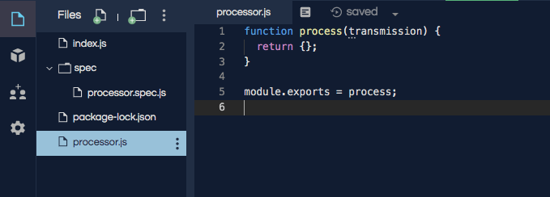

TDD in Action
=============

Fork `this repl.it <https://repl.it/@launchcode/Transmission-processor-TDD-starter>`_
and follow along as we implement a project using TDD.

We need to write a Node module to process transmissions from the
`Voyager1 probe <https://voyager.jpl.nasa.gov/mission/>`_.

.. admonition:: Example

   Transmission

   .. sourcecode:: js

      "1410::<932829840830053761>"

   Expected Result

   .. sourcecode:: js

      {
         id: 1410,
         rawData: 932829840830053761
      }

Requirements
------------
The features for this project have already been broken down into
small testable units. Let's review these and then we will
take it slow and handle these one at a time.

#. Take in a transmission string and return an object ``{}``.
#. Return ``-1`` if the transmission does NOT contain ``"::"``.
#. Returned object should contain an ``id`` property

   * The ``id`` is the part of the transmission *before* the ``"::"``

#. The ``id`` property should be of type ``Number``
#. Returned object should contain a ``rawData`` property

   * The ``rawData`` is the part of the transmission *after* the ``"::"``

#. Return -1 if the ``rawData`` part of the transmission does NOT start with ``<`` and end with ``>``

Requirement #1
--------------
**Requirement:** Take in a transmission string and return an object ``{}``.

To get started on this we need to:

a. Create a blank test function.
b. Give the test a name that describes that behavior the test verify.

Creating a blank test is easy, go to ``processor.spec.js`` and add an empty test method.

.. sourcecode:: js
   :linenos:

   const assert = require('assert');

   describe("data-processor", function() {

      it("", function(){
         
      });

   });

Now we need to give the test a name that is a clear, testable statement that
describes the behavior of the feature we are testing. Give the test
the name ``"takes a string returns an object"``.

.. sourcecode:: js
   :linenos:

   const assert = require('assert');

   describe("transmission processor", function() {

      it("takes a string returns an object", function() {

      });

   });

Now that we have a clear goal for this test, we can add logic and ``assert``
calls to verify the behavior we know should work. But wait, we haven't added anything
except *test* code at this point. There isn't anything to verify!

We are going to think about and visualize
how this feature should in code. Then we will write out in the test how
this new code will be used. Bear with it, this exercise is actually
quite useful.

We need think of something that will satisfy this statement
``"it("takes a string returns an object", ``.
We have to determine what the ``it`` is. Let's define ``it`` a function named
``processor``, which is imported from a module named ``processor``.

.. sourcecode:: js
   :linenos:

   const assert = require('assert');
   const processor = require('../processor.js');

   describe("transmission processor", function() {

      it("takes a string returns an object", function(){
         
      });

   });

We have an idea for a function named ``processor`` and we have imported it.
Keep in mind this function only exists as a concept and we are writing a test
to see if this concept makes sense.

Now the real meat of the test. We are going to use ``assert.strictEqual`` to
verify that if we pass a string to ``processor`` that an ``{}`` is returned.
Carefully review lines **7** and **8** shown below.

.. sourcecode:: js
   :linenos:

   const assert = require('assert');
   const processor = require('../processor.js');

   describe("transmission processor", function() {

      it("takes a string returns an object", function(){
         let result = processor("9701::<489584872710>");
         assert.strictEqual(typeof result, "object");
      });

   });

Code Red
^^^^^^^^
Let's run the test! Click the ``run >`` button in your repl.it.
You should see an error about ``processor.js`` not existing. And that makes sense
we were using that module before we created it. We are officially in the Red
phase of Red, Green, Refactor!

::

   Error: Cannot find module '../processor.js'

Go Green!
^^^^^^^^^
Now that we have a failing test, we have only one choice. Make it pass.

a. Add a ``processor.js`` file to your repl.it.
b. Inside of the module declare a ``processor`` function that takes a parameter and returns ``{}``.

Contents of new ``processor.js`` file.

.. sourcecode:: js
   :linenos:

   function process(transmission) {
      return {};
   }

   module.exports = process;

       processor.js file

**Run the test again.**

We did it! ``1 spec, 0 failures`` means 1 passing
test. In repl.it you have to imagine the satisfying green color of a passing test.
::

   1 spec, 0 failures
   Finished in 0.011 seconds

Refactor if Needed
^^^^^^^^^^^^^^^^^^
This solution is very simple and does not need to be improved. The refactor step 
does not always lead to an actual changing of your code. The most important part is to
review your code to make sure that it's efficient and meets your team's standards.

Requirement #2
--------------
**Requirement:** Return ``-1`` if the transmission does NOT contain ``"::"``.

We will follow the same steps to write this test and eventually make it green

a. Create a blank test function.
b. Give the test a name that describes that behavior the test verify.
c. Think about then write code that fulfills the stated behavior.
d. Run the test and see the it fail.
e. Implement new code to make test pass.
f. Run the test and see it pass.
g. Do we need to refactor? Can the code be better?

See lines **11 - 14** for the solution to steps a. to c.

.. sourcecode:: js
   :linenos:

   const assert = require('assert');
   const processor = require('../processor.js');

   describe("transmission processor", function() {

      it("takes a string returns an object", function(){
         let result = processor("9701::<489584872710>");
         assert.strictEqual(typeof result, "object");
      });

      it("returns -1 if '::' not found", function(){
         let result = processor("9701<489584872710>");
         assert.strictEqual(result, -1);
      });

   });

Error message displayed when you run the test. Notice that ``-1`` was
the expected value, but the actual value was ``{}``.
::

   Failures:
   1) transmission processor returns -1 if '::' not found
   Message:
    AssertionError [ERR_ASSERTION]: Input A expected to strictly equal input B:
    + expected - actual
    
    - 'object'
    + -1

Code the solution. Go to ``processor.js`` and update the ``processor`` function
to check the ``transmission`` argument for the presence of ``'::'``.

.. sourcecode:: js
   :linenos:

   function process(transmission) {
      if (transmission.indexOf("::") < 0) {
         // Data is invalid
         return -1;
      }
      return {};
   }

   module.exports = process;

Run the tests again. They should both pass.

::

   2 specs, 0 failures
   Finished in 0.035 seconds

Requirement #3
--------------
**Requirement:** Returned object should contain an ``id`` property.
The ``id`` is the part of the transmission *before* the ``"::"``

The same steps will be followed, even though they are not explicitly listed.

See lines **16 - 19** to see the test added for this requirement.

.. sourcecode:: js
   :linenos:

   const assert = require('assert');
   const processor = require('../processor.js');

   describe("transmission processor", function() {

      it("takes a string returns an object", function(){
         let result = processor("9701::<489584872710>");
         assert.strictEqual(typeof result, "object");
      });

      it("returns -1 if '::' not found", function(){
         let result = processor("9701<489584872710>");
         assert.strictEqual(result, -1);
      });

      it("returns id in object", function() {
        let result = processor("9701::<489584872710>");
        assert.strictEqual(result.hasOwnProperty("id"), true);
      });

   });

Fail Message

::

  Failures:
  1) transmission processor returns id in object
  Message:
  AssertionError [ERR_ASSERTION]: Input A expected to strictly equal input B:
  + expected - actual
    
  - false
  + true

The object returned from ``processor`` doesn't have an id property. We need to
split the transmission on ``'::'`` and then add that value to the object with
the key ``id``. See solution in ``processor.js`` below.

.. sourcecode:: js
   :linenos:

   function process(transmission) {
      if (transmission.indexOf("::") < 0) {
         // Data is invalid
         return -1;
      }
      let parts = transmission.split("::");
      return {
         id: parts[0]
      };
   }

   module.exports = process;

That did it. The tests pass. :)

::

  3 specs, 0 failures
  Finished in 0.011 seconds

Requirement #4
--------------
**Requirement:** The ``id`` property should be of type ``Number``

.. todo:: THIS

Requirement #5
--------------
**Requirement:** Returned object should contain a ``rawData`` property. The ``rawData``
is the part of the transmission *after* the ``"::"``

.. todo:: THIS

Requirement #6
--------------
**Requirement:** Return -1 if the ``rawData`` part of the transmission does NOT
start with ``<`` and end with ``>``

.. todo:: THIS

Try These On Your Own
----------------------
Use TDD to add these features.

1. Trim leading and trailing whitespace from transmission.
2. Return -1 if more than one ``"::"`` found in transmission
3. Return -1 for value of ``rawData`` if anything besides numbers are present
4. Allow for multiple ``rawData`` values

   * ``rawData`` would be returned as an array of numbers
   * Get the new test working and then fix any broken existing tests
   * Example Transmission:  ``"9701::<21212.232323.242424>"``
   * Result: ``{ id: 9701, rawData: [21212,232323,242424] }``
